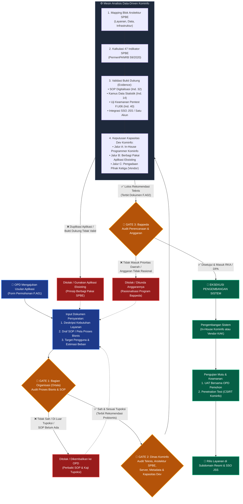

# Alur Tata Kelola & Analisis Kelayakan Usulan Aplikasi SPBE (3-Gate System & Data-Driven)
*Dokumen ini menjabarkan tata kelola menyeluruh pengajuan aplikasi baru oleh OPD melalui mekanisme 3-Gate Clearance (Bagian Organisasi, Dinas Kominfo, dan Bappeda), serta bagaimana sistem secara cerdas melakukan analisis kelayakan teknis SPBE secara data-driven tanpa radio button subyektif.*

---

## 1. Konsep Dasar Tata Kelola 3-Gate System

Dalam tata kelola SPBE modern (Perpres 95/2018 dan Standar Teknis Aplikasi SPBE Daerah), pembangunan atau pengembangan aplikasi tidak boleh lagi dilakukan secara parsial, sepihak oleh OPD, atau langsung belanja anggaran ke pihak ketiga.

Untuk mencegah timbulnya **aplikasi silo (terisolasi)**, **duplikasi fungsi**, dan **pemborosan APBD**, sistem menerapkan **Mekanisme Tiga Gerbang (3-Gate Clearance System)**:

1. **Gate 1: Bagian Organisasi (Ortala)** $\rightarrow$ Memeriksa kesesuaian **Proses Bisnis & SOP**. Memastikan alur kerjanya sah, memiliki landasan hukum pelayanan, dan sesuai tugas pokok & fungsi (tupoksi) perangkat daerah.
2. **Gate 2: Dinas Kominfo** $\rightarrow$ Memeriksa kelaikan **Teknis, Server, Arsitektur SPBE, & Metadata**, serta memutuskan apakah tim programmer internal Kominfo sanggup membangunnya secara *in-house* atau harus memanfaatkan aplikasi eksisting / pengadaan pihak ketiga. Di gerbang ini juga berjalan mesin analisis kelayakan *data-driven* berbasis 47 Indikator SPBE.
3. **Gate 3: Bappeda** $\rightarrow$ Memeriksa kesesuaian **Perencanaan & Anggaran**. Memastikan usulan selaras dengan prioritas pembangunan daerah (RPJMD/RKPD) dan anggarannya efisien sebelum masuk ke RKA/DPA.

> [!IMPORTANT]
> **Prinsip Utama: No Gate, No Budget.**  
> Bappeda dan BPKAD tidak akan mengesahkan anggaran belanja aplikasi jika usulan belum mengantongi rekomendasi sah dari Gate 1 (Ortala) dan Gate 2 (Kominfo).

---

## 2. Diagram Alur Lengkap Sistem (3-Gate Clearance & Analisis SPBE)

---

## 3. Rincian Peran & Tanggung Jawab Tiga Gerbang (3 Gates)

| Parameter | 🚪 GATE 1: Bagian Organisasi (Ortala) | 🚪 GATE 2: Dinas Kominfo | 🚪 GATE 3: Bappeda |
|:---|:---|:---|:---|
| **Instansi Penguji** | Bagian Organisasi Sekretariat Daerah | Dinas Komunikasi Informatika dan Persandian | Badan Perencanaan Pembangunan Daerah |
| **Fokus Utama** | **Proses Bisnis & Keabsahan SOP** | **Teknis, Server, Arsitektur SPBE, & Metadata** | **Kesesuaian Perencanaan & Anggaran** |
| **Pertanyaan Kunci** | *"Apakah alur kerjanya sah, tidak tumpang tindih kewenangan, dan sesuai tupoksi OPD?"* | *"Apakah aplikasi redundan, aman, standar API-nya klop, dan apakah tim programmer Kominfo sanggup buat atau pakai eksisting?"* | *"Apakah usulan masuk prioritas pembangunan daerah dan anggarannya rasional di APBD?"* |
| **Dokumen Input** | Draf SOP Layanan, Landasan Tupoksi (Perbup/Perwal SOTK) | Formulir F.A01, Rekomendasi Ortala, Peta Data, Spek Teknis | Dokumen Hasil Analisis Kelayakan F.A02, Rekomtek Kominfo, Rencana Anggaran Biaya (RAB) |
| **Output / Produk** | **Surat Rekomendasi Kesesuaian Probismis & SOP** | **Dokumen Hasil Analisis Kelayakan F.A02 & Rekomtek SPBE** | **Persetujuan Pagu Alokasi Anggaran (Masuk RKA/DPA)** |

---

## 4. Pendalaman Mekanisme di Tiap Gerbang

### 🚪 GATE 1: Bagian Organisasi (Ortala) — Audit Proses Bisnis & SOP
Sebelum teknologi dibangun, tata kelola organisasi harus sudah matang. Ortala memastikan bahwa aplikasi digital mengotomatisasi proses kerja yang memang sah dan memiliki standar pelayanan resmi.

*   **1. Uji Kesesuaian Tupoksi:** Memeriksa apakah urusan yang akan dibuatkan aplikasi benar-benar menjadi wewenang OPD pemohon sesuai regulasi pembentukan perangkat daerah. Mencegah perebutan kewenangan antar-dinas.
*   **2. Audit Peta Proses Bisnis (Probismis):** Meneliti diagram alir alur kerja layanan dari pemohon hingga output terbit. Alur yang rumit (*spaghetti process*) harus disederhanakan (*business process re-engineering*) sebelum didigitalkan.
*   **3. Standar Operasional Prosedur (SOP):** Memastikan tersedianya SOP tertulis yang memuat penanggung jawab di setiap tahapan, waktu penyelesaian (*SLA*), dan syarat dokumen.

---

### 🚪 GATE 2: Dinas Kominfo — Audit Teknis, Arsitektur SPBE, & Kapasitas Programmer
Dinas Kominfo bertindak sebagai arsitek digital dan pengawal keterpaduan sistem SPBE. Di gerbang ini, sistem menjalankan **Analisis Kelayakan Berbasis Data (*Data-Driven Engine*)**:

#### A. Menghilangkan "Radio Button" Subyektif
Di sistem lama, status *"Selaras dengan SPBE"* seringkali hanya formalitas klik tombol Ya/Tidak oleh analis. Pada alur baru ini:
*   **Dampak Positif adalah KESIMPULAN OTOMATIS (OUTPUT):** Sistem hanya menyimpulkan aplikasi layak jika analis/OPD memetakan aplikasi ke **47 Indikator Indeks SPBE Nasional** (PermenPANRB 59/2020) dan mengunggah **Bukti Dukung (Evidence)** yang sah.

#### B. Tahapan Analisis di Gate 2:
1.  **Mapping Arsitektur SPBE:**
    *   Sistem meminta analis memetakan modul aplikasi ke dalam blok **Peta Arsitektur SPBE Daerah** (Domain Layanan Publik/Administrasi Pemerintahan, Domain Data, Domain Infrastruktur).
    *   Jika aplikasi tidak menemukan padanan blok arsitektur di master data, maka sistem menolak usulan karena dinilai di luar cetak biru SPBE.
2.  **Kalkulasi 47 Indikator SPBE & Upload Bukti Dukung (*Evidence-Based*):**
    *   *Indikator 32 (Layanan Berbasis Elektronik):* Wajib unggah SOP digitalisasi hasil persetujuan Gate 1.
    *   *Indikator 14 (Manajemen Data & Metadata):* Wajib tautkan *Kamus Data* yang telah divalidasi Seksi Statistik.
    *   *Indikator 40 (Keamanan Informasi):* Wajib integrasi SSO terpusat (Keycloak / JSS) dan komitmen uji penetrasi (*Pentest* CSIRT - F.U06).
3.  **Audit Redudansi (Prinsip Berbagi Pakai SPBE):**
    *   Mengecek apakah fitur serupa sudah ada di aplikasi daerah lain atau aplikasi umum nasional. Jika sudah ada, usulan dialihkan ke pemanfaatan aplikasi eksisting.
4.  **Keputusan Kapasitas Pengembangan (*Who Builds It?*):**
    *   **Jalur A (In-House Programmer Kominfo):** Jika kapasitas tim programmer internal mencukupi, aplikasi masuk ke antrean *sprint backlog* internal tanpa biaya vendor pihak ketiga.
    *   **Jalur B (Berbagi Pakai / Replikasi):** Membuka modul API pada aplikasi eksisting yang sudah ada.
    *   **Jalur C (Pengadaan Pihak Ketiga):** Jika modul membutuhkan teknologi khusus di luar kapasitas in-house, Kominfo menyusun Kerangka Acuan Kerja (KAK) teknis terstandar untuk pengadaan luar.

*   **Output Gate 2:** Dokumen **F.A02 (Hasil Analisis Kelayakan Aplikasi SPBE)** yang ter-generate otomatis secara objektif.

---

### 🚪 GATE 3: Bappeda — Audit Perencanaan & Anggaran
Bappeda menjadi filter terakhir untuk memastikan efisiensi anggaran belanja daerah dan keselarasan dengan arah kebijakan kepala daerah.

*   **1. Keselarasan Prioritas Pembangunan Daerah:**
    *   Memeriksa apakah usulan aplikasi mendukung target Indikator Kinerja Utama (IKU) Kepala Daerah dalam RPJMD dan RKPD.
*   **2. Rasionalisasi Anggaran & Efisiensi Belanja:**
    *   Bappeda hanya membahas alokasi anggaran apabila usulan telah lolos Gate 1 (Ortala) dan mengantongi dokumen F.A02 dari Gate 2 (Kominfo).
    *   Menilai kewajaran Rencana Anggaran Biaya (RAB) belanja modal/jasa konsultan perangkat lunak.
*   **3. Penguncian di Sistem Perencanaan (SIPD):**
    *   Menetapkan kode sub-kegiatan dan alokasi pagu resmi pada Rencana Kerja dan Anggaran (RKA) / Dokumen Pelaksanaan Anggaran (DPA).

---

## 5. Keuntungan Tata Kelola 3-Gate Ini bagi Daerah

1.  **Objektif, Terukur, & Bebas Subyektivitas:** Analisis SPBE tidak bergantung pada asumsi individu analis, melainkan berdasarkan bukti dokumen (*evidence-based*) dan keterkaitan arsitektur.
2.  **Zero Duplikasi & Efisiensi APBD:** Tidak ada lagi OPD yang diam-diam membeli aplikasi ke vendor swasta tanpa izin Kominfo atau menduplikasi aplikasi dinas lain.
3.  **Siap Audit BPK & Asesor KemenPANRB:** Setiap kali dilakukan evaluasi Indeks SPBE Nasional, dokumen pendukung dan riwayat clearance dari ketiga pintu gerbang sudah tersimpan rapi dan dapat ditelusuri (*fully auditable*).
4.  **Pemberdayaan Programmer Internal:** Memberikan kepastian peran tim *in-house* Diskominfo untuk menangani aplikasi-aplikasi strategis daerah secara terstruktur.
