<!-- Dibuat oleh Bidang Sistem Informasi dan Statistik Dinas Komunikasi Informatika dan Persandian Kota Yogyakarta -->
# 📘 BLUEPRINT — SISTEM INFORMASI PROJECT (MANAJEMEN & PELACAKAN SIKLUS HIDUP APLIKASI SPBE)
> Dokumen gabungan **BRD + PRD + SRS + MODULAR IMPLEMENTATION PLAN + APPLE HIG UI SPEC** — Referensi spesifikasi tunggal untuk vibe engineering & agentic coding di Google Antigravity 2.0.
> Acuan Hukum & Standar: **Keputusan Wali Kota Yogyakarta Nomor 108 Tahun 2026 tentang Penetapan Standar Teknis dan Prosedur Pembangunan dan Pengembangan Aplikasi Khusus SPBE** · Perpres 95/2018 SPBE · Perpres 132/2022 Arsitektur SPBE · Permenkomdigi No. 6/2025 · BABOK v3 · ISO/IEC/IEEE 29148:2018 · ISO/IEC 25010 · Apple Human Interface Guidelines (HIG).

---

## 1. Informasi Dokumen

| Field | Nilai |
| :--- | :--- |
| **Judul Sistem** | Project — Sistem Informasi Manajemen Permohonan & Pelacakan Siklus Hidup Aplikasi SPBE Kota Yogyakarta |
| **Kode Dokumen** | `BLUEPRINT-PROJECT-V2.0` |
| **Versi Dokumen** | `2.0.0` (Full Lifecycle Compliance Kepwal 108/2026) |
| **Tanggal Terbit** | 31 Agustus 2026 |
| **Status Dokumen** | `DISETUJUI (APPROVED & FULL SSOT AUDIT PASSED)` |
| **Dasar Regulasi Acuan** | Keputusan Wali Kota Yogyakarta Nomor 108 Tahun 2026 tentang Standar Teknis & Prosedur Pembangunan/Pengembangan Aplikasi Khusus SPBE |
| **Pemilik Sistem (Product Owner)** | Dinas Komunikasi Informatika dan Persandian Kota Yogyakarta |
| **Interviewer & Lead Architect** | Antigravity Requirement Engineer & System Architect |
| **Mode SRS** | Mode B — Konseptual Diskominfo Standard Stack |
| **Target Eksekusi** | Google Antigravity 2.0 (Go Clean Arch + React Vite + PostgreSQL 16 + MinIO + Keycloak SSO JSS) |

### Riwayat Revisi

| Versi | Tanggal | Deskripsi Perubahan | Penulis |
| :---: | :---: | :--- | :--- |
| `0.1.0` | 2026-08-30 | Inisiasi ekstraksi kebutuhan bisnis dari mockup UI front-end publik dan formulir F.A01 s/d F.A03 | Tim Pengembang |
| `1.0.0` | 2026-08-30 | Finalisasi blueprint awal (BRD, PRD, SRS, MOD-00 s/d MOD-06, dan UI Specs Apple HIG) | Lead Architect & Diskominfo |
| `1.1.0` | 2026-08-30 | Penyesuaian integrasi eOffice dan 4 pengujian mutu (F.UO3, F.UO4/BA UAT, Pentest, Stress Test) | Lead Architect & Diskominfo |
| `1.2.0` | 2026-08-30 | Sinkronisasi pembagian form input digital vs MinIO upload | Lead Architect & Diskominfo |
| `2.0.0` | 2026-08-31 | **Hasil Audit SSOT Kepwal 108/2026**: Integrasi 10 Siklus Lengkap (F.P01 Pemeliharaan, F.P02 Insiden CSIRT, F.P03 Change Request, F.E01 Monev & SLA 3 Bulan, F.RA01/RA02 Replikasi SPBE, FI.02 Hosting/Subdomain), perincian alur proses bisnis [Aktor] vs [Sistem], standardisasi 6 bagian wajib SRS-F, dan ekspansi modul MOD-00 s/d MOD-09. | Lead Architect & Diskominfo Auditor |

---

## 2. Ringkasan Eksekutif

Aplikasi **Project** dibangun oleh Dinas Komunikasi Informatika dan Persandian Kota Yogyakarta sebagai platform digital sentral untuk tata kelola siklus hidup perangkat lunak SPBE mengacu penuh pada **Keputusan Wali Kota Yogyakarta Nomor 108 Tahun 2026 tentang Standar Teknis dan Prosedur Pembangunan dan Pengembangan Aplikasi Khusus SPBE**. 

Sistem ini memadukan **Formulir Input Digital Interaktif (dengan auto-generate PDF ber-KOP Naskah Dinas)** dan **Repositori Upload Berkas Digital (MinIO Object Storage)** yang mengawal 10 tahapan siklus hidup aplikasi pemerintah:

```
[1. Permohonan] ──> [2. Verifikasi & Kelayakan] ──> [3. Perencanaan] ──> [4. Rancang Bangun & Implementasi] ──> [5. Pengujian Mutu (5 Instrumen)]
       │
       └──> [6. Serah Terima & Rilis Layanan] ──> [7. Operasional & Subdomain] ──> [8. Pemeliharaan & CR] ──> [9. Monev & SLA 3 Bulan] ──> [10. Replikasi SPBE]
```

---

## 3. Matriks Standarisasi Formulir Kepwal 108/2026 (Digital vs MinIO)

| Kode Form / Dokumen | Nama Formulir / Berkas Resmi | Tipe di Sistem | Aktor Pengelola | Tahapan Siklus Kepwal |
| :--- | :--- | :---: | :---: | :---: |
| **`F.A01`** | **Formulir Pengajuan Pengembangan Aplikasi SPBE** | 📝 **Input Digital** + Cetak PDF | PIC Pemohon OPD | 1. Permohonan / Analisis |
| **Lampiran `F.A01`** | 4 Berkas: Dasar Hukum, SOP, Contoh Laporan, Dokumen Lainnya | 📂 **Upload PDF (MinIO)** | PIC Pemohon OPD | 1. Permohonan / Analisis |
| **Surat eOffice** | Surat Resmi Permohonan OPD ber-Nomor Registrasi | 📂 **Upload / Input Ref** | PIC Pemohon OPD | 2. Verifikasi eOffice |
| **`F.A02`** | **Formulir Analisis Kelayakan Pengembangan Aplikasi SPBE** (12 Bagian) | 📝 **Input Digital** + Cetak PDF | Tim Analis & Kabid | 2. Analisis Kelayakan |
| **`F.P01 (Perencanaan)`**| **Dokumen Kerangka Acuan Kerja (KAK)** | 📂 **Upload PDF (MinIO)** | Tim Analis & Perencanaan | 3. Perencanaan |
| **`F.A03`** | **Formulir Analisis Kebutuhan Sistem** (*Software Requirement*) | 📝 **Input Digital** + Cetak PDF | Tim Bisnis Analis & Perencanaan | 3. Perencanaan |
| **`F.R01 (Rancang)`**| **Dokumen Rancang Bangun Aplikasi (Arsitektur, ERD, UI)** | 📂 **Upload PDF (MinIO)** | Tim Developer / Arsitek | 4. Rancang Bangun |
| **`FI.01`** | **Dokumen Pengembangan Aplikasi SPBE (Backend/Frontend)** | 📂 **Upload PDF / Link Git** | Tim Developer / Programmer | 4. Implementasi |
| **`FI.02`** | **Formulir Permohonan Hosting Aplikasi & Subdomain** | 📝 **Input Digital** + Cetak PDF | Tim Developer ke Bid. IT | 4. Implementasi & Rilis |
| **`F.UO1`** | **Formulir Rencana Pengujian Aplikasi (Test Plan)** | 📝 **Input Digital** + Cetak PDF | Ketua Tim Kerja & Kabid | 5. Pengujian |
| **`F.UO2`** | **Formulir Pengujian Integrasi Sistem (Integration Test)** | 📝 **Input Digital** + Cetak PDF | Tim Pengembang / Integrator | 5. Pengujian |
| **`F.UO3`** | **Formulir Pengujian Fungsional (Functional Testing)** | 📝 **Input Digital** + Cetak PDF | Tim QA / Analis & Kabid | 5. Pengujian |
| **`F.UO4`** | **Dokumen UAT (User Acceptance Test)** | 📝 **Input Digital** + Cetak PDF | Penguji 1 & 2, Tim Analis | 5. Pengujian |
| **`F.UO5`** | **Berita Acara UAT (User Acceptance Test)** | 📝 **Input Digital** + Cetak PDF | Klien OPD, Tim Kerja & Kabid | 5. Pengujian |
| **`F.U06` / Pentest** | **Laporan Pengujian Keamanan (Pentest Report CSIRT)** | 📂 **Upload PDF (MinIO)** | Bidang Persandian / Pentester | 5. Pengujian |
| **`F.U07` / Stress** | **Formulir Pengujian Beban (Performance & Stress Test)** | 📝 **Input Digital** + Upload Raw | Tim DevOps / Admin Server | 5. Pengujian |
| **`F.SR01`** | **Berita Acara Serah Terima Aplikasi Khusus (BAST)** | 📝 **Input Digital** + Cetak PDF | Pihak I & II (Kominfo & OPD) | 6. Serah Terima |
| **`F.R01 (Rilis)`** | **Berita Acara Training of Trainer (TOT)** | 📝 **Input Digital** + Cetak PDF | Tim Pelatih & Peserta OPD | 7. Rilis Layanan |
| **`F.R02`** | **Format SK Penetapan Aplikasi Khusus** | 📝 **Input Digital / Template** | Kepala OPD Pemilik Layanan | 7. Rilis Layanan |
| **`F.R03`** | **Format SK Tim Pengelola Aplikasi Khusus** | 📝 **Input Digital / Template** | Kepala OPD Pemilik Layanan | 7. Rilis Layanan |
| **`F.R04`** | **Formulir Checklist Kesiapan Rilis Aplikasi Khusus** | 📝 **Input Digital** + Cetak PDF | Tim Produksi & Tim Rilis | 7. Rilis Layanan |
| **`F.P01 (Maint)`** | **Formulir Pencatatan Pemeliharaan Aplikasi** | 📝 **Input Digital** + Cetak PDF | Unit Pengelola / Tim Dev | 8. Pemeliharaan |
| **`F.P02`** | **Format Laporan Insiden Keamanan Informasi (CSIRT)** | 📝 **Input Digital** + Cetak PDF | Jogjakarta CSIRT | 8. Pemeliharaan |
| **`F.P03`** | **Formulir Change Request (CR Permohonan Perubahan)** | 📝 **Input Digital** + Cetak PDF | PIC OPD Pemohon CR | 8. Pemeliharaan & CR |
| **`F.E01`** | **Formulir Evaluasi Penggunaan Aplikasi (Monev 3 Bulan/SLA)** | 📝 **Input Digital** + Cetak PDF | Tim Monev & Perencanaan | 9. Pemantauan & Evaluasi |
| **`F.RA01`** | **Formulir Assessment Replikasi Aplikasi SPBE** | 📝 **Input Digital** + Cetak PDF | OPD/Instansi Pemohon Replikasi | 10. Replikasi SPBE |
| **`F.RA02`** | **Formulir Kelayakan Replikasi Aplikasi SPBE** | 📝 **Input Digital** + Cetak PDF | Tim Analis Replikasi Kominfo | 10. Replikasi SPBE |

---

# BAGIAN A — BRD (Business Requirements Document)

## A.1. Latar Belakang & Konteks Bisnis

- **A.1.1. Kondisi Bisnis Saat Ini (As-Is)**:
  Sebelumnya, permohonan aplikasi diajukan melalui surat lepas tanpa standardisasi tahapan teknis terpadu. OPD langsung mem-*bypass* ke tim *developer* (Seksi Perangkat Lunak) tanpa *assessment* kelayakan SPBE dari Seksi Perencanaan dan tanpa standarisasi metadata dari Seksi Data Statistik. Hal ini memicu aplikasi yang tidak terkontrol (idle/mangkrak), *scope creep*, dan data *silo* pasca-rilis.
- **A.1.2. Kondisi Target (To-Be - Siklus Hidup Aplikasi SPBE)**:
  1. **Fase 1: Inisiasi & Pengajuan Layanan (Form F.A01 & eOffice):** OPD/Vendor *wajib* mengisi form digital pengajuan (Form **F.A01**) yang mencakup Informasi Permohonan, Informasi Umum Aplikasi, dan 4 Lampiran Dokumen Wajib (SOP, Dasar Hukum, Contoh Laporan, Dokumen Lainnya) yang diunggah ke MinIO, serta validasi nomor surat dinas resmi **eOffice**.
     - **Output Resmi Fase 1:**
       - **Nomor Registrasi Unik SPBE:** Berformat `REG-YYYYMMDD-XXXX` sebagai nomor tiket tunggal pelacakan end-to-end.
       - **Dokumen Cetak Formulir F.A01 PDF:** Ber-KOP naskah dinas resmi Pemkot Yogyakarta lengkap dengan QR-code bukti tanda terima pengajuan.
       - **Bundel 4 Lampiran Dokumen Sah:** Terverifikasi magic bytes PDF dan tersimpan di MinIO Object Storage.
       - **Tiket Masuk Antrean Analis:** Berstatus `Menunggu Telaah Kelayakan (F.A02)` pada dashboard Seksi Perencanaan untuk diproses ke Fase 2.
  2. **Fase 2: Asesmen Kelayakan & Klarifikasi Teknis (Rapat Klarifikasi Teknis OPD & Form F.A02 Resmi):** Tiket masuk pertama kali diterima oleh **Ketua Tim Kerja Perencanaan** yang melakukan penugasan resmi (*resource allocation*): menugaskan **Tim Analis Kelayakan (Lead Analis F.A02)** dan **Business Analyst (BA Bisnis Proses)**.
     - Tim Analis & BA mengeksekusi **Modul Manajemen Rapat Klarifikasi Teknis OPD (Multi-Sesi)**: studio inisiasi rapat terjadwal, validasi *Target Kesepakatan Checklist 100%* (Mandatory Guard), risalah notulensi format dokumen MS Word & bukti foto ke MinIO, pelacak tindak lanjut tugas perbaikan OPD, serta daftar hadir digital & TTE Berita Acara Rapat Klarifikasi.
     - Tim Analis mengeksekusi **Kertas Kerja Asesmen Analis 4 Pilar (Form F.A02 Workbench)**: Uji Redundansi Katalog Aplikasi Pemkot, Pemetaan Arsitektur & Regulasi, Rubrik Penilaian Berbobot 12 Bagian & Eviden Sah, serta Kalkulasi Skor Kelayakan & Kuadran McFarlan-Peppard.
     - Seluruh hasil evaluasi kertas kerja disajikan pada panel referensi, lalu Tim Analis melakukan **Pengisian Manual Formulir F.A02 Resmi** (Nomor Surat Dinas Telaah, Ringkasan Eksekutif, Pertimbangan Analis, dan Rekomendasi Resmi) sebelum diajukan ke Approval Digital Kabid Pengembangan Aplikasi.
  3. **Fase 3: Standardisasi Metadata Satu Data Indonesia / SDI (Walidata Daerah):** Permohonan yang telah lolos telaah F.A02 dan disahkan Kabid diteruskan ke Seksi Data Statistik (Walidata Daerah). **Tahap ini WAJIB CLEAR TERLEBIH DAHULU sebelum masuk ke analisis kebutuhan teknis**: memverifikasi Kamus Data, Standar Data, Kode Referensi Data Induk Pemkot, dan Interoperabilitas SPLP hingga diterbitkannya **Rekomendasi Walidata SDI (Clearance Metadata Sah 100%)**. Bila struktur data belum standar / duplikat, tiket dikembalikan ke OPD untuk perbaikan kamus data.
  4. **Fase 4: Perencanaan Teknis & Penandatanganan KAK Bersama (Form F.A03 & Penandatanganan KAK F.P01 Kedua Belah Pihak):** Setelah Metadata SDI dinyatakan Clear 100%, Tim Bisnis Analis & Arsitek Sistem memproses perencanaan teknis:
     - Penyusunan Formulir **F.A03** Software Requirements (kebutuhan fungsional per role, non-fungsional SLA/keamanan, matriks mitigasi risiko).
     - Penyusunan Draf Kerangka Acuan Kerja KAK Teknis (**F.P01**) dan Blueprint Rancang Bangun Sistem.
     - Sesi Pembahasan & Harmonisasi Draf KAK bersama Tim Teknis OPD Pemohon untuk mengunci ruang lingkup pekerjaan.
     - **Penandatanganan Digital KAK oleh Kedua Belah Pihak (Mandatory Contract Gate):** Dokumen KAK F.P01 wajib ditandatangani secara digital oleh **Pihak I (Kepala Bidang / Diskominfo)** dan **Pihak II (Kepala OPD / PPK Pemohon)**. Penandatanganan kedua belah pihak ini menjadi komitmen sah ruang lingkup dan alokasi waktu.
     - **Quality Guard:** Status tiket HANYA dapat bertransisi menjadi **Ready for Dev** apabila KAK telah ditandatangani oleh kedua belah pihak dan seluruh dokumen perencanaan terkunci permanen di MinIO. Tim pengembang dilarang memulai koding sebelum KAK disahkan kedua pihak (*mencegah scope creep*).
  5. **Fase 5: Pengembangan Sistem / Development (Papan Kerja Ala OpenProject & Eksekusi FI.01/FI.02):** Tiket berstatus `Ready for Dev` diterima Ketua Tim Kerja Perangkat Lunak. Proses pengembangan dijalankan secara terstruktur:
     - **Alokasi Squad Pengembang:** Penugasan Project Manager (PM), Desainer Sistem Informasi (DSI UI-UX), Backend Dev, Frontend Dev, dan QA.
     - **Sprint Kickoff & Koordinasi Teknis:** Bedah F.A03, KAK F.P01, penetapan milestone sprint, arsitektur tech stack, dan branching Git.
     - **Papan Kerja Work Packages (Ala OpenProject):** Manajemen kartu kerja kanban (`Backlog` ➔ `To Do` ➔ `In Progress` ➔ `Review` ➔ `Done`), pelacak persentase progres fisik pengembangan secara real-time (0% s/d 100%), dan integrasi commit Git.
     - **Dokumentasi & Infrastruktur:** Pengisian Form **FI.01** (Dokumentasi Rancang Bangun & Kodefikasi), pengajuan Form **FI.02** (Hosting & Subdomain ke Bidang IT), serta deployment build ke lingkungan Staging Sandbox Pemkot.
  6. **Fase 6: Pengujian Mutu Sistem / QA Suite (5 Pilar Kepwal 108/2026):** Setelah progres pengembangan fisik mencapai 100% dan deploy ke staging, tim QA mengeksekusi 5 Pilar Pengujian Mutu (Form **F.UO1 s/d F.U07**):
     - Rencana Uji Sistem (Form **F.UO1**).
     - Pilar 1: Pengujian Integrasi (Form **F.UO2**).
     - Pilar 2: Pengujian Fungsional Sistem (Form **F.UO3**).
     - Pilar 3: Pengujian Penerimaan Pengguna UAT OPD (Form **F.UO4**) & Berita Acara UAT (Form **F.UO5**).
     - Pilar 4: Pengujian Keamanan Pentest CSIRT (Form **F.U06**).
     - Pilar 5: Pengujian Beban & Stress Test k6 (Form **F.U07**).
     - **Quality Gate:** Lulus 100% seluruh pilar (Nol bug High/Critical, UAT disetujui, dan Pentest Clear) sebelum dapat melangkah ke tahap serah terima.
  7. **Fase 7: Serah Terima & Rilis Layanan Produksi (F.SR01 s/d F.R04):** Setelah seluruh pengujian mutu lulus, dilaksanakan proses serah terima dan go-live:
     - Penandatanganan Berita Acara Serah Terima BAST (Form **F.SR01**) antara Diskominfo dan OPD dengan klausul mandatori aplikasi wajib aktif bertransaksi minimal 3 bulan di JSS.
     - Pelaksanaan pelatihan pengguna dan penandatanganan Berita Acara Training of Trainers TOT (Form **F.R01**).
     - Penerbitan Surat Keputusan Tim Pengelola Aplikasi OPD (Form **F.R02 / F.R03**).
     - Pemeriksaan Checklist Kesiapan Rilis Produksi (Form **F.R04**), verifikasi DNS/SSL, dan integrasi SSO JSS.
     - Aplikasi aktif beroperasi di lingkungan produksi dan didaftarkan ke sistem pemantauan berkala (Monev SLA 3 Bulan Form **F.E01**).

  **Diagram Alur Kerja Target (To-Be) per Fase:**

  **1. Fase 1: Inisiasi & Pengajuan Layanan (Form F.A01 & eOffice)**
  ```mermaid
  flowchart TD
      A["👤 OPD / PIC Pemohon<br/>(Unit Kerja Pemohon se-Kota Yogyakarta)"]
      
      A -->|"1. Input Data Pokok & Probis"| B["📝 Draf Permohonan Form F.A01<br/>• Info Pemohon & Judul Usulan<br/>• Urgensi, Probis & Dampak jika Tidak Dibangun"]
      
      B -->|"2. Unggah 4 Dokumen Sah"| C["📂 Repositori MinIO Storage<br/>• Dokumen Dasar Hukum (PDF)<br/>• SOP Pelayanan / Bisnis Proses (PDF)<br/>• Contoh Laporan / Output Manual (PDF)<br/>• Dokumen Pendukung Lainnya (PDF)"]
      
      C -->|"3. Naskah Dinas Resmi"| D["📬 Integrasi Surat eOffice Pemkot<br/>• Input Nomor & Tanggal Surat Dinas OPD<br/>• Verifikasi Surat Resmi Masuk"]
      
      D -->|"4. Final Submit & Penguncian Berkas"| E["📥 Sistem Antrean Seksi Perencanaan Diskominfo"]
      
      E -->|"Menerbitkan Artefak Sah"| OutFase1
      
      subgraph OutFase1 ["🎯 4 OUTPUT RESMI FASE 1"]
          direction TB
          O1["🎫 1. Nomor Registrasi Unik SPBE<br/>Format Resmi: REG-YYYYMMDD-XXXX (ID Tunggal Sistem)"]
          O2["📄 2. Dokumen Cetak Form F.A01 PDF<br/>Ber-KOP Resmi Naskah Dinas Pemkot + QR Code Tanda Terima Digital"]
          O3["🗂️ 3. Bundel 4 Berkas Lampiran Sah<br/>Tervalidasi Magic Bytes PDF di Object Storage MinIO"]
          O4["📌 4. Tiket Masuk Antrean Analis Aktif<br/>Status: 'Menunggu Telaah Kelayakan (F.A02)'"]
          
          O1 --> O2 --> O3 --> O4
      end
      
      OutFase1 -->|"➡️ Diteruskan ke Tahap Berikutnya"| Next["🔬 FASE 2: ASESMEN KELAYAKAN & KLARIFIKASI TEKNIS<br/>• Manajemen Rapat Klarifikasi Teknis OPD (Multi-Sesi)<br/>• Kertas Kerja Asesmen Analis F.A02"]
  ```

  **2. Fase 2: Asesmen Kelayakan & Klarifikasi Teknis (Rapat Klarifikasi Teknis OPD & Form F.A02 Resmi)**
  ```mermaid
  flowchart TD
      A["📥 Tiket Masuk F.A01<br/>(Terverifikasi eOffice)"] --> LeadPlan["👤 Ketua Tim Kerja Perencanaan<br/>(Seksi Perencanaan TI)"]
      
      LeadPlan --> PlanTeamAssign
      
      subgraph PlanTeamAssign ["👥 PENUGASAN TIM TELAAH PERENCANAAN"]
          direction TB
          AS1["1. Penugasan Lead Analis Kelayakan (F.A02)<br/>• Memimpin Rapat Klarifikasi Teknis OPD<br/>• Pelaksana Kertas Kerja Asesmen 4 Pilar"]
          AS2["2. Penugasan Business Analyst (BA Bisnis Proses)<br/>• Analisis SOP, Regulasi & Probis Pemohon<br/>• Pendamping Analisis Kebutuhan Sistem"]
          
          AS1 --- AS2
      end
      
      PlanTeamAssign --> RapatKlarifikasi
      PlanTeamAssign --> Workbench
      
      subgraph RapatKlarifikasi ["🤝 MANAJEMEN RAPAT KLARIFIKASI TEKNIS OPD (Multi-Sesi)"]
          direction TB
          H1["1. Studio Inisiasi Rapat (Sesi #1, #2, dst.)<br/>• Penjadwalan rapat & tim hadir lintas instansi<br/>• Penetapan Target Kesepakatan Rapat"]
          H2["2. Pelaksanaan Rapat & Risalah Rich Text<br/>• Notulensi format dokumen MS Word<br/>• Unggah foto dokumentasi / sketsa ke MinIO"]
          H3["3. Pelacak Tindak Lanjut / Tugas Hasil Rapat<br/>• Penugasan revisi SOP / dokumen teknis OPD<br/>• Verifikasi dokumen perbaikan OPD"]
          H4["4. Gate Mandatori: Target Kesepakatan 100%<br/>• Guard: Ditolak jika target rapat belum 100% tercapai<br/>• Daftar Hadir Digital & Berita Acara Rapat TTE"]
          
          H1 --> H2 --> H3 --> H4
          H3 -- "Revisi Belum Lengkap" --> H1
      end
      
      subgraph Workbench ["🔬 KERTAS KERJA ASESMEN ANALIS (Form F.A02 Workbench)"]
          direction TB
          W1["1. Uji Redundansi & Katalog Aplikasi<br/>• Scan database aplikasi aktif Pemkot<br/>• Deteksi kemiripan fungsi / probis<br/>• Justifikasi diferensiasi sistem"]
          W2["2. Pemetaan Arsitektur SPBE & Regulasi<br/>• Validasi Tupoksi/SOTK Pemohon<br/>• Pemetaan Domain Layanan & Probis"]
          W3["3. Rubrik Penilaian Berbobot 12 Bagian<br/>• Scoring tingkat kematangan (Level 1-4)<br/>• Wajib tautkan bukti dukung (Evidence)<br/>• Knockout Check (Kriteria Gugur)"]
          W4["4. Scoring Engine & McFarlan Grid<br/>• Integrasi Skor Teknis + Berita Acara Rapat<br/>• Kuadran: Strategic / High Potential /<br/>  Key Operational / Support"]
          
          W1 --> W2 --> W3 --> W4
      end
      
      H4 -- "✅ Clearance Rapat Disahkan (Berita Acara Sah)" --> W4
      
      W4 --> SummaryWorkbench["📊 Tampilan Rekapitulasi Hasil Asesmen<br/>• Rekapitulasi Skor Total & Kuadran McFarlan<br/>• Status Redundansi, Regulasi & Eviden Sah<br/>• Status Clearance Rapat Klarifikasi Teknis"]
      
      SummaryWorkbench --> FormFA02Manual["✍️ Pengisian Manual Formulir F.A02 Resmi (oleh Analis)<br/>• Input Nomor & Tanggal Surat Dinas Telaah F.A02<br/>• Input Narasi Ringkasan Eksekutif & Pertimbangan Analis<br/>• Penetapan Rekomendasi Resmi (Lanjut Bangun / Berbagi Pakai / Ditolak)"]
      
      FormFA02Manual --> KabidAppr{"👔 Approval Digital Kabid<br/>Pengembangan Aplikasi"}
      KabidAppr -- "Perlu Koreksi Form / Nilai" --> FormFA02Manual
      
      KabidAppr -- "❌ Ditolak / Alihkan Berbagi Pakai" --> RejRedund["Ditolak / Dialihkan ke<br/>Berbagi Pakai Aplikasi Eksisting"]
      RejRedund -.-> RetOPD["Kembali ke OPD<br/>(Surat F.A02 Catatan Rekomendasi)"]
      
      KabidAppr -- "⚠️ Layak Bersyarat (Skor 60-79)" --> ReviseDoc["Dikembalikan untuk Perbaikan Dokumen / SOP"]
      ReviseDoc -.-> RetOPD
      
      KabidAppr -->|"✅ Disetujui Rekomtek (Skor ≥ 80)"| OutFase2["🎯 OUTPUT FASE 2: FORM F.A02 SAH<br/>• Berita Acara Rapat Klarifikasi Lengkap<br/>• Rekomtek SPBE Ber-TTD Digital Kabid"]
      
      OutFase2 -->|"➡️ Diteruskan ke Tahap Berikutnya"| NextFase3["📊 FASE 3: STANDARDISASI METADATA SDI<br/>(Walidata Daerah / Seksi Data Statistik)"]
  ```

  **3. Fase 3: Standardisasi Metadata Satu Data Indonesia (Walidata SDI)**
  ```mermaid
  flowchart TD
      InFase3["🎯 Tiket Lolos Telaah F.A02<br/>(Rekomtek SPBE Sah)"] --> WalidataOffice["📊 Seksi Data Statistik<br/>(Walidata Daerah)"]
      
      WalidataOffice --> WalidataSDI
      
      subgraph WalidataSDI ["📊 PROSES STANDARISASI METADATA SATU DATA INDONESIA (SDI)"]
          direction TB
          SDI1["1. Telaah Struktur Data & Usulan Variabel<br/>• Verifikasi Kamus Data OPD Pemohon<br/>• Validasi Standar Data (Definisi, Satuan, Klasifikasi)"]
          SDI2["2. Penyelarasan Kode Referensi & Interoperabilitas<br/>• Sinkronisasi Data Induk Pemkot Yogyakarta<br/>• Uji Kesiapan Berbagi Pakai API / SPLP"]
          SDI3["3. Clearance Walidata Daerah<br/>• Rekomendasi Walidata SDI Sah<br/>• Mandatory Check: Data Wajib Terstandar 100%"]
          
          SDI1 --> SDI2 --> SDI3
      end
      
      SDI1 -- "❌ Data Redundan / Belum Standar" --> RejSDI["Dikembalikan untuk Revisi Kamus Data OPD"]
      RejSDI -.-> RetOPD2["Kembali ke OPD<br/>(Catatan Rekomendasi Walidata)"]
      
      SDI3 -->|"✅ Metadata SDI CLEAR (Rekomendasi Walidata Sah)"| OutFase3["🎯 OUTPUT FASE 3: METADATA SDI CLEAR<br/>• Berita Acara Rekomendasi Walidata SDI Sah<br/>• Kamus Data & Standar Kode Terverifikasi 100%"]
      
      OutFase3 -->|"➡️ Diteruskan ke Tahap Berikutnya"| NextFase4["📋 FASE 4: PERENCANAAN TEKNIS & KESEPAKATAN KAK<br/>(Form F.A03 & Penandatanganan KAK Kedua Belah Pihak)"]
  ```

  **4. Fase 4: Perencanaan Teknis & Penandatanganan KAK Bersama (Form F.A03 & KAK F.P01)**
  ```mermaid
  flowchart TD
      InFase4["🎯 Tiket Lolos: Metadata SDI Clear<br/>(Kamus Data Terstandar)"] --> TimAnalisKebutuhan["👤 Tim Bisnis Analis & Arsitek Sistem<br/>(Seksi Perencanaan TI)"]
      
      TimAnalisKebutuhan --> AnalisisTeknis
      
      subgraph AnalisisTeknis ["📋 1. PENYUSUNAN DOKUMEN PERENCANAAN TEKNIS (F.A03 & F.P01)"]
          direction TB
          AN1["1. Penyusunan Software Requirements (Form F.A03)<br/>• Kebutuhan Fungsional per Role Pengguna<br/>• Non-Fungsional (SLA, Performa, Skalabilitas, Security)<br/>• Matriks Manajemen Risiko & Rencana Mitigasi"]
          AN2["2. Penyusunan Draf KAK Teknis (Form F.P01)<br/>• Kerangka Acuan Kerja (KAK Teknis)<br/>• Blueprint Rancang Bangun & Arsitektur Sistem<br/>• Spesifikasi Infrastruktur & Subdomain Awal"]
          
          AN1 --> AN2
      end
      
      AnalisisTeknis --> KAKReview
      
      subgraph KAKReview ["🤝 2. HARMONISASI & PEMBAHASAN KAK BERSAMA OPD"]
          direction TB
          REV1["Sesi Pembahasan Draf KAK Bersama Tim Teknis OPD"]
          REV2["Sinkronisasi Batasan Ruang Lingkup & Deliverables"]
          REV3["Finalisasi Dokumen KAK F.P01 & Form F.A03"]
          
          REV1 --> REV2 --> REV3
      end
      
      KAKReview --> KAKSigning
      
      subgraph KAKSigning ["✍️ 3. PENANDATANGANAN KAK KEDUA BELAH PIHAK (MANDATORY GATE)"]
          direction TB
          SIGN1["Pihak I: Kepala Bidang / Diskominfo<br/>(Penetapan KAK & Alokasi Resource Dev)"]
          SIGN2["Pihak II: Kepala OPD / PPK Pemohon<br/>(Komitmen Ruang Lingkup & Probis)"]
          LOCK["Penguncian Dokumen KAK F.P01 & F.A03 di MinIO<br/>(Kontrak Ruang Lingkup Tidak Boleh Berubah)"]
          
          SIGN1 --- SIGN2
          SIGN1 --> LOCK
          SIGN2 --> LOCK
      end
      
      LOCK -- "Ada Perubahan Ruang Lingkup" --> AnalisisTeknis
      
      LOCK -->|"✅ KAK Resmi Ditandatangani Kedua Belah Pihak"| OutFase4["🎯 OUTPUT FASE 4: DOKUMEN KAK SAH & TERKUNCI<br/>• Form F.A03 Software Requirements Final<br/>• KAK F.P01 Ber-TTD Digital Diskominfo & OPD<br/>• Status Tiket: Ready for Dev"]
      
      OutFase4 -->|"➡️ Diteruskan ke Seksi Perangkat Lunak"| NextFase5["💻 FASE 5: PENGEMBANGAN SISTEM (DEVELOPMENT)<br/>(Workspace Ala OpenProject, FI.01 & FI.02)"]
  ```

  **5. Fase 5: Pengembangan Sistem / Development (Workspace Ala OpenProject, FI.01 & FI.02)**
  ```mermaid
  flowchart TD
      ReadyDev["🎯 Tiket Masuk: Status Ready for Dev<br/>(Dokumen F.A03 & KAK F.P01 Ditandatangani 2 Pihak)"] --> DevLead["👤 Ketua Tim Kerja Perangkat Lunak<br/>(Seksi Pengembangan Aplikasi)"]
      
      DevLead --> SquadForm
      
      subgraph SquadForm ["👥 1. PEMBENTUKAN SQUAD PROJECT (RESOURCE ALLOCATION)"]
          direction TB
          SQ1["Penugasan Project Manager (PM / Ketua Tim Teknis)"]
          SQ2["Penugasan Desainer Sistem Informasi (DSI / UI-UX)"]
          SQ3["Penugasan Software Engineer (Backend & Frontend Dev)"]
          SQ4["Penugasan Software Tester / Quality Assurance (QA)"]
          
          SQ1 --> SQ2 --> SQ3 --> SQ4
      end
      
      SquadForm --> DevKickoff
      
      subgraph DevKickoff ["🤝 2. SPRINT KICKOFF & KOORDINASI TEKNIS DEV"]
          direction TB
          M1["Bedah F.A03, KAK F.P01 & Standar Metadata SDI"]
          M2["Penetapan Sprint Milestones & Arsitektur Tech Stack"]
          M3["Inisialisasi Repositori Git & Branching Strategy"]
          M4["Risalah Rapat Koordinasi Dev & Target Deliverables"]
          
          M1 --> M2 --> M3 --> M4
      end
      
      DevKickoff --> DevBoard
      
      subgraph DevBoard ["📊 3. PAPAN KERJA SPRINT & MONITORING PROGRES (ALA OPENPROJECT)"]
          direction TB
          OP1["Papan Kerja Work Packages (Backlog ➔ To Do ➔ In Progress ➔ Review ➔ Done)"]
          OP2["Task DSI / UI-UX: Wireframing, Desain UI & Prototipe Figma"]
          OP3["Task Backend Dev: Skema DB, Endpoint REST/SPLP & Logic"]
          OP4["Task Frontend Dev: Slicing UI, Integrasi API & Validasi Input"]
          OP5["Pelacak Real-Time Progres Fisik (% Selesai) & Stream Commit Git"]
          
          OP1 --> OP2 & OP3 & OP4 --> OP5
      end
      
      DevBoard --> DevArtefak
      
      subgraph DevArtefak ["📝 4. DOKUMENTASI RANCANG BANGUN & INFRASTRUKTUR"]
          direction TB
          FI01["Pengisian Form FI.01 (Dokumentasi Rancang Bangun & Kodefikasi)"]
          FI02["Pengajuan Form FI.02 (Permohonan Hosting & Subdomain ke Bid. IT)"]
          StagingDeploy["Deployment Build ke Lingkungan Staging / Sandbox Pemkot"]
          
          FI01 --> FI02 --> StagingDeploy
      end
      
      StagingDeploy -->|"✅ Progres Fisik 100% & Deploy Staging Sukses"| OutFase5["🎯 OUTPUT FASE 5: BUILD APLIKASI SELESAI<br/>• Source Code Repositori Git & Tag Rilis<br/>• Form FI.01 & FI.02 Lengkap<br/>• Aplikasi Aktif di Server Staging"]
      
      OutFase5 -->|"➡️ Diteruskan ke Tim Penguji"| NextFase6["🛡️ FASE 6: PENGUJIAN MUTU SISTEM (QA SUITE)<br/>(Quality Gate: 5 Pilar Kepwal 108/2026)"]
  ```

  **6. Fase 6: Pengujian Mutu Sistem / QA Suite (5 Pilar Kepwal 108/2026)**
  ```mermaid
  flowchart TD
      InFase6["🎯 Tiket Masuk: Build Staging Siap Uji<br/>(Dokumen FI.01 & FI.02 Lengkap)"] --> QALead["👤 Tim QA & Software Tester<br/>(Didampingi CSIRT & OPD)"]
      
      QALead --> TestPlan["📋 Penyusunan Rencana Uji Mutu Sistem (Form F.UO1)"]
      
      TestPlan --> QASuite
      
      subgraph QASuite ["🛡️ EKSEKUSI 5 PILAR PENGUJIAN MUTU SPBE"]
          direction TB
          Q1["Pilar 1: Pengujian Integrasi (Form F.UO2)<br/>• Uji interoperabilitas API, DB koneksi & SPLP"]
          Q2["Pilar 2: Pengujian Fungsional Sistem (Form F.UO3)<br/>• Verifikasi kelayakan alur fitur sesuai F.A03"]
          Q3["Pilar 3: Pengujian Penerimaan UAT OPD (Form F.UO4 & BA F.UO5)<br/>• Pengujian end-to-end oleh PIC OPD pemohon"]
          Q4["Pilar 4: Pengujian Keamanan Pentest CSIRT (Form F.U06)<br/>• Asesmen kerentanan web & penetrasi oleh CSIRT"]
          Q5["Pilar 5: Pengujian Beban & Stress Test k6 (Form F.U07)<br/>• Pengujian konkurensi, respon time & beban puncak"]
          
          Q1 --> Q2 --> Q3 --> Q4 --> Q5
      end
      
      Q2 -- "Ada Bug Fungsional" --> DevFix["Kembali ke Papan Kerja Dev (Fase 5)<br/>untuk Perbaikan Bug"]
      Q3 -- "Catatan Revisi UAT OPD" --> DevFix
      Q4 -- "Temuan Kerentanan High/Critical" --> DevFix
      
      QASuite -->|"✅ Seluruh 5 Pengujian LULUS MUTU (Nol Bug Kritis)"| OutFase6["🎯 OUTPUT FASE 6: SERTIFIKASI UJI MUTU SPBE SAH<br/>• Form F.UO1 s/d F.U07 Lengkap & Ditandatangani<br/>• Laporan Pentest CSIRT & Berita Acara UAT Sah"]
      
      OutFase6 -->|"➡️ Diteruskan ke Tahap Serah Terima"| NextFase7["🚀 FASE 7: SERAH TERIMA & RILIS LAYANAN<br/>(BAST F.SR01, TOT, SK Pengelola & Rilis F.R04)"]
  ```

  **7. Fase 7: Serah Terima & Rilis Layanan Produksi (F.SR01 s/d F.R04)**
  ```mermaid
  flowchart TD
      InFase7["🎯 Tiket Masuk: Lulus Quality Gate 5 Pilar<br/>(Hasil Uji Mutu SPBE Sah)"] --> HandoverTeam["👥 Tim Serah Terima & Tim Rilis<br/>(Diskominfo & OPD Pemohon)"]
      
      HandoverTeam --> HandoverRelease
      
      subgraph HandoverRelease ["🚀 PROSES SERAH TERIMA & RILIS PRODUKSI"]
          direction TB
          HR1["1. Berita Acara Serah Terima BAST (Form F.SR01)<br/>• TTE Pihak I Diskominfo & Pihak II OPD<br/>• Klausul Mandatori: Aplikasi Wajib Aktif Minimal 3 Bulan di JSS"]
          HR2["2. Berita Acara Pelatihan Pengguna / TOT (Form F.R01)<br/>• Pelaksanaan pelatihan admin & operator OPD"]
          HR3["3. Penetapan SK Tim Pengelola Aplikasi OPD (Form F.R02 / F.R03)<br/>• Legalitas admin pengampu dan penanggung jawab data"]
          HR4["4. Checklist Kesiapan Rilis Produksi (Form F.R04)<br/>• Verifikasi DNS *.jogjakota.go.id, SSL, SSO JSS & Foto MinIO"]
          HR5["5. Go-Live Produksi & Publikasi ke JSS<br/>• Deploy ke server produksi Data Center Pemkot"]
          
          HR1 --> HR2 --> HR3 --> HR4 --> HR5
      end
      
      HandoverRelease --> OutFase7["🎯 OUTPUT FASE 7: APLIKASI AKTIF / PRODUKSI DI JSS<br/>• BAST F.SR01 Sah Bertanda Tangan Kedua Belah Pihak<br/>• Aplikasi Tayang & Aktif Digunakan di JSS<br/>• Terdaftar pada Siklus Monitoring 3 Bulan (Form F.E01)"]
      
      OutFase7 --> PostRelease["📈 SIKLUS PASCA-RILIS (OPERASIONAL & MONEV)<br/>• Pemeliharaan & Change Request (F.P01, F.P02, F.P03)<br/>• Monitoring Kepatuhan Transaksi 3 Bulan (F.E01)<br/>• Katalog Replikasi Aplikasi SPBE (F.RA01 & F.RA02)"]
  ```

- **A.1.3. Pemicu Perubahan**:
  Ditetapkannya **Keputusan Wali Kota Yogyakarta Nomor 108 Tahun 2026** mencabut Kepwal 278/2024 dan menyelaraskan dengan Permenkomdigi No. 6/2025 serta Perpres 132/2022. Regulasi ini mewajibkan kontrol ketat 10 tahapan SPBE, audit keamanan CSIRT, kepatuhan SLA 90%, klausul pemanfaatan 3 bulan, dan standarisasi replikasi.
- **A.1.4. Kaitan dengan Strategi Organisasi**:
  Menjadikan Pemerintah Kota Yogyakarta sebagai *Government as a Platform* yang terintegrasi penuh dalam ekosistem Super-App Jogja Smart Service (JSS) dan Satu Data Daerah.

## A.2. Pernyataan Masalah & Peluang

- **A.2.1. Problem Statement**:
  *"Ketiadaan platform pelacakan end-to-end yang mencakup pra-pengembangan hingga pasca-rilis mengakibatkan disparitas standar mutu software, ketidakpatuhan terhadap 5 instrumen pengujian SPBE, tidak terkontrolnya perubahan fitur (scope creep), serta tingginya risiko aplikasi mangkrak (idle) tanpa mekanisme evaluasi otomatis."*
- **A.2.2. Value Proposition (Peluang Solusi)**:
  Membangun Sistem Informasi **Project** yang mengotomatisasi seluruh alur 10 tahapan Kepwal 108/2026: intake digital multi-step, validasi eOffice, telaah kelayakan 12 bagian, 5 pilar pengujian mutu, checklist rilis terstandarisasi, registrasi tiket pemeliharaan & CR, evaluasi keaktifan 3 bulan, serta portal replikasi SPBE.

## A.3. Tujuan Bisnis & KPI (SMART)

| ID | Tujuan Bisnis | Metrik (KPI) | Baseline | Target | Periode Ukur |
| :---: | :--- | :--- | :---: | :---: | :---: |
| `TUJ-01` | Transparansi progres permohonan SPBE bagi seluruh OPD | Penurunan jumlah pertanyaan manual status pengerjaan | ~30 inquiry/mgg | < 2 inquiry/mgg | Triwulanan |
| `TUJ-02` | Percepatan waktu verifikasi & telaah kelayakan permohonan | SLA verifikasi form F.A02 & eOffice | 14 hari kerja | ≤ 3 hari kerja | Bulanan |
| `TUJ-03` | Standarisasi kelengkapan dokumen teknis & artefak SPBE | Persentase aplikasi berstatus Selesai yang memiliki arsip digital 100% lengkap | ~40% | 100% Terverifikasi | Semesteran |
| `TUJ-04` | Pengendalian masa pakai & eliminasi aplikasi mangkrak | Evaluasi kepatuhan transaksi 3 bulan (F.E01) & SLA $\ge 90\%$ | 0% termonitor | 100% Termonitor | Triwulanan |
| `TUJ-05` | Efisiensi belanja TI melalui Replikasi SPBE | Jumlah aplikasi yang berhasil direplikasi tanpa bangun ulang | 0 replikasi | $\ge 5$ replikasi/thn | Tahunan |

## A.4. Ruang Lingkup Sistem

### A.4.1. In-Scope:
1. **Portal Publik & Monitoring Prioritas**: Hero Banner, Ringkasan Statistik 6 Status, Top 10 Prioritas Stepper, Pencarian & Filter Publik.
2. **Modul Permohonan OPD (F.A01 & eOffice)**: Multi-step intake PIC OPD via SSO JSS, No. Registrasi unik, 4 Dokumen Lampiran MinIO, Validasi Nomor Surat Dinas eOffice, Cetak PDF KOP Naskah Dinas.
3. **Modul Manajemen Rapat Klarifikasi Teknis OPD (Multi-Sesi)**: Master Index seluruh usulan aplikasi dalam rapat klarifikasi, Studio inisiasi rapat multi-sesi, target kesepakatan checklist guard (mandatori 100% terpenuhi), editor notulensi format dokumen MS Word & unggah bukti foto rapat ke MinIO, pelacak tindak lanjut tugas perbaikan OPD, daftar hadir digital & TTE Berita Acara Rapat Klarifikasi.
4. **Modul Analisis Kelayakan & Approval (F.A02 - Assessment Workbench)**: Disposisi Tim Telaah (Ketua Tim Kerja assign Lead Analis F.A02 & Business Analyst BA), Kertas kerja asesmen 4 pilar (Uji Redundansi Katalog, Pemetaan Arsitektur, Rubrik 12 Bagian berbobot Level 1-4 & Eviden Sah), integrasi clearance berita acara rapat klarifikasi, scoring engine otomatis, kuadran McFarlan-Peppard, Panel Tampilan Rekapitulasi Hasil Asesmen, Pengisian Manual Form F.A02 Resmi oleh Analis, Rekomendasi Tindak Lanjut, Approval Digital Kabid.
5. **Modul Standardisasi Metadata SDI (Walidata Daerah)**: Telaah struktur data & usulan variabel, verifikasi Kamus Data OPD, validasi Standar Data nasional/daerah, sinkronisasi Kode Referensi Data Induk Pemkot Yogyakarta, pengujian kesiapan bagi pakai SPLP, dan penerbitan Rekomendasi Walidata SDI (Clearance Metadata Wajib Clear).
6. **Modul Analisis Kebutuhan Sistem & Penandatanganan KAK Bersama (F.A03 & KAK F.P01)**: Input Form F.A03 Software Requirements (kebutuhan fungsional per role, non-fungsional, matriks risiko), penyusunan draf KAK Teknis (F.P01) dan Blueprint Rancang Bangun Sistem, sesi harmonisasi ruang lingkup bersama OPD, penandatanganan digital KAK oleh kedua belah pihak (Diskominfo & OPD), penguncian berkas ke MinIO, serta penerbitan status Ready for Dev.
7. **Modul Manajemen Proyek Pengembangan (Ala OpenProject - FI.01 & FI.02)**: Resource Allocation (Ketua Tim Kerja assign PM, DSI UI-UX, Backend Dev, Frontend Dev, QA), Sprint Kickoff & Notulensi Dev Meeting, Papan Kerja Work Packages Kanban terintegrasi Git commits, Pelacak Real-Time Progres Fisik Pengembangan (0-100%), Pengisian Formulir Rancang Bangun FI.01, dan Pengajuan Hosting/Subdomain FI.02.
8. **Modul 5 Pilar Pengujian Mutu (QA Suite Kepwal 108/2026)**:
   - Pengujian Integrasi (**F.UO2**)
   - Pengujian Fungsional (**F.UO3**)
   - Pengujian Penerimaan Pengguna UAT & Berita Acara (**F.UO4 & F.UO5**)
   - Pengujian Keamanan Pentest CSIRT (**F.U06**)
   - Pengujian Beban / Performance Test (**F.U07**)
9. **Modul Serah Terima & Rilis Layanan**:
   - Berita Acara Serah Terima (**F.SR01**) klausul 3 bulan.
   - Berita Acara TOT (**F.R01**), SK Penetapan (**F.R02**), SK Tim Pengelola (**F.R03**).
   - Checklist Kesiapan Rilis (**F.R04**) & Upload Foto Dokumentasi MinIO.
10. **Modul Pemeliharaan & Change Request (CR)**:
    - Pencatatan Pemeliharaan (**F.P01** - Perfektif, Adaptif, Korektif, Preventif).
    - Pencatatan Laporan Insiden CSIRT (**F.P02**).
    - Pengajuan & Asesmen Dampak Change Request (**F.P03**).
11. **Modul Monitoring, Evaluasi & SLA 3 Bulan (F.E01)**:
    - Evaluasi kuartalan, pelacakan kepatuhan SLA (Target $\ge 90\%$), pemantauan pertumbuhan data transaksi, dan rekomendasi *auto-deactivation* aplikasi menganggur > 3 bulan.
12. **Modul Replikasi SPBE Antar-Instansi (F.RA01 & F.RA02)**:
    - Intake Assessment Replikasi oleh instansi pemohon (**F.RA01**), telaah kelayakan teknis/operasional (**F.RA02**), dan register PKS.
13. **4 Modul Pengaturan Sistem Wajib**: User Management, Dynamic RBAC, 8 Tema UI Apple HIG, Master Data Terpadu.

---

## A.5. Kebutuhan Bisnis (Business Requirements)

| ID | Kebutuhan Bisnis | Prioritas | Sumber Regulasi / Acuan | Status |
| :---: | :--- | :---: | :--- | :---: |
| `BR-01` | Sistem wajib menyediakan portal transparansi publik untuk memantau ringkasan statistik dan progres aplikasi prioritas tanpa autentikasi. | **Must Have** | Mockup UI & Prinsip Transparansi SPBE | Terverifikasi |
| `BR-02` | Sistem wajib menyediakan form permohonan digital F.A01 via SSO JSS, auto-generate No. Registrasi unik, upload 4 berkas lampiran, dan validasi surat eOffice. | **Must Have** | Kepwal 108/2026 Lamp. II Hal 57 | Terverifikasi |
| `BR-03` | Sistem wajib menyediakan instrumen telaah F.A02 (kertas kerja asesmen kelayakan SPBE) bagi Tim Analis dengan scoring otomatis dan approval bertingkat Kabid. | **Must Have** | Kepwal 108/2026 Lamp. II Hal 59 | Terverifikasi |
| `BR-03B` | Sistem wajib menyediakan modul tersendiri Manajemen Rapat Klarifikasi Teknis OPD multi-sesi berkelanjutan dengan Target Kesepakatan Guard, editor notulensi Word-style, foto bukti MinIO, pelacak tugas tindak lanjut OPD, dan TTE Berita Acara Rapat. | **Must Have** | Kepwal 108/2026 BAB II & Tata Kelola SPBE | Terverifikasi |
| `BR-04A` | Sistem wajib menyediakan modul Telaah & Standardisasi Metadata Satu Data Indonesia (SDI) bagi Walidata Daerah (Seksi Data Statistik) dengan verifikasi Kamus Data dan Rekomendasi Walidata yang wajib disahkan (Clear) sebelum permohonan dapat masuk ke analisis kebutuhan teknis. | **Must Have** | Perpres 39/2019 & Kepwal 108/2026 | Terverifikasi |
| `BR-04B` | Sistem wajib menyediakan modul Analisis Kebutuhan Sistem (Form F.A03), repositori KAK Teknis (F.P01) & Blueprint, serta modul penandatanganan digital KAK oleh kedua belah pihak (Diskominfo & OPD Pemohon) sebagai prasyarat wajib sebelum tiket bertransisi ke status Ready for Dev. | **Must Have** | Kepwal 108/2026 Lamp. II Hal 63 | Terverifikasi |
| `BR-05` | Sistem wajib mengelola 5 instrumen pengujian mutu: Integrasi (F.UO2), Fungsional (F.UO3), UAT (F.UO4/F.UO5), Pentest CSIRT (F.U06), dan Stress Test (F.U07). | **Must Have** | Kepwal 108/2026 Lamp. II Hal 86–102 | Terverifikasi |
| `BR-06` | Sistem wajib mengelola instrumen Serah Terima & Rilis: BAST F.SR01 (klausul 3 bulan), TOT F.R01, SK Pengelola F.R02/F.R03, dan Checklist Rilis F.R04. | **Must Have** | Kepwal 108/2026 Lamp. II Hal 103–114 | Terverifikasi |
| `BR-07` | Sistem wajib mengelola form permohonan hosting & subdomain FI.02 ke Bidang Infrastruktur Telematika. | **Must Have** | Kepwal 108/2026 Lamp. II Hal 84 | Terverifikasi |
| `BR-08` | Sistem wajib menyediakan manajemen pemeliharaan F.P01, insiden keamanan CSIRT F.P02, dan instrumen Change Request F.P03. | **Must Have** | Kepwal 108/2026 Lamp. II Hal 115–120 | Terverifikasi |
| `BR-09` | Sistem wajib menyediakan instrumen Monev F.E01 untuk mengukur pertumbuhan data transaksi dan evaluasi penonaktifan aplikasi jika *idle* 3 bulan. | **Must Have** | Kepwal 108/2026 BAB II Hal 13 & Hal 121 | Terverifikasi |
| `BR-10` | Sistem wajib menyediakan modul Replikasi Aplikasi SPBE melalui Form Assessment F.RA01 dan Kelayakan Replikasi F.RA02. | **Must Have** | Kepwal 108/2026 BAB II Hal 14 & Hal 123 | Terverifikasi |
| `BR-11` | Sistem wajib menyediakan 4 Modul Pengaturan Sistem (User & RBAC, Hak Akses Modul, 8 Tema UI Apple HIG, Master Data). | **Must Have** | AGENTS.md Diskominfo Standard | Terverifikasi |

---

## A.6. Detail Alur Proses Bisnis Terstruktur ([Aktor] vs [Sistem])

### Probis 1: Pengajuan Permohonan Aplikasi & Integrasi eOffice (F.A01)
- **`[Aktor: PIC OPD]`**: Mengakses portal backoffice via Keycloak SSO JSS, mengisi identitas pemohon, informasi umum sistem, mengunggah 4 berkas lampiran (PDF), dan menekan tombol *Kirim Permohonan*.
- **`[Sistem]`**: Memvalidasi kelengkapan form, memverifikasi magic bytes PDF, menyimpan berkas ke MinIO, meng-generate Nomor Registrasi unik berformat `REG-YYYYMMDD-XXXX`, dan menerbitkan draf PDF F.A01 ber-KOP resmi.
- **`[Aktor: PIC OPD]`**: Mengajukan surat dinas resmi melalui aplikasi eOffice Pemkot Jogja dengan mencantumkan Nomor Registrasi, lalu menginput nomor surat dan tanggal surat dinas ke dalam sistem.
- **`[Sistem]`**: Mengubah status permohonan menjadi `Menunggu Telaah Kelayakan (F.A02)` dan mengirim notifikasi ke antrean Tim Analis.

### Probis 2A: Disposisi Tim Telaah & Siklus Rapat Klarifikasi Teknis OPD (Multi-Sesi)
- **`[Aktor: Ketua Tim Kerja Perencanaan]`**: Menerima tiket permohonan F.A01 yang telah terverifikasi nomor surat eOffice, lalu melakukan **Disposisi Tim Telaah (Resource Allocation Perencanaan)**:
  1. Menugaskan **Lead Analis Kelayakan (Pranata Komputer Penelaah F.A02)** sebagai koordinator klarifikasi dan pelaksana kertas kerja asesmen.
  2. Menugaskan **Business Analyst (BA Bisnis Proses)** untuk mendampingi bedah SOP, regulasi tupoksi, dan formulasi kebutuhan sistem F.A03.
- **`[Aktor: Lead Analis & Business Analyst (BA)]`**: Mengakses **Manajemen Rapat Klarifikasi Teknis OPD**, memilih aplikasi usulan aktif (atau melalui Master Index Usulan Aplikasi), dan membuka **Studio Inisiasi Rapat**:
  1. Menetapkan agenda topik, waktu, ruang rapat (hybrid Zoom/luring), dan registrasi tim hadir lintas instansi.
  2. Merumuskan *Target Kesepakatan Rapat* yang wajib disetujui bersama PIC OPD.
  3. Memimpin sesi rapat klarifikasi teknis, mencatat risalah pembahasan menggunakan editor format dokumen MS Word, serta mengunggah foto bukti fisik/sketsa diagram ke MinIO.
  4. Mendaftarkan *Tindak Lanjut / Tugas Hasil Rapat OPD* (Action Items perbaikan KAK/SOP) dan memantau status penyelesaiannya secara berulang (*multi-session*).
  5. Memberlakukan *Mandatory Validation Guard*: status *Final Clearance* ditolak sistem bila Target Kesepakatan rapat belum 100% tercapai `[✓]`.
  6. Mengesahkan daftar hadir digital dan membubuhkan TTE Berita Acara Rapat Klarifikasi Teknis.
- **`[Sistem]`**: Menyimpan seluruh riwayat sesi rapat (Sesi #1, #2, dst.), memperbarui status clearance aplikasi menjadi `Clearance Rapat Disahkan`, dan menerbitkan Berita Acara Rapat PDF siap pakai di Kertas Kerja F.A02.

### Probis 2B: Telaah Kelayakan & Approval SPBE (F.A02) - Workbench Analis
- **`[Aktor: Tim Analis]`**: Membuka berkas permohonan, memeriksa surat eOffice, lalu mengeksekusi **Kertas Kerja Asesmen Analis**:
  1. *Uji Redundansi*: Memindai katalog aplikasi aktif Pemkot Yogyakarta untuk memastikan usulan bebas duplikasi fitur/probis eksisting.
  2. *Pemetaan Arsitektur & Regulasi*: Memvalidasi landasan hukum tupoksi pemohon (SOTK) serta memetakan domain arsitektur SPBE.
  3. *Scoring Rubrik 12 Bagian & Eviden*: Mengisi rubrik tingkat kematangan (Level 1-4) pada 12 bagian telaah dan menautkan bukti dukung (evidence) sah.
  4. *Konsumsi Hasil Rapat Klarifikasi*: Mengintegrasikan Berita Acara & status *Clearance Rapat Disahkan* dari Modul Rapat Klarifikasi Teknis OPD ke dalam rekomendasi akhir.
- **`[Sistem]`**: Menghitung skor total kelayakan (0-100), menentukan kuadran portofolio McFarlan-Peppard (*Strategic, High Potential, Key Operational, Support*), mengunci isian kertas kerja, dan menyajikan seluruh rekapitulasi evaluasi tersebut pada **Panel Tampilan Hasil Asesmen** sebagai rujukan utama pengisian formulir resmi.
- **`[Aktor: Tim Analis]`**: Membuka lembar **Pengisian Formulir F.A02 Resmi**, mengonsumsi ringkasan data yang disajikan dari kertas kerja, dan melakukan penginputan secara manual:
  1. *Identitas Naskah Dinas*: Menginput nomor surat telaah dinas dan tanggal penetapan telaah resmi.
  2. *Ringkasan & Pertimbangan*: Merumuskan narasi Ringkasan Eksekutif hasil telaah, pertimbangan keselarasan arsitektur/tupoksi, dan justifikasi teknis analis.
  3. *Penetapan Rekomendasi Resmi*: Memilih dan merumuskan rekomendasi tindak lanjut resmi (Disetujui Bangun Baru / Dialihkan ke Berbagi Pakai / Replikasi / Ditolak / Perbaikan Dokumen).
  4. *Finalisasi Pengajuan*: Mengunci formulir dan mengirimkan berkas Form F.A02 resmi (beserta lampiran kertas kerja lengkap) ke antrean Kepala Bidang.
- **`[Aktor: Kabid Pengembangan Aplikasi]`**: Memeriksa lembar telaah Form F.A02 hasil input analis, rincian lampiran kertas kerja, dan riwayat rapat klarifikasi teknis, memberikan arahan/catatan, lalu membubuhkan persetujuan digital (*Approval Action*). Bila ada ketidaksesuaian nilai/pertimbangan, mengembalikan berkas ke Analis untuk perbaikan.
- **`[Sistem]`**: Menerbitkan dokumen sah Formulir F.A02 PDF ber-KOP naskah dinas resmi Pemkot Yogyakarta lengkap dengan TTD Digital Kabid dan lampiran kertas kerja. Jika disetujui (skor ≥ 80), status bertransisi ke `Tahap Standardisasi Metadata SDI (Gatekeeper 2)`. Jika direkomendasikan berbagi pakai/ditolak, status dialihkan ke `Ditolak / Dialihkan Berbagi Pakai`. Jika syarat kurang (skor 60-79), sistem mengembalikan status beserta catatan telaah perbaikan kepada OPD.

### Probis 3: Gatekeeper 2 — Telaah & Standardisasi Metadata Satu Data Indonesia (Walidata Daerah)
- **`[Aktor: Seksi Data Statistik / Walidata Daerah]`**: Mengakses tiket permohonan yang telah lolos telaah F.A02 & disetujui Kabid, membuka lembar telaah metadata:
  1. *Verifikasi Usulan Variabel & Kamus Data*: Memvalidasi nama variabel data, tipe data, panjang field, format, dan batasan nilai (*domain values*) yang diajukan OPD.
  2. *Penyelarasan Standar Data & Kode Referensi Daerah*: Memastikan variabel data merujuk pada standar data nasional/daerah dan memanfaatkan kode referensi data induk Pemkot Yogyakarta (mencegah data silo dan inkonsistensi atribut).
  3. *Uji Interoperabilitas SPLP & Kesiapan Bagi Pakai*: Memverifikasi kesiapan pertukaran data antar-OPD melalui API / Sistem Penghubung Layanan Pemerintah (SPLP).
  4. *Penerbitan Rekomendasi Walidata SDI*: Menerbitkan Berita Acara / Surat Rekomendasi Walidata SDI berstatus Clear. Jika ditemukan variabel data duplikat atau struktur data non-standar, tiket dikembalikan ke OPD untuk perbaikan kamus data.
- **`[Sistem]`**: Mengunci status `Metadata SDI Clearance Disahkan` dan mengalirkan tiket ke antrean Tim Bisnis Analis & Arsitek Sistem. Tanpa clearance Walidata SDI, formulir F.A03 terkunci secara otomatis (*guard system*).

### Probis 4: Perencanaan Teknis & Penandatanganan KAK Bersama Kedua Belah Pihak (Form F.A03 & KAK F.P01)
- **`[Aktor: Tim Bisnis Analis & Arsitek Sistem]`**: Mengakses tiket yang telah lolos Metadata SDI Clear, lalu melakukan perancangan kebutuhan teknis komprehensif:
  1. *Penyusunan Form F.A03 (Software Requirements)*: Menguraikan rincian Kebutuhan Fungsional (User Story / Use Case per Role Pengguna), Kebutuhan Non-Fungsional (target SLA ketersediaan, waktu respon, beban konkurensi, standar keamanan informasi), dan Matriks Manajemen Risiko SPBE beserta mitigasinya.
  2. *Penyusunan Draf KAK Teknis (Form F.P01) & Blueprint*: Menyusun Kerangka Acuan Kerja (KAK) pengembangan teknis, menyusun Blueprint Arsitektur Sistem (Arsitektur Aplikasi, Integrasi, & Infrastruktur), spesifikasi stack teknologi, dan mengunggah dokumen draf (PDF) ke MinIO.
  3. *Penginputan Kebutuhan Hosting & Subdomain Awal (FI.02)*: Bersama Tim Developer menginput usulan subdomain `*.jogjakota.go.id` dan tech stack yang diajukan ke Bidang Infrastruktur Telematika.
- **`[Aktor: Tim Analis Perencanaan & Tim Teknis OPD Pemohon]`**: Mengadakan **Sesi Harmonisasi & Finalisasi KAK**:
  1. Membahas butir-butir ruang lingkup pekerjaan, jadwal sprint, batasan modul, dan kriteria penerimaan sistem.
  2. Menyepakati komitmen bersama agar tidak terjadi perubahan ruang lingkup (*scope creep*) liar di tengah proses koding.
  3. Mengunci draf final KAK F.P01 dan Form F.A03.
- **`[Aktor: Kepala Bidang Diskominfo (Pihak I) & Kepala OPD / PPK Pemohon (Pihak II)]`**: Mengeksekusi **Penandatanganan Digital KAK Kedua Belah Pihak (Mandatory Contract Gate)**:
  1. *Pihak I (Kepala Bidang Pengembangan Aplikasi Diskominfo)*: Membubuhkan tanda tangan digital pengesahan KAK dan alokasi sumber daya pengembangan.
  2. *Pihak II (Kepala OPD Pemohon / Pejabat Pembuat Komitmen OPD)*: Membubuhkan tanda tangan digital komitmen kesiapan proses bisnis, data, dan ruang lingkup.
- **`[Sistem]`**: Mengunci artefak sah KAK F.P01 dan Form F.A03 secara permanen di MinIO, mencatat jejak audit TTE kedua belah pihak, mengubah status permohonan aplikasi menjadi `Ready for Dev`, dan meneruskan tiket ke dashboard antrean Seksi Perangkat Lunak (Developer). **Quality Guard**: Sistem memblokir inisiasi development jika KAK belum ditandatangani oleh kedua belah pihak.

### Probis 5: Manajemen Proyek Pengembangan / Development Ala OpenProject (FI.01 & FI.02)
- **`[Aktor: Ketua Tim Kerja Perangkat Lunak]`**: Mengakses tiket aplikasi berstatus `Ready for Dev` (yang telah sah ber-KAK dua pihak), membuka menu **Alokasi Squad Project (Resource Allocation)**:
  1. *Penugasan PM*: Menunjuk Project Manager (PM / Ketua Tim Teknis) sebagai pengelola sprint deliverable.
  2. *Penugasan DSI*: Menugaskan Desainer Sistem Informasi (DSI / UI-UX) untuk desain wireframe, alur interaksi, dan prototipe.
  3. *Penugasan Tim Dev*: Menugaskan Software Engineer (Backend Developer & Frontend Developer) untuk implementasi kode.
  4. *Penugasan QA*: Menugaskan Software Tester / QA untuk pengujian berkelanjutan.
- **`[Aktor: PM & Tim Squad]`**: Menyelenggarakan **Sprint Kickoff & Rapat Koordinasi Teknis Dev**:
  1. Membedah Form F.A03 (Kebutuhan Sistem), KAK F.P01 yang telah ditandatangani, dan Clearance Metadata SDI.
  2. Menyepakati pembagian sprint milestones, struktur branch Git, dan arsitektur tech stack.
  3. Mencatat risalah notulensi rapat koordinasi dev & target deliverable modul.
- **`[Sistem]`**: Menginisiasi ruang proyek di **Papan Kerja Sprint (Ala OpenProject)** lengkap dengan Work Packages Kanban (`Backlog` ➔ `To Do` ➔ `In Progress` ➔ `In Review` ➔ `Done`):
  1. *Jalur DSI / UI-UX*: Pembuatan wireframe, design system, dan prototipe interaktif Figma.
  2. *Jalur Backend Dev*: Desain skema DB, implementasi REST API/GraphQL, dan interoperabilitas SPLP.
  3. *Jalur Frontend Dev*: Slicing antarmuka, konsumsi API, manajemen state, dan penanganan validasi.
  4. *Monitoring Progres Fisik*: Menghitung akumulasi bobot persentase penyelesaian task secara otomatis (0% s/d 100%) dan menampilkan stream commit Git secara real-time.
- **`[Aktor: PM & Tim Dev]`**: Mendokumentasikan hasil pengembangan:
  1. Mengisi **Form FI.01 (Dokumentasi Rancang Bangun & Kodefikasi)**: mencakup URL Git repo, commit tag rilis, spesifikasi arsitektur modul, dan dokumentasi API.
  2. Mengisi & mengajukan **Form FI.02 (Permohonan Hosting & Subdomain)** kepada Bidang Infrastruktur Telematika untuk penyediaan subdomain `*.jogjakota.go.id` dan resource container/VM.
  3. Melakukan deployment build aplikasi ke server Staging / Sandbox Pemkot Yogyakarta.
- **`[Sistem]`**: Memvalidasi kesiapan deploy — jika progres fisik telah mencapai 100% dan Form FI.01/FI.02 terverifikasi, sistem mengubah status aplikasi menjadi `Siap Diuji Mutu` dan mengalirkan tiket ke antrean Tim QA (Fase 6).

### Probis 6: Quality Gate — 5 Pilar Pengujian Mutu SPBE (F.UO1 s/d F.U07)
- **`[Aktor: Tim QA / Penguji]`**: Mengisi Rencana Uji (**F.UO1**), mengeksekusi Pengujian Integrasi (**F.UO2**), dan menginput tabel hasil Pengujian Fungsional (**F.UO3**).
- **`[Aktor: OPD & Tim Analis]`**: Melaksanakan sesi UAT (**F.UO4**), menandatangani Berita Acara UAT (**F.UO5**).
- **`[Aktor: Tim CSIRT & DevOps]`**: Mengunggah Laporan Pentest CSIRT (**F.U06**) dan mengisi formulir pengujian beban Stress Test k6 (**F.U07**).
- **`[Sistem]`**: Memvalidasi *Quality Gate* — aplikasi tidak dapat masuk ke tahap Serah Terima jika terdapat *Failed Functional Test*, celah keamanan *High/Critical*, atau hasil UAT ditolak. Jika ada temuan, tiket dikembalikan ke Papan Kerja Dev untuk perbaikan.

### Probis 7: Serah Terima & Rilis Layanan Produksi (F.SR01 s/d F.R04)
- **`[Aktor: Pihak I Kominfo & Pihak II OPD]`**: Menandatangani digital BAST (**F.SR01**) yang memuat klausul wajib aktif dalam minimal 3 bulan di JSS, menandatangani BA TOT (**F.R01**), serta menginput referensi SK Tim Pengelola (**F.R02/F.R03**).
- **`[Aktor: Tim Rilis & DevOps]`**: Memeriksa dan mencentang Checklist Kesiapan Rilis (**F.R04**), verifikasi SSL, DNS, dan integrasi SSO JSS.
- **`[Sistem]`**: Mengubah status aplikasi menjadi `Selesai / Aktif Beroperasi`, mempublikasikan ringkasan aplikasi ke Portal Transparansi Publik, dan mengaktifkan jadwal monitoring berkala (Monev F.E01).

### Probis 8: Pasca-Rilis — Pemeliharaan & Change Request (F.P01, F.P02, F.P03)
- **`[Aktor: PIC OPD]`**: Mengajukan permintaan penambahan/perubahan fitur melalui Form Change Request (**F.P03**) disertai justifikasi dampak (revenue, efisiensi, UX, regulasi).
- **`[Aktor: Tim CSIRT]`**: Menginput Laporan Insiden Keamanan Informasi (**F.P02**) jika terdeteksi kerentanan operasional.
- **`[Aktor: Tim Maintenance Kominfo]`**: Mencatat riwayat perbaikan bug / update sistem pada Formulir Pemeliharaan (**F.P01** - Perfektif, Adaptif, Korektif, Preventif).
- **`[Sistem]`**: Merekam riwayat pemeliharaan ke dalam audit log dan memperbarui versi aplikasi.

### Probis 9: Pasca-Rilis — Monitoring, Evaluasi & SLA 3 Bulan (F.E01)
- **`[Sistem]`**: Secara otomatis mengagregasi volume transaksi data per aplikasi setiap 30 hari. Jika dalam kurun waktu **3 bulan berturut-turut pertumbuhan data bernilai 0 (nol)**, sistem memberikan tanda peringatan *IDLE WARNING*.
- **`[Aktor: Tim Evaluator Kominfo]`**: Mengisi Formulir Evaluasi (**F.E01**), mengevaluasi ketercapaian SLA ($\ge 90\%$), dan menerbitkan rekomendasi: *Lanjut Beroperasi*, *Optimalisasi*, atau *Penonaktifan dari Pusat Data*.

### Probis 10: Replikasi Aplikasi SPBE Antar-Instansi (F.RA01 & F.RA02)
- **`[Aktor: Instansi Pemohon Replikasi]`**: Memilih aplikasi katalog SPBE yang berstatus selesai, mengisi Form Assessment Replikasi (**F.RA01** - kesiapan server, jaringan, SDM, proses bisnis).
- **`[Aktor: Tim Analis Replikasi Kominfo]`**: Mengisi Form Kelayakan Replikasi (**F.RA02** - hasil analisis kelayakan teknis, operasional, keamanan) dan mencatat nomor dokumen PKS.
- **`[Sistem]`**: Menerbitkan surat rekomendasi kelayakan replikasi dan mendokumentasikan jejak replikasi sistem.

---

# BAGIAN B — PRD (Product Requirements Document)

## B.1. Persona Pengguna & Pemetaan Hak Akses

| ID | Persona & Peran | Profil & Konteks | Wewenang Modul & Aksi |
| :---: | :--- | :--- | :--- |
| `P-01` | **PIC Pemohon OPD** | ASN pengampu unit kerja pemohon se-Kota Yogyakarta. | Mengisi F.A01, upload lampiran, input ref eOffice, UAT (F.UO4/UO5), BAST (F.SR01), mengajukan Change Request (F.P03). |
| `P-02` | **Tim Analis & Kabid** | Pranata Komputer & Kabid Pengembangan Aplikasi. | Telaah kelayakan F.A02 (12 bagian), approval digital Kabid, telaah F.A03, evaluasi replikasi F.RA02. |
| `P-03` | **Tim Bisnis Analis & QA** | Analis Sistem & Software Tester. | Input F.A03, upload KAK/Blueprint, menyusun F.UO1, F.UO2, F.UO3, memandu UAT, evaluasi F.E01. |
| `P-04` | **Ketua Tim Project & Dev**| Project Manager, Developer, & Sysadmin. | Kelola 10 siklus pengerjaan, repo Git, F.U07 stress test, FI.02 hosting/subdomain, rilis F.R04, log pemeliharaan F.P01. |
| `P-05` | **Tim Keamanan CSIRT** | Analis Persandian & Cyber Security Officer. | Unggah Laporan Pentest F.U06, registrasi tiket insiden keamanan F.P02, audit kerentanan berkala. |
| `P-06` | **Pengawas / Pimpinan** | Walikota, Sekda, Asisten, Kepala Dinas. | Read-Only: Dashboard analitik eksekutif, rekapitulasi, laporan monev F.E01, ekspor Excel/PDF. |
| `P-07` | **Superadmin** | Administrator Sentral Diskominfo. | Full Access: User CRUD, RBAC dinamis, permission matrix, tema UI, master data, konfigurasi SLA. |
| `P-08` | **Publik / Tamu** | Masyarakat umum & pegawai non-login. | Melihat dashboard ringkasan statistik & top 10 aplikasi prioritas beserta stepper progres. |

### Pemetaan Persona ke 4 Role Standar Keycloak Pemkot Yogyakarta

| Role Keycloak | Persona yang Dipetakan | Wewenang Inti |
| :---: | :--- | :--- |
| `Superadmin` | P-07 (Administrator Sentral Diskominfo) | Full Access seluruh modul & konfigurasi sistem, CRUD User, RBAC, Master Data, Tema UI. |
| `Pengawas` | P-06 (Pimpinan / Walikota / Sekda / Kadis) | Read-Only seluruh modul (hanya method `GET`), dashboard analitik eksekutif, ekspor laporan Excel/PDF, audit trail. |
| `Admin` | P-02 (Tim Analis & Kabid), P-03 (Tim Bisnis Analis & QA), P-05 (Tim CSIRT) | Manajemen permohonan, telaah kelayakan F.A02, approval Kabid, pengujian mutu, evaluasi monev, insiden keamanan. |
| `Operator` | P-01 (PIC Pemohon OPD), P-04 (Ketua Tim Project & Developer) | Input form permohonan F.A01, upload artefak, update status siklus pengerjaan, pengajuan Change Request, log pemeliharaan. |

> **Catatan**: Role `Publik / Tamu` (P-08) tidak memerlukan autentikasi Keycloak dan hanya dapat mengakses endpoint Portal Publik (`SRS-F-02`).

---

## B.2. Daftar Fitur Produk & Prioritas MoSCoW

| ID Fitur | Modul & Nama Fitur | Deskripsi Fungsionalitas | Prioritas | Traceability |
| :---: | :--- | :--- | :---: | :---: |
| `PRD-01` | **Portal Publik & Monitoring Prioritas** | Tampilan publik tanpa login: Statistik 6 tahapan, Top 10 Aplikasi Prioritas dengan Stepper Interaktif, Filter & Pencarian. | **Must Have** | `BR-01` |
| `PRD-02` | **Permohonan OPD & Sinkronisasi eOffice** | Multi-step form F.A01, auto-number `REG-YYYYMMDD-XXXX`, upload 4 berkas MinIO, pencatatan surat dinas eOffice, Cetak PDF F.A01. | **Must Have** | `BR-02` |
| `PRD-03A` | **Manajemen Rapat Klarifikasi Teknis OPD (Multi-Sesi)** | Master Index Seluruh Usulan Aplikasi, Studio Inisiasi Sesi Rapat Multi-Sesi, Target Kesepakatan Mandatory Guard (100%), Risalah Notulensi Format Dokumen MS Word, Upload Foto/Sketsa Bukti Rapat ke MinIO, Pelacak Tindak Lanjut Tugas Hasil Rapat OPD, Daftar Hadir Digital & TTE Berita Acara Rapat. | **Must Have** | `BR-03B` |
| `PRD-03B` | **Kertas Kerja Asesmen Analis & Pengisian Form F.A02** | Workbench Kertas Kerja 4 Pilar, Uji Redundansi Katalog Pemkot, Pemetaan Arsitektur, Rubrik 12 Bagian & Eviden Sah, Konsumsi Hasil Berita Acara Rapat Klarifikasi, Scoring Engine Otomatis, Kuadran McFarlan-Peppard, Panel Tampilan Hasil Evaluasi, Form Input Manual F.A02 Resmi (Ringkasan Eksekutif, Pertimbangan Analis, Rekomendasi Tindak Lanjut), serta Approval Digital Kabid. | **Must Have** | `BR-03` |
| `PRD-04A`| **Standardisasi Metadata Satu Data Indonesia (SDI)** | Lembar kerja telaah Walidata Daerah (Seksi Data Statistik): Validasi Kamus Data & usulan variabel, harmonisasi standar data, kode referensi data induk, kesiapan API/SPLP, serta penerbitan Rekomendasi Walidata SDI (Clearance Gatekeeper 2). | **Must Have** | `BR-04A` |
| `PRD-04B`| **Analisis Kebutuhan Sistem & Penandatanganan KAK Bersama (F.A03 & F.P01)** | Form digital F.A03 Software Requirements (kebutuhan fungsional/non-fungsional, matriks risiko), repositori draf KAK Teknis (F.P01) & Blueprint, sesi harmonisasi ruang lingkup, modul penandatanganan digital KAK oleh kedua belah pihak (Diskominfo & OPD Pemohon), Cetak PDF F.A03, serta penguncian tiket status Ready for Dev. | **Must Have** | `BR-04B` |
| `PRD-05` | **Manajemen Proyek Pengembangan (Ala OpenProject - FI.01 & FI.02)** | Alokasi Squad Tim (PM, DSI UI-UX, Backend, Frontend, QA), Papan Kerja Work Packages Kanban, Pelacakan Real-Time Progres Fisik (0-100%), Stream Git Commit & Branching, Formulir Rancang Bangun FI.01, dan Pengajuan Hosting & Subdomain FI.02. | **Must Have** | `BR-07` |
| `PRD-06` | **QA & 5 Pilar Pengujian Mutu SPBE** | Form digital F.UO1 Test Plan, F.UO2 Integrasi, F.UO3 Fungsional, F.UO4/UO5 UAT, F.U06 Pentest CSIRT, F.U07 Stress Test. | **Must Have** | `BR-05` |
| `PRD-07` | **Serah Terima, TOT & Rilis Layanan** | Form BAST F.SR01 (klausul 3 bulan), TOT F.R01, SK Pengelola F.R02/F.R03, Checklist Rilis F.R04, upload foto MinIO. | **Must Have** | `BR-06` |
| `PRD-08` | **Manajemen Pemeliharaan & Change Request** | Form Pemeliharaan F.P01 (4 tipe), Insiden CSIRT F.P02, dan Form Pengajuan Change Request F.P03. | **Must Have** | `BR-08` |
| `PRD-09` | **Monitoring, Evaluasi & SLA Tracking** | Form Monev F.E01, indikator ketercapaian SLA $\ge 90\%$, tracking data transaksi bulanan & peringatan idle 3 bulan. | **Must Have** | `BR-09` |
| `PRD-10` | **Katalog & Replikasi Aplikasi SPBE** | Form Assessment F.RA01, Telaah Kelayakan Replikasi F.RA02, repositori PKS Replikasi SPBE. | **Must Have** | `BR-10` |
| `PRD-11` | **4 Modul Sistem Wajib & Pengaturan** | Manajemen User & RBAC, Permission Matrix, 8 Tema UI Apple HIG, Master Data Terpadu. | **Must Have** | `BR-11` |
| `PRD-12` | **Pengawasan Eksekutif & Audit Trail** | Menu pengawasan read-only pimpinan, export laporan komprehensif, dan log audit mutasi data. | **Should Have** | `BR-01`, `BR-09` |

---

# BAGIAN C — SRS (Software Requirements Specification)

## C.1. Kebutuhan Fungsional Baku (Standar 6 Bagian SSOT)

Setiap kebutuhan fungsional di bawah ini dijabarkan secara lengkap memuat **(1) Input Data, (2) Validasi, (3) Penyimpanan Data, (4) Status, (5) Error Handling, dan (6) QA Testing Acceptance**.

```
SRS-F-01: Otentikasi Terpusat Keycloak SSO JSS & OIDC
├── 1. Input Data: Authorization Code OIDC dari sso.jogjakota.go.id, Client ID, Client Secret, Redirect URI.
├── 2. Validasi: Verifikasi signature JWT Keycloak (RS256), validasi masa aktif token (exp claim), pencocokan audience (aud), dan pengecekan claims NIP/OPD.
├── 3. Penyimpanan Data: Session token tersimpan di Redis cache (TTL 10 menit auto-refresh) & sync profil user di tabel `users`.
├── 4. Status: `UNAUTHENTICATED`, `AUTHENTICATED`, `SESSION_EXPIRED`.
├── 5. Error Handling: 401 Unauthorized bila token tidak valid/kadaluarsa; 403 Forbidden bila role tidak terdaftar di database lokal.
└── 6. QA Acceptance: 
    - Positive: Pengguna login via Keycloak JSS berhasil diarahkan ke dashboard sesuai role dalam < 1 detik.
    - Negative: Token dipalsukan/dimanipulasi menghasilkan HTTP 401 dan redirect ke SSO login.
```

```
SRS-F-02: Portal Publik & Agregasi Statistik Prioritas
├── 1. Input Data: HTTP GET Request publik (filter opsional: tahapan, OPD, pencarian nama aplikasi).
├── 2. Validasi: Sanitasi query string dari karakter injeksi (SQLi/XSS), limit pagination max 50 baris per halaman.
├── 3. Penyimpanan Data: Read-only query ke tabel `applications` dengan materialized caching di Redis (TTL 60 detik).
├── 4. Status: `PUBLIC_VIEW_READY`.
├── 5. Error Handling: HTTP 400 bila query string mengandung karakter tidak valid; HTTP 500 fallback ke graceful empty state.
└── 6. QA Acceptance:
    - Positive: Tamu dapat melihat 6 card ringkasan statistik dan stepper 10 aplikasi prioritas tanpa token JWT.
    - Negative: Eksploitasi parameter query dengan payload injection dibersihkan secara aman tanpa error leakage.
```

```
SRS-F-03: Pengajuan Permohonan Aplikasi OPD (Form F.A01 & eOffice)
├── 1. Input Data: DTO F.A01 (Nama App, Jenis Pengajuan, Latar Belakang, Tujuan, Output, Pengguna Akhir, Dampak Tidak Dibangun) + 4 Berkas PDF Lampiran (Dasar Hukum, SOP, Contoh Laporan, Lainnya).
├── 2. Validasi: Seluruh field teks wajib diisi; validasi file multipart: tipe MIME wajib application/pdf, magic bytes header `%PDF-`, ukuran maks 10MB per berkas.
├── 3. Penyimpanan Data: Record disimpan di tabel `applications` & `application_attachments`; file binary disimpan di bucket MinIO `spbe-attachments`.
├── 4. Status: Bertransisi ke `PERMOHONAN_DIAJUKAN` dengan nomor unik `REG-YYYYMMDD-XXXX`.
├── 5. Error Handling: 422 Unprocessable Entity bila field kosong; 415 Unsupported Media Type bila file bukan PDF asli; 500 bila MinIO gagal menyimpan.
└── 6. QA Acceptance:
    - Positive: Form terkirim sukses, Nomor Registrasi terbentuk otomatis, 4 file tersimpan di MinIO dan dapat diunduh via Presigned URL.
    - Negative: Pengunggahan file .exe yang di-rename menjadi .pdf ditolak oleh validasi Magic Bytes (HTTP 415).
```

```
SRS-F-04A: Manajemen Rapat Klarifikasi Teknis OPD (Multi-Sesi)
├── 1. Input Data: DTO Sesi Rapat Klarifikasi (Application ID, Nomor Sesi #N, Topik Agenda Rapat, Waktu & Tempat/Link Zoom, Daftar Hadir Peserta Lintas Instansi, Array Target Kesepakatan Rapat [Deskripsi, Status Centang], Rich Text Notulensi HTML, Array Upload Foto Dokumentasi/Sketsa ke MinIO, Array Tindak Lanjut Hasil Rapat [Uraian Tugas, Penanggung Jawab, Deadline]).
├── 2. Validasi: Target Kesepakatan minimal 1 butir; Mandatori Guard: status Berita Acara Rapat Final Clearance hanya dapat disahkan jika 100% Target Kesepakatan telah dicentang disepakati [✓] dan Tugas Tindak Lanjut terselesaikan; foto bukti rapat berekstensi JPG/PNG maks 5MB.
├── 3. Penyimpanan Data: Tabel `hearing_sessions` dan `hearing_action_items`; file foto & PDF berita acara di MinIO bucket `spbe-attachments/rapat-klarifikasi`.
├── 4. Status: `RAPAT_DIJADWALKAN` ➔ `RAPAT_BERLANGSUNG` ➔ `TINDAK_LANJUT_PENDING` ➔ `RAPAT_CLEARANCE_DISAHKAN`.
├── 5. Error Handling: 422 Unprocessable bila mencoba mengesahkan Final Clearance saat target kesepakatan < 100%; 400 Bad Request bila file gambar corrupt.
└── 6. QA Acceptance:
    - Positive: Analis menginput sesi rapat, mengisi target kesepakatan, mencentang 100% target, mengesahkan TTE, dan status aplikasi otomatis berstatus 'Clearance Rapat Disahkan'.
    - Negative: Upaya pengesahan berita acara rapat dengan target kesepakatan yang belum 100% terceklis diblokir sistem dengan dialog peringatan mandatory guard.
```

```
SRS-F-04B: Kertas Kerja Asesmen Analis & Pengisian Formulir F.A02 Resmi
├── 1. Input Data: DTO Kertas Kerja (Hasil Uji Redundansi JSONB, Pemetaan Arsitektur SPBE JSONB, Rubrik Skor 12 Bagian JSONB, Tautan Bukti Dukung/Eviden JSONB, ID Sesi Rapat Clearance Terverifikasi, Total Skor Terkalkulasi, Kuadran McFarlan) + DTO Formulir F.A02 Resmi Manual (Nomor Surat Telaah Dinas, Tanggal Penetapan Telaah, Narasi Ringkasan Eksekutif, Justifikasi Pertimbangan Analis, Pilihan Rekomendasi Resmi: 'SETUJU_BANGUN' / 'BERBAGI_PAKAI' / 'REPLIKASI' / 'TOLAK_REVISI').
├── 2. Validasi: Role wajib `Analis` (untuk kertas kerja & pengisian manual F.A02) atau `Superadmin`/`Kabid` (approval final); rapat klarifikasi wajib berstatus `RAPAT_CLEARANCE_DISAHKAN`; seluruh rubrik 12 bagian wajib terisi; nomor surat telaah wajib diisi; narasi pertimbangan minimal 50 karakter; sistem menolak jika ada kriteria knockout.
├── 3. Penyimpanan Data: Record tersimpan di tabel `feasibility_analyses`; file PDF resmi Form F.A02 di MinIO bucket `spbe-attachments/telaah-fa02`.
├── 4. Status: `TELAAH_KERTAS_KERJA` ➔ `FORM_FA02_DRAF` ➔ `MENUNGGU_APPROVAL_KABID` ➔ `DISETUJUI_PERENCANAAN` atau `DIALIHKAN_BERBAGI_PAKAI` / `DITOLAK_REVISI`.
├── 5. Error Handling: 403 Forbidden bila analis mencoba approval mandiri; 422 Unprocessable bila formulir F.A02 diajukan sebelum kertas kerja lengkap atau narasi telaah kosong; 400 Bad Request bila melanggar kriteria knockout.
└── 6. QA Acceptance:
    - Positive: Analis menyelesaikan kertas kerja, sistem menampilkan ringkasan skor & kuadran, analis mengisi formulir F.A02 secara manual (rekomendasi: Lanjut Bangun), Kabid menyetujui secara digital, sistem menerbitkan PDF F.A02 ber-KOP resmi lengkap dengan lampiran kertas kerja dan memajukan tahap ke Standardisasi Metadata SDI (Gatekeeper 2).
    - Negative: Upaya mengajukan Form F.A02 ke Kabid sebelum melengkapi narasi telaah resmi dan nomor surat diblokir oleh validasi sistem.
```

```
SRS-F-05A: Standardisasi Metadata Satu Data Indonesia (SDI - Walidata Daerah)
├── 1. Input Data: DTO Telaah Walidata (Application ID, Daftar Variabel Data Usulan, Kamus Data OPD [Nama Variabel, Tipe Data, Panjang, Format, Definisi], Kode Referensi Terkait, Status Kesiapan API/SPLP, Catatan Verifikasi Walidata, Keputusan Clearance: 'DISETUJUI' / 'REVISI_KAMUS_DATA').
├── 2. Validasi: Role wajib `Walidata Daerah` / `Seksi Data Statistik` atau `Superadmin`; aplikasi wajib berstatus `DISETUJUI_PERENCANAAN` (lolos Rekomtek F.A02); seluruh variabel data wajib memiliki padanan definisi baku dan kode referensi; mandatori clearance sebelum form F.A03 dapat dibuka.
├── 3. Penyimpanan Data: Record tersimpan di tabel `metadata_sdi_analyses`; lampiran rekomendasi Walidata di MinIO bucket `spbe-attachments/sdi-clearance`.
├── 4. Status: `METADATA_SDI_MENUNGGU_TELAAH` ➔ `METADATA_SDI_REVISI` atau `METADATA_SDI_CLEARANCE_DISAHKAN`.
├── 5. Error Handling: 403 Forbidden bila non-walidata mencoba mengesahkan clearance; 422 Unprocessable bila terdapat variabel tanpa definisi baku/konflik kode referensi; 400 bila permohonan belum disetujui F.A02.
└── 6. QA Acceptance:
    - Positive: Walidata memvalidasi seluruh variabel, mengesahkan clearance, status aplikasi bertransisi ke 'METADATA_SDI_CLEARANCE_DISAHKAN', dan membuka akses form F.A03 bagi Tim Bisnis Analis.
    - Negative: Tim Analis mencoba submit Form F.A03 sebelum rekomendasi Walidata SDI disahkan menghasilkan error HTTP 403 / Guard Lock ("Tahap Metadata SDI Belum Clear").
```

```
SRS-F-05B: Analisis Kebutuhan Sistem & Penandatanganan KAK Bersama (Form F.A03 & KAK F.P01)
├── 1. Input Data: DTO F.A03 (Kebutuhan Fungsional per Role Pengguna, Kebutuhan Non-Fungsional [SLA, Beban, Security], Matriks Manajemen Risiko SPBE) + File PDF Kerangka Acuan Kerja KAK (Form F.P01) dan Dokumen Blueprint Rancang Bangun + TTE Digital Pihak I (Kepala Bidang Diskominfo) + TTE Digital Pihak II (Kepala OPD / PPK Pemohon).
├── 2. Validasi: Role wajib `Bisnis Analis` / `Superadmin` (untuk penyusunan draf), `Kabid Pengembangan Aplikasi` (Pihak I), dan `Kepala OPD / PPK` (Pihak II); status aplikasi wajib `METADATA_SDI_CLEARANCE_DISAHKAN`; modul fungsional terisi minimal 1 role; validasi magic bytes PDF berkas KAK & Blueprint; Dokumen KAK F.P01 wajib ditandatangani secara digital oleh kedua belah pihak sebagai kontrak ruang lingkup kerja.
├── 3. Penyimpanan Data: Record di tabel `system_requirements` dan `application_attachments` (kategori: `KAK_FP01`, `BLUEPRINT`); file PDF di MinIO bucket `spbe-attachments/perencanaan`.
├── 4. Status: `PERENCANAAN_DRAF` ➔ `HARMONISASI_KAK_OPD` ➔ `MENUNGGU_TTD_KAK_DUA_PIHAK` ➔ `KAK_DISAHKAN_DUA_PIHAK` ➔ `READY_FOR_DEV`.
├── 5. Error Handling: 422 jika rincian modul fungsional kosong atau berkas KAK belum ditandatangani kedua belah pihak; 403 jika tahap Metadata SDI belum disahkan; 500 jika gagal generate PDF F.A03 atau proses enkripsi TTE digital.
└── 6. QA Acceptance:
    - Positive: Analis mengisi form F.A03, mengunggah draf KAK, diadakan harmonisasi, Kabid Kominfo dan Kepala OPD menandatangani KAK secara digital, dokumen terkunci permanen di MinIO dan status tiket bertransisi ke 'READY_FOR_DEV' (masuk antrean Seksi Perangkat Lunak).
    - Negative: Upaya mengalirkan tiket ke Seksi Perangkat Lunak (Ready for Dev) sebelum dokumen KAK ditandatangani oleh kedua belah pihak diblokir oleh sistem dengan error HTTP 422 Guard Contract Lock.
```

```
SRS-F-06: Manajemen Proyek Pengembangan Ala OpenProject & Infrastruktur (FI.01 & FI.02)
├── 1. Input Data: DTO Squad Allocation (Ketua Tim Kerja assign PM ID, DSI ID, Backend Dev IDs, Frontend Dev IDs, QA IDs), DTO Sprint Kickoff (Milestones, Tech Stack, Repositori Git URL), DTO Work Package Task (Judul Task, Jalur: DSI/Backend/Frontend/QA, Assignee, Status Kanban, Bobot %, Estimasi Jam), DTO Form FI.01 (Dokumentasi Rancang Bangun, Changelog, Endpoint API), DTO Form FI.02 (Kategori Kritikal P/AP/SP, usulan subdomain `*.jogjakota.go.id`, kebutuhan container/RAM/storage).
├── 2. Validasi: Role wajib `Ketua Tim Kerja Perangkat Lunak` (untuk alokasi tim) atau `PM`/`Developer` (untuk task dan FI.01/FI.02); total akumulasi progres fisik terhitung 0-100%; validasi URL Git dan konvensi penamaan subdomain alfanumerik.
├── 3. Penyimpanan Data: Record di tabel `project_squads`, `work_packages`, `development_records`, dan `hosting_requests`.
├── 4. Status: `SQUAD_TERBENTUK` ➔ `PENGEMBANGAN_BERJALAN` ➔ `DEVELOPMENT_SELESAI_100%` ➔ `SIAP_UJI_MUTU`.
├── 5. Error Handling: 400 bila format subdomain tidak valid; 422 bila mencoba submit Form FI.01 tanpa tautan commit Git; 403 bila bukan anggota squad yang mengupdate task.
└── 6. QA Acceptance:
    - Positive: Ketua Tim mengalokasikan squad, PM menginput work packages, developer mengupdate status task hingga progres 100%, sistem men-generate Form FI.01 dan FI.02, dan tiket bertransisi ke tahap Pengujian Mutu (QA Suite).
    - Negative: Tiket tidak dapat dimajukan ke tahap Pengujian Mutu QA jika progres fisik task development belum mencapai 100%.
```

```
SRS-F-07: 5 Pilar Pengujian Mutu SPBE (Form F.UO1 s/d F.U07)
├── 1. Input Data: DTO F.UO1 (Test Plan), DTO F.UO2 (Integrasi), DTO F.UO3 (Fungsional), DTO F.UO4/UO5 (UAT & Berita Acara), File PDF Pentest CSIRT F.U06, DTO Stress Test F.U07 (k6 baseline & log resource).
├── 2. Validasi: Pengujian fungsional F.UO3 wajib mencakup seluruh modul; file Pentest CSIRT wajib valid; UAT wajib ada status Diterima oleh OPD.
├── 3. Penyimpanan Data: Tabel `functional_tests`, `uat_tests`, `security_pentests`, `load_tests`.
├── 4. Status: `PENGUJIAN_BERJALAN` ➔ `PENGUJIAN_LULUS_MUTU` atau `PENGUJIAN_REVISI`.
├── 5. Error Handling: 400 Bad Request jika mencoba rilis aplikasi saat hasil UAT masih 'Ditolak' atau terdapat temuan Pentest High.
└── 6. QA Acceptance:
    - Positive: Seluruh 5 instrumen pengujian terverifikasi lulus, sistem mengizinkan transisi ke tahap Serah Terima.
    - Negative: Transisi status ke Serah Terima diblokir otomatis oleh sistem jika form F.UO3 memiliki status Gagal > 0.
```

```
SRS-F-08: Serah Terima, TOT & Checklist Kesiapan Rilis (F.SR01, F.R01, F.R04)
├── 1. Input Data: DTO BAST F.SR01 (Pihak I & II, klausul 3 bulan), DTO TOT F.R01 (Daftar peserta, materi), DTO Checklist Rilis F.R04 (20 item checklist), Upload Foto Dokumentasi.
├── 2. Validasi: 20 butir checklist F.R04 wajib terverifikasi (Status: Lulus/Ada/Ya); BAST wajib memuat klausul pemanfaatan 3 bulan.
├── 3. Penyimpanan Data: Tabel `handover_bast`, `tot_records`, `release_checklists`, `release_photos`.
├── 4. Status: `SERAH_TERIMA_SELESAI` ➔ `APLIKASI_RILIS_PRODUKSI`.
├── 5. Error Handling: 422 bila salah satu item checklist kritis (HTTPS, SSO, Backup) bernilai 'Tidak'.
└── 6. QA Acceptance:
    - Positive: Dokumen BAST F.SR01, TOT F.R01, dan Rilis F.R04 ter-generate PDF, status berubah menjadi Rilis Produksi.
    - Negative: Checklist F.R04 yang belum lengkap memunculkan pesan peringatan dan menonaktifkan tombol submit rilis.
```

```
SRS-F-09: Manajemen Pemeliharaan & Change Request Pasca-Rilis (F.P01, F.P02, F.P03)
├── 1. Input Data: DTO Pemeliharaan F.P01 (Jenis: Perfektif/Adaptif/Korektif/Preventif, modul diperbaiki), DTO CSIRT F.P02 (Insiden Keamanan), DTO Change Request F.P03 (Justifikasi dampak 5 aspek).
├── 2. Validasi: ID Aplikasi berstatus Rilis Produksi; justifikasi dampak CR wajib terisi kuadran persentase.
├── 3. Penyimpanan Data: Tabel `maintenance_logs`, `security_incidents`, `change_requests`.
├── 4. Status: `CR_DIAJUKAN` ➔ `CR_DISETUJUI` ➔ `PEMELIHARAAN_SELESAI`.
├── 5. Error Handling: 404 jika ID aplikasi tidak ditemukan; 400 jika jenis pemeliharaan di luar 4 kategori Kepwal.
└── 6. QA Acceptance:
    - Positive: OPD berhasil mengajukan CR F.P03, Tim Kominfo mencatat tiket pemeliharaan F.P01, riwayat versi aplikasi terupdate.
    - Negative: Pengajuan CR untuk aplikasi yang belum berstatus Rilis ditolak sistem.
```

```
SRS-F-10: Monitoring, Evaluasi Berkala & Kebijakan Idle 3 Bulan (F.E01)
├── 1. Input Data: Input evaluasi F.E01 (Ketercapaian SLA %, Kepuasan Pengguna, Kendala Operasional, Rekomendasi) + Cron Job agregasi bulanan data transaksi.
├── 2. Validasi: Nilai SLA numeric 0–100%; verifikasi data transaksi via query metrik backend.
├── 3. Penyimpanan Data: Tabel `monev_records` dan snapshot `application_monthly_metrics`.
├── 4. Status: `STATUS_AKTIF`, `PERINGATAN_IDLE_3_BULAN`, `REKOMENDASI_NONAKTIF`.
├── 5. Error Handling: 500 bila cron job agregasi data gagal; sistem mencatat failed audit event.
└── 6. QA Acceptance:
    - Positive: Aplikasi tanpa pertumbuhan data selama 3 bulan otomatis ditandai status 'PERINGATAN_IDLE_3_BULAN' pada dashboard Pengawas.
    - Negative: Nilai input SLA > 100% ditolak validasi batas numerik (boundary violation).
```

```
SRS-F-11: Replikasi Aplikasi SPBE Antar-Instansi (F.RA01 & F.RA02)
├── 1. Input Data: DTO F.RA01 Assessment Replikasi (Instansi Pemohon, Kesiapan Server, Jaringan, SDM), DTO F.RA02 Kelayakan Replikasi (Hasil uji teknis & operasional), Nomor Surat PKS.
├── 2. Validasi: Aplikasi target wajib berstatus *Selesai/Open for Replication*; form F.RA01 terisi lengkap.
├── 3. Penyimpanan Data: Tabel `replication_requests` dan `replication_feasibility`.
├── 4. Status: `REPLIKASI_DIAJUKAN` ➔ `REPLIKASI_LAYAK` ➔ `REPLIKASI_PKS_AKTIF`.
├── 5. Error Handling: 400 jika target aplikasi berstatus ditolak/ditunda.
└── 6. QA Acceptance:
    - Positive: Permohonan replikasi F.RA01 terkirim, formulir kelayakan F.RA02 terbit, dan PDF rekomendasi replikasi terbentuk.
    - Negative: Pengajuan replikasi tanpa menyertakan kontak PIC instansi pemohon gagal divalidasi.
```

```
SRS-F-12: 4 Modul Pengaturan Sistem (User, RBAC, 8 Tema UI, Master Data)
├── 1. Input Data: DTO User CRUD, Matriks Permission (Role ID ➔ Modul Action), Konfigurasi Tema Aktif (1 dari 8 tema terstandarisasi), Master OPD & Kategori.
├── 2. Validasi: Khusus role `Superadmin`; integritas foreign key master data; validasi palet hex warna tema anti-clash.
├── 3. Penyimpanan Data: Tabel `users`, `roles`, `permissions`, `theme_settings`, `mst_organizations`, `mst_categories`.
├── 4. Status: `CONFIG_ACTIVE`.
├── 5. Error Handling: 403 Forbidden bila non-superadmin mengakses; 409 Conflict bila duplikasi kode master data.
└── 6. QA Acceptance:
    - Positive: Superadmin mengubah tema ke 'Dark Forest Emerald', antarmuka berubah seketika tanpa color clash dan kontras WCAG AA/AAA terpenuhi.
    - Negative: Perubahan role tanpa hak akses ditolak oleh middleware otorisasi.
```

---

## C.2. Non-Functional Requirements (SRS-NF)

| ID | Kategori | Parameter & Spesifikasi | Standar Acuan |
| :---: | :--- | :--- | :---: |
| `SRS-NF-01` | **Performa & Latensi** | Waktu respons API Backend Go $\le 200$ ms pada beban 500 Concurrent Users (Virtual Users). | Kepwal 108/2026 BAB II & IV |
| `SRS-NF-02` | **Keamanan & OWASP** | Zero High/Critical Vulnerabilities pada audit SAST/DAST; wajib parameterised query, OIDC Keycloak JSS, dan CSP/CORS whitelist. | Kepwal 108/2026 BAB III Hal 17–25 |
| `SRS-NF-03` | **Ketersediaan & SLA** | Uptime sistem minimal 99.5% dengan pemenuhan Service Level Agreement (SLA) layanan $\ge 90\%$. | Kepwal 108/2026 BAB II Hal 11 |
| `SRS-NF-04` | **Penyimpanan Objek** | Seluruh dokumen & foto disimpan di MinIO Object Storage dengan Presigned URL kedaluwarsa 15 menit (Dilarang simpan lokal server). | AGENTS.md Diskominfo Policy |
| `SRS-NF-05` | **UI/UX & Aksesibilitas** | Kepatuhan Apple Human Interface Guidelines (San Francisco/Inter Font, Squircle radius `rounded-2xl`, Frosted Glass blur, Kontras WCAG AA/AAA). | Kepwal 108/2026 BAB V Hal 41–55 |
| `SRS-NF-06` | **Kualitas Pengujian (QA)**| Target Code Coverage pengujian unit & integrasi backend Go minimal **85%**, mencakup Positive & Negative Path testing. | AGENTS.md QA Standard |
| `SRS-NF-07` | **Deployment & Orchestration** | Seluruh layanan (Backend Go, Frontend React, PostgreSQL 16, Redis 7, MinIO, Keycloak) di-orchestrate menggunakan **Docker Compose** untuk konsistensi environment development, staging, dan production. File `docker-compose.yml` wajib tersedia di root proyek. | AGENTS.md Standard & DevOps Best Practice |

---

## C.3. Data Model & ERD (PostgreSQL 16+ Lengkap 10 Siklus)

```mermaid
erDiagram
    USERS ||--o{ USER_ROLES : has
    ROLES ||--o{ USER_ROLES : assigned_to
    ROLES ||--o{ ROLE_PERMISSIONS : defines
    MODULES ||--o{ ROLE_PERMISSIONS : applies_to
    
    ORGANIZATIONS ||--o{ APPLICATIONS : submits
    USERS ||--o{ APPLICATIONS : creates
    
    APPLICATIONS ||--o{ APPLICATION_ATTACHMENTS : contains
    APPLICATIONS ||--o{ HEARING_SESSIONS : conducts_rapat_klarifikasi
    HEARING_SESSIONS ||--o{ HEARING_ACTION_ITEMS : generates_tindak_lanjut
    APPLICATIONS ||--|| FEASIBILITY_ANALYSES : evaluated_by_fa02
    APPLICATIONS ||--|| METADATA_SDI_ANALYSES : verified_by_walidata
    APPLICATIONS ||--|| SYSTEM_REQUIREMENTS : specifies_fa03
    APPLICATIONS ||--|| PROJECT_SQUADS : assigned_to_squad
    PROJECT_SQUADS ||--o{ WORK_PACKAGES : tracks_tasks
    APPLICATIONS ||--o{ HOSTING_REQUESTS : requested_by_fi02
    APPLICATIONS ||--o{ FUNCTIONAL_TESTS : tested_by_fu03
    APPLICATIONS ||--o{ UAT_TESTS : tested_by_fu04_fu05
    APPLICATIONS ||--o{ SECURITY_PENTESTS : audited_by_fu06
    APPLICATIONS ||--o{ LOAD_TESTS : benchmarked_by_fu07
    APPLICATIONS ||--|| HANDOVER_BAST : completed_by_fsr01
    APPLICATIONS ||--o{ TOT_RECORDS : trained_by_fr01
    APPLICATIONS ||--|| RELEASE_CHECKLISTS : verified_by_fr04
    APPLICATIONS ||--o{ MAINTENANCE_LOGS : maintained_by_fp01
    APPLICATIONS ||--o{ SECURITY_INCIDENTS : reported_by_fp02
    APPLICATIONS ||--o{ CHANGE_REQUESTS : requested_by_fp03
    APPLICATIONS ||--o{ MONEV_RECORDS : evaluated_by_fe01
    APPLICATIONS ||--o{ REPLICATION_REQUESTS : replicated_by_fra01
    REPLICATION_REQUESTS ||--|| REPLICATION_FEASIBILITY : analyzed_by_fra02
    APPLICATIONS ||--o{ APPLICATION_AUDIT_LOGS : records

    APPLICATIONS {
        uuid id PK
        varchar registration_number UK
        varchar eoffice_letter_number
        date eoffice_letter_date
        uuid organization_id FK
        uuid created_by_user_id FK
        varchar name
        varchar application_type
        text short_description
        text legal_basis
        text background
        text objective
        text expected_output
        varchar target_users
        varchar app_managers
        varchar impact_if_not_built
        varchar priority_level
        varchar current_stage
        varchar status
        integer progress_percentage
        timestamptz created_at
        timestamptz updated_at
    }

    HEARING_SESSIONS {
        uuid id PK
        uuid application_id FK
        integer session_number
        varchar agenda_topic
        timestamptz session_date
        varchar meeting_location
        jsonb target_goals
        text rich_notes_html
        jsonb evidence_photos
        jsonb attendees_list
        varchar clearance_status
        varchar ba_hearing_pdf_key
        boolean tte_signed
        uuid created_by_user_id FK
        timestamptz created_at
    }

    HEARING_ACTION_ITEMS {
        uuid id PK
        uuid hearing_session_id FK
        uuid application_id FK
        text task_description
        varchar assigned_to
        date due_date
        varchar verification_status
        varchar evidence_file_key
        timestamptz verified_at
        uuid verified_by_user_id FK
    }

    FEASIBILITY_ANALYSES {
        uuid id PK
        uuid application_id FK
        varchar letter_number
        date letter_date
        varchar managed_affair
        varchar service_owner
        jsonb redundancy_check
        jsonb architecture_mapping
        jsonb policy_compliance
        jsonb needs_urgency
        jsonb business_process
        jsonb technical_aspects
        jsonb data_security
        jsonb hrm_institution
        jsonb budget_efficiency
        jsonb spbe_index_impact
        jsonb rubric_scores
        jsonb evidence_attachments
        uuid hearing_clearance_session_id FK
        varchar hearing_clearance_status
        decimal total_score
        varchar mcfarlan_category
        varchar feasibility_status
        text main_notes
        varchar follow_up_recommendation
        uuid assigned_by_lead_id FK
        uuid lead_analyst_user_id FK
        uuid business_analyst_user_id FK
        uuid approver_kabid_id FK
        timestamptz approved_at
        timestamptz created_at
    }

    METADATA_SDI_ANALYSES {
        uuid id PK
        uuid application_id FK
        varchar recommendation_number UK
        date recommendation_date
        jsonb proposed_variables
        jsonb data_dictionary_validations
        jsonb master_code_references
        boolean splp_interoperability_ready
        varchar walidata_clearance_status
        text walidata_notes
        varchar sdi_recommendation_pdf_key
        uuid walidata_user_id FK
        timestamptz cleared_at
        timestamptz created_at
    }

    SYSTEM_REQUIREMENTS {
        uuid id PK
        uuid application_id FK
        varchar fa03_document_number UK
        jsonb functional_requirements_by_role
        jsonb non_functional_sla_security
        jsonb risk_mitigation_matrix
        varchar kak_fp01_minio_key
        varchar blueprint_minio_key
        varchar fa03_pdf_minio_key
        varchar planning_status
        uuid analyst_user_id FK
        uuid signer_diskominfo_user_id FK
        timestamptz signed_diskominfo_at
        uuid signer_opd_user_id FK
        timestamptz signed_opd_at
        boolean is_kak_signed_both_parties
        timestamptz finalized_at
        timestamptz created_at
    }

    PROJECT_SQUADS {
        uuid id PK
        uuid application_id FK
        uuid team_lead_user_id FK
        uuid pm_user_id FK
        uuid dsi_uiux_user_id FK
        jsonb backend_dev_user_ids
        jsonb frontend_dev_user_ids
        uuid qa_tester_user_id FK
        text sprint_kickoff_notes
        varchar git_repository_url
        varchar default_branch
        integer total_physical_progress_pct
        varchar dev_stage_status
        timestamptz allocated_at
        timestamptz created_at
    }

    WORK_PACKAGES {
        uuid id PK
        uuid project_squad_id FK
        uuid application_id FK
        varchar package_number UK
        varchar title
        text description
        varchar discipline_track
        varchar kanban_status
        varchar priority
        numeric weight_percentage
        numeric estimated_hours
        numeric logged_hours
        uuid assigned_to_user_id FK
        varchar git_commit_hash
        varchar pr_link
        timestamptz completed_at
        timestamptz created_at
    }

    HOSTING_REQUESTS {
        uuid id PK
        uuid application_id FK
        varchar request_number
        varchar criticality_category
        integer user_count_estimate
        varchar proposed_subdomain
        varchar programming_language
        varchar frontend_framework
        varchar backend_framework
        varchar database_type
        varchar git_repository_url
        uuid pic_user_id FK
        varchar status
        timestamptz approved_at
    }

    FUNCTIONAL_TESTS {
        uuid id PK
        uuid application_id FK
        varchar form_number
        jsonb test_items
        integer total_scenarios
        integer passed_count
        integer passed_with_notes_count
        integer failed_count
        text result_summary
        uuid planner_lead_id FK
        uuid dev_lead_id FK
        timestamptz approved_at
    }

    UAT_TESTS {
        uuid id PK
        uuid application_id FK
        varchar project_name
        integer period_number
        date test_date
        varchar tester_name_1
        varchar tester_name_2
        jsonb test_items
        varchar client_acceptance_status
        varchar ba_uat_minio_key
        uuid dev_lead_id FK
        uuid approver_kabid_id FK
        timestamptz approved_at
    }

    MAINTENANCE_LOGS {
        uuid id PK
        uuid application_id FK
        varchar form_number
        date maintenance_date
        varchar maintenance_type
        varchar repaired_module
        text description
        text remarks
        uuid performed_by_user_id FK
        timestamptz created_at
    }

    CHANGE_REQUESTS {
        uuid id PK
        uuid application_id FK
        varchar cr_number
        varchar reference_number
        text initial_condition
        text change_reason
        text change_detail
        jsonb impact_assessment_5_aspects
        uuid requester_user_id FK
        varchar status
        uuid approved_by_kabid_id FK
        timestamptz approved_at
    }

    MONEV_RECORDS {
        uuid id PK
        uuid application_id FK
        varchar period_month_year
        integer registered_users_count
        integer active_users_daily
        numeric database_size_mb
        numeric monthly_data_growth_mb
        boolean is_idle_3_months
        numeric sla_achievement_percentage
        varchar user_satisfaction_level
        text operational_obstacles
        text future_recommendation
        uuid evaluator_user_id FK
        timestamptz created_at
    }

    REPLICATION_REQUESTS {
        uuid id PK
        uuid target_application_id FK
        varchar request_number
        varchar requesting_agency_name
        varchar requesting_opd_name
        varchar pic_name
        varchar pic_phone
        text replication_purpose
        jsonb technical_readiness
        jsonb operational_readiness
        varchar pks_document_number
        varchar pks_minio_key
        varchar status
        timestamptz created_at
    }

    REPLICATION_FEASIBILITY {
        uuid id PK
        uuid replication_request_id FK
        varchar report_number
        jsonb technical_feasibility
        jsonb operational_feasibility
        jsonb data_integration_feasibility
        jsonb security_feasibility
        varchar conclusion_status
        text notes
        uuid analyst_user_id FK
        timestamptz created_at
    }
```



---

# BAGIAN D — RENCANA IMPLEMENTASI MODULAR LENGKAP (`MOD-00` s/d `MOD-09`)

## D.1. Peta 10 Modul Implementasi & Dependensi

| ID Modul | Nama Modul Implementasi | PRD Terkait | SRS-F Terkait | Dependency | Urutan Build |
| :---: | :--- | :---: | :---: | :---: | :---: |
| `MOD-00` | **Core Infrastructure, Keycloak SSO JSS & Base Layout** | `PRD-01`, `PRD-11` | `SRS-F-01`, `SRS-NF-01..06` | - | 1 |
| `MOD-01` | **Sistem Pengaturan Terpadu & Master Data Dinamis** | `PRD-11` | `SRS-F-12` | `MOD-00` | 2 |
| `MOD-02` | **Portal Publik & Monitoring Prioritas** | `PRD-01` | `SRS-F-02` | `MOD-00`, `MOD-01` | 3 |
| `MOD-03` | **Modul Permohonan OPD, F.A01 & eOffice Sync** | `PRD-02` | `SRS-F-03` | `MOD-00`, `MOD-01` | 4 |
| `MOD-04` | **Modul Analisis Kelayakan (F.A02) & Rapat Klarifikasi Teknis OPD** | `PRD-03A`, `PRD-03B` | `SRS-F-04A`, `SRS-F-04B` | `MOD-03` | 5 |
| `MOD-05A`| **Modul Standardisasi Metadata SDI (Walidata Daerah)** | `PRD-04A` | `SRS-F-05A` | `MOD-04` | 6 |
| `MOD-05B`| **Modul Analisis Kebutuhan Sistem & Dokumen Perencanaan (F.A03 & KAK F.P01)** | `PRD-04B` | `SRS-F-05B` | `MOD-05A` | 7 |
| `MOD-05C`| **Modul Manajemen Proyek Pengembangan (Ala OpenProject - FI.01 & FI.02)** | `PRD-05` | `SRS-F-06` | `MOD-05B` | 8 |
| `MOD-06` | **Modul QA Suite & 5 Pilar Pengujian Mutu (F.UO1-U07)**| `PRD-06` | `SRS-F-07` | `MOD-05C` | 9 |
| `MOD-07` | **Modul Serah Terima (BAST/TOT), Rilis & Foto MinIO** | `PRD-07` | `SRS-F-08` | `MOD-06` | 10 |
| `MOD-08` | **Modul Pemeliharaan, CSIRT & Change Request (F.P01-P03)**| `PRD-08` | `SRS-F-09` | `MOD-07` | 11 |
| `MOD-09` | **Modul Monev SLA (F.E01), Replikasi SPBE & Audit Eksekutif**| `PRD-09`, `PRD-10`, `PRD-12`| `SRS-F-10`, `SRS-F-11` | `MOD-08` | 12 |

## D.2. Diagram Alur Kerja Dependensi Antar-Modul

```mermaid
flowchart LR
    MOD00["MOD-00: Core & Auth SSO"] --> MOD01["MOD-01: Settings & Master Data"]
    MOD01 --> MOD02["MOD-02: Portal Publik & Prioritas"]
    MOD01 --> MOD03["MOD-03: Permohonan F.A01 & eOffice"]
    MOD03 --> MOD04["MOD-04: Analisis Kelayakan F.A02 & Rapat Klarifikasi"]
    MOD04 --> MOD05A["MOD-05A: Standardisasi Metadata SDI Walidata"]
    MOD05A --> MOD05B["MOD-05B: Perencanaan F.A03 & KAK F.P01"]
    MOD05B --> MOD05C["MOD-05C: Dev Workspace OpenProject & FI.01/FI.02"]
    MOD05C --> MOD06["MOD-06: 5 Pilar QA (F.UO1-U07)"]
    MOD06 --> MOD07["MOD-07: Serah Terima & Rilis (F.SR01, F.R01-R04)"]
    MOD07 --> MOD08["MOD-08: Pemeliharaan & Change Request (F.P01-P03)"]
    MOD08 --> MOD09["MOD-09: Monev SLA, Replikasi SPBE & Audit"]
```



---

# BAGIAN E — SPESIFIKASI UI & DESAIN VISUAL (APPLE HIG)

## E.1. Design Tokens & 8 Tema Terstandarisasi

- **Font Utama**: `-apple-system, BlinkMacSystemFont, "SF Pro Display", "SF Pro Text", "Helvetica Neue", Inter, sans-serif`.
- **Continuous Squircle**: `rounded-2xl` (16–20px) pada Card Metrik & Modal Dialog; `rounded-xl` (10–12px) pada Button & Input.
- **Frosted Glass Blur**: `backdrop-filter: blur(20px) saturate(180%)` dengan semi-transparansi `bg-white/75` (Light) & `bg-slate-900/80` (Dark).
- **Branding Resmi Pemkot Yogyakarta**:
  - Pojok Kiri Atas: Logo Pemkot Jogja (tinggi 40px) + Teks "PROJECT" dan "Dinas Komunikasi Informatika dan Persandian".
  - Footer: `© 2026 Pemerintah Kota Yogyakarta`.

### 8 Tema Terstandarisasi (Anti-Color Clash & WCAG AA/AAA Ratio $\ge 4.5:1$):
1. **Light Yogyakarta Classic Navy (Default)**: Primary `#1E3A8A` | Bg `#F8FAFC` | Surface `#FFFFFF` | Text `#0F172A`
2. **Light Emerald Teal**: Primary `#0D9488` | Bg `#F0FDFA` | Surface `#FFFFFF` | Text `#064E3B`
3. **Light Royal Modern**: Primary `#2563EB` | Bg `#F8FAFC` | Surface `#FFFFFF` | Text `#1E1B4B`
4. **Light Kraton Heritage Gold**: Primary `#B45309` | Bg `#FFFBEB` | Surface `#FFFFFF` | Text `#451A03`
5. **Dark Midnight Slate (Default Dark)**: Primary `#60A5FA` | Bg `#0B0F19` | Surface `#111827` | Text `#F9FAFB`
6. **Dark Forest Emerald**: Primary `#34D399` | Bg `#022C22` | Surface `#064E3B` | Text `#ECFDF5`
7. **Dark Obsidian Pitch Black**: Primary `#818CF8` | Bg `#000000` | Surface `#121212` | Text `#FFFFFF`
8. **Dark Kraton Night Heritage**: Primary `#FBBF24` | Bg `#1C1917` | Surface `#292524` | Text `#FEF3C7`

---

## Referensi Regulasi & Dokumen

1. **Keputusan Wali Kota Yogyakarta Nomor 108 Tahun 2026** tentang Penetapan Standar Teknis dan Prosedur Pembangunan dan Pengembangan Aplikasi Khusus Sistem Pemerintahan Berbasis Elektronik.
2. **Peraturan Presiden No. 95 Tahun 2018** tentang Sistem Pemerintahan Berbasis Elektronik (SPBE).
3. **Peraturan Presiden No. 132 Tahun 2022** tentang Arsitektur SPBE Nasional.
4. **Peraturan Menteri Komunikasi dan Digital Nomor 6 Tahun 2025** tentang Standar Teknis dan Prosedur Pembangunan dan Pengembangan Aplikasi SPBE.
5. **Arsitektur SPBE Pemerintah Kota Yogyakarta**.
6. **Apple Human Interface Guidelines (HIG)** & **ISO/IEC/IEEE 29148:2018**.
