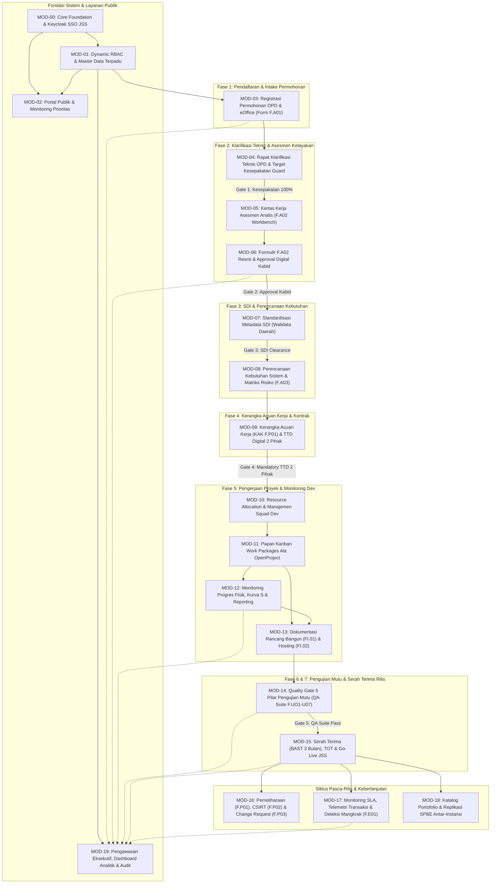

<!-- Dibuat oleh Bidang Sistem Informasi dan Statistik Dinas Komunikasi Informatika dan Persandian Kota Yogyakarta -->
# 📘 BLUEPRINT — SISTEM INFORMASI PROJECT (MANAJEMEN & PELACAKAN SIKLUS HIDUP APLIKASI SPBE)
> Dokumen gabungan **BRD + PRD + SRS + MODULAR IMPLEMENTATION PLAN + APPLE HIG UI SPEC** — Referensi spesifikasi tunggal untuk vibe engineering & agentic coding di Google Antigravity 2.0.
> Acuan Hukum & Standar: **Keputusan Wali Kota Yogyakarta Nomor 108 Tahun 2026 tentang Penetapan Standar Teknis dan Prosedur Pembangunan dan Pengembangan Aplikasi Khusus SPBE** · Perpres 95/2018 SPBE · Perpres 132/2022 Arsitektur SPBE · Permenkomdigi No. 6/2025 · BABOK v3 · ISO/IEC/IEEE 29148:2018 · ISO/IEC 25010 · Apple Human Interface Guidelines (HIG).

---

## 1. Informasi Dokumen

| Field | Nilai |
| :--- | :--- |
| **Judul Sistem** | Project — Sistem Informasi Manajemen Permohonan & Pelacakan Siklus Hidup Aplikasi SPBE Kota Yogyakarta |
| **Kode Dokumen** | `BLUEPRINT-PROJECT-V2.0` |
| **Versi Dokumen** | `2.0.0` (Full Lifecycle Compliance Kepwal 108/2026) |
| **Tanggal Terbit** | 31 Agustus 2026 |
| **Status Dokumen** | `DISETUJUI (APPROVED & FULL SSOT AUDIT PASSED)` |
| **Dasar Regulasi Acuan** | Keputusan Wali Kota Yogyakarta Nomor 108 Tahun 2026 tentang Standar Teknis & Prosedur Pembangunan/Pengembangan Aplikasi Khusus SPBE |
| **Pemilik Sistem (Product Owner)** | Dinas Komunikasi Informatika dan Persandian Kota Yogyakarta |
| **Interviewer & Lead Architect** | Antigravity Requirement Engineer & System Architect |
| **Mode SRS** | Mode B — Konseptual Diskominfo Standard Stack |
| **Target Eksekusi** | Google Antigravity 2.0 (Go Clean Arch + React Vite + PostgreSQL 16 + MinIO + Keycloak SSO JSS) |

### Riwayat Revisi

| Versi | Tanggal | Deskripsi Perubahan | Penulis |
| :---: | :---: | :--- | :--- |
| `0.1.0` | 2026-08-30 | Inisiasi ekstraksi kebutuhan bisnis dari mockup UI front-end publik dan formulir F.A01 s/d F.A03 | Tim Pengembang |
| `1.0.0` | 2026-08-30 | Finalisasi blueprint awal (BRD, PRD, SRS, MOD-00 s/d MOD-06, dan UI Specs Apple HIG) | Lead Architect & Diskominfo |
| `1.1.0` | 2026-08-30 | Penyesuaian integrasi eOffice dan 4 pengujian mutu (F.UO3, F.UO4/BA UAT, Pentest, Stress Test) | Lead Architect & Diskominfo |
| `1.2.0` | 2026-08-30 | Sinkronisasi pembagian form input digital vs MinIO upload | Lead Architect & Diskominfo |
| `2.0.0` | 2026-08-31 | **Hasil Audit SSOT Kepwal 108/2026**: Integrasi 10 Siklus Lengkap (F.P01 Pemeliharaan, F.P02 Insiden CSIRT, F.P03 Change Request, F.E01 Monev & SLA 3 Bulan, F.RA01/RA02 Replikasi SPBE, FI.02 Hosting/Subdomain), perincian alur proses bisnis [Aktor] vs [Sistem], standardisasi 6 bagian wajib SRS-F, dan ekspansi modul MOD-00 s/d MOD-09. | Lead Architect & Diskominfo Auditor |

---

## 2. Ringkasan Eksekutif

Aplikasi **Project** dibangun oleh Dinas Komunikasi Informatika dan Persandian Kota Yogyakarta sebagai platform digital sentral untuk tata kelola siklus hidup perangkat lunak SPBE mengacu penuh pada **Keputusan Wali Kota Yogyakarta Nomor 108 Tahun 2026 tentang Standar Teknis dan Prosedur Pembangunan dan Pengembangan Aplikasi Khusus SPBE**. 

Sistem ini memadukan **Formulir Input Digital Interaktif (dengan auto-generate PDF ber-KOP Naskah Dinas)** dan **Repositori Upload Berkas Digital (MinIO Object Storage)** yang mengawal 10 tahapan siklus hidup aplikasi pemerintah:

```
[1. Permohonan] ──> [2. Verifikasi & Kelayakan] ──> [3. Perencanaan] ──> [4. Rancang Bangun & Implementasi] ──> [5. Pengujian Mutu (5 Instrumen)]
       │
       └──> [6. Serah Terima & Rilis Layanan] ──> [7. Operasional & Subdomain] ──> [8. Pemeliharaan & CR] ──> [9. Monev & SLA 3 Bulan] ──> [10. Replikasi SPBE]
```

---

## 3. Matriks Standarisasi Formulir Kepwal 108/2026 (Digital vs MinIO)

| Kode Form / Dokumen | Nama Formulir / Berkas Resmi | Tipe di Sistem | Aktor Pengelola | Tahapan Siklus Kepwal |
| :--- | :--- | :---: | :---: | :---: |
| **`F.A01`** | **Formulir Pengajuan Pengembangan Aplikasi SPBE** | 📝 **Input Digital** + Cetak PDF | PIC Pemohon OPD | 1. Permohonan / Analisis |
| **Lampiran `F.A01`** | 4 Berkas: Dasar Hukum, SOP, Contoh Laporan, Dokumen Lainnya | 📂 **Upload PDF (MinIO)** | PIC Pemohon OPD | 1. Permohonan / Analisis |
| **Surat eOffice** | Surat Resmi Permohonan OPD ber-Nomor Registrasi | 📂 **Upload / Input Ref** | PIC Pemohon OPD | 2. Verifikasi eOffice |
| **`F.A02`** | **Formulir Analisis Kelayakan Pengembangan Aplikasi SPBE** (12 Bagian) | 📝 **Input Digital** + Cetak PDF | Tim Analis & Kabid | 2. Analisis Kelayakan |
| **`F.P01 (Perencanaan)`**| **Dokumen Kerangka Acuan Kerja (KAK)** | 📂 **Upload PDF (MinIO)** | Tim Analis & Perencanaan | 3. Perencanaan |
| **`F.A03`** | **Formulir Analisis Kebutuhan Sistem** (*Software Requirement*) | 📝 **Input Digital** + Cetak PDF | Tim Bisnis Analis & Perencanaan | 3. Perencanaan |
| **`F.R01 (Rancang)`**| **Dokumen Rancang Bangun Aplikasi (Arsitektur, ERD, UI)** | 📂 **Upload PDF (MinIO)** | Tim Developer / Arsitek | 4. Rancang Bangun |
| **`FI.01`** | **Dokumen Pengembangan Aplikasi SPBE (Backend/Frontend)** | 📂 **Upload PDF / Link Git** | Tim Developer / Programmer | 4. Implementasi |
| **`FI.02`** | **Formulir Permohonan Hosting Aplikasi & Subdomain** | 📝 **Input Digital** + Cetak PDF | Tim Developer ke Bid. IT | 4. Implementasi & Rilis |
| **`F.UO1`** | **Formulir Rencana Pengujian Aplikasi (Test Plan)** | 📝 **Input Digital** + Cetak PDF | Ketua Tim Kerja & Kabid | 5. Pengujian |
| **`F.UO2`** | **Formulir Pengujian Integrasi Sistem (Integration Test)** | 📝 **Input Digital** + Cetak PDF | Tim Pengembang / Integrator | 5. Pengujian |
| **`F.UO3`** | **Formulir Pengujian Fungsional (Functional Testing)** | 📝 **Input Digital** + Cetak PDF | Tim QA / Analis & Kabid | 5. Pengujian |
| **`F.UO4`** | **Dokumen UAT (User Acceptance Test)** | 📝 **Input Digital** + Cetak PDF | Penguji 1 & 2, Tim Analis | 5. Pengujian |
| **`F.UO5`** | **Berita Acara UAT (User Acceptance Test)** | 📝 **Input Digital** + Cetak PDF | Klien OPD, Tim Kerja & Kabid | 5. Pengujian |
| **`F.U06` / Pentest** | **Laporan Pengujian Keamanan (Pentest Report CSIRT)** | 📂 **Upload PDF (MinIO)** | Bidang Persandian / Pentester | 5. Pengujian |
| **`F.U07` / Stress** | **Formulir Pengujian Beban (Performance & Stress Test)** | 📝 **Input Digital** + Upload Raw | Tim DevOps / Admin Server | 5. Pengujian |
| **`F.SR01`** | **Berita Acara Serah Terima Aplikasi Khusus (BAST)** | 📝 **Input Digital** + Cetak PDF | Pihak I & II (Kominfo & OPD) | 6. Serah Terima |
| **`F.R01 (Rilis)`** | **Berita Acara Training of Trainer (TOT)** | 📝 **Input Digital** + Cetak PDF | Tim Pelatih & Peserta OPD | 7. Rilis Layanan |
| **`F.R02`** | **Format SK Penetapan Aplikasi Khusus** | 📝 **Input Digital / Template** | Kepala OPD Pemilik Layanan | 7. Rilis Layanan |
| **`F.R03`** | **Format SK Tim Pengelola Aplikasi Khusus** | 📝 **Input Digital / Template** | Kepala OPD Pemilik Layanan | 7. Rilis Layanan |
| **`F.R04`** | **Formulir Checklist Kesiapan Rilis Aplikasi Khusus** | 📝 **Input Digital** + Cetak PDF | Tim Produksi & Tim Rilis | 7. Rilis Layanan |
| **`F.P01 (Maint)`** | **Formulir Pencatatan Pemeliharaan Aplikasi** | 📝 **Input Digital** + Cetak PDF | Unit Pengelola / Tim Dev | 8. Pemeliharaan |
| **`F.P02`** | **Format Laporan Insiden Keamanan Informasi (CSIRT)** | 📝 **Input Digital** + Cetak PDF | Jogjakarta CSIRT | 8. Pemeliharaan |
| **`F.P03`** | **Formulir Change Request (CR Permohonan Perubahan)** | 📝 **Input Digital** + Cetak PDF | PIC OPD Pemohon CR | 8. Pemeliharaan & CR |
| **`F.E01`** | **Formulir Evaluasi Penggunaan Aplikasi (Monev 3 Bulan/SLA)** | 📝 **Input Digital** + Cetak PDF | Tim Monev & Perencanaan | 9. Pemantauan & Evaluasi |
| **`F.RA01`** | **Formulir Assessment Replikasi Aplikasi SPBE** | 📝 **Input Digital** + Cetak PDF | OPD/Instansi Pemohon Replikasi | 10. Replikasi SPBE |
| **`F.RA02`** | **Formulir Kelayakan Replikasi Aplikasi SPBE** | 📝 **Input Digital** + Cetak PDF | Tim Analis Replikasi Kominfo | 10. Replikasi SPBE |

---

# BAGIAN A — BRD (Business Requirements Document)

## A.1. Latar Belakang & Konteks Bisnis

- **A.1.1. Kondisi Bisnis Saat Ini (As-Is)**:
  Sebelumnya, permohonan aplikasi diajukan melalui surat lepas tanpa standardisasi tahapan teknis terpadu. OPD langsung mem-*bypass* ke tim *developer* (Seksi Perangkat Lunak) tanpa *assessment* kelayakan SPBE dari Seksi Perencanaan dan tanpa standarisasi metadata dari Seksi Data Statistik. Hal ini memicu aplikasi yang tidak terkontrol (idle/mangkrak), *scope creep*, dan data *silo* pasca-rilis.
- **A.1.2. Kondisi Target (To-Be - Siklus Hidup Aplikasi SPBE)**:
  1. **Fase 1: Inisiasi & Pengajuan Layanan (Form F.A01 & eOffice):** OPD/Vendor *wajib* mengisi form digital pengajuan (Form **F.A01**) yang mencakup Informasi Permohonan, Informasi Umum Aplikasi, dan 4 Lampiran Dokumen Wajib (SOP, Dasar Hukum, Contoh Laporan, Dokumen Lainnya) yang diunggah ke MinIO, serta validasi nomor surat dinas resmi **eOffice**.
     - **Output Resmi Fase 1:**
       - **Nomor Registrasi Unik SPBE:** Berformat `REG-YYYYMMDD-XXXX` sebagai nomor tiket tunggal pelacakan end-to-end.
       - **Dokumen Cetak Formulir F.A01 PDF:** Ber-KOP naskah dinas resmi Pemkot Yogyakarta lengkap dengan QR-code bukti tanda terima pengajuan.
       - **Bundel 4 Lampiran Dokumen Sah:** Terverifikasi magic bytes PDF dan tersimpan di MinIO Object Storage.
       - **Tiket Masuk Antrean Analis:** Berstatus `Menunggu Telaah Kelayakan (F.A02)` pada dashboard Seksi Perencanaan untuk diproses ke Fase 2.
  2. **Fase 2: Asesmen Kelayakan & Klarifikasi Teknis (Rapat Klarifikasi Teknis OPD & Form F.A02 Resmi):** Tiket masuk pertama kali diterima oleh **Ketua Tim Kerja Perencanaan** yang melakukan penugasan resmi (*resource allocation*): menugaskan **Tim Analis Kelayakan (Lead Analis F.A02)** dan **Business Analyst (BA Bisnis Proses)**.
     - Tim Analis & BA mengeksekusi **Modul Manajemen Rapat Klarifikasi Teknis OPD (Multi-Sesi)**: studio inisiasi rapat terjadwal, validasi *Target Kesepakatan Checklist 100%* (Mandatory Guard), risalah notulensi format dokumen MS Word & bukti foto ke MinIO, pelacak tindak lanjut tugas perbaikan OPD, serta daftar hadir digital & TTE Berita Acara Rapat Klarifikasi.
     - Tim Analis mengeksekusi **Kertas Kerja Asesmen Analis 4 Pilar (Form F.A02 Workbench)**: Uji Redundansi Katalog Aplikasi Pemkot, Pemetaan Arsitektur & Regulasi, Rubrik Penilaian Berbobot 12 Bagian & Eviden Sah, serta Kalkulasi Skor Kelayakan & Kuadran McFarlan-Peppard.
     - Seluruh hasil evaluasi kertas kerja disajikan pada panel referensi, lalu Tim Analis melakukan **Pengisian Manual Formulir F.A02 Resmi** (Nomor Surat Dinas Telaah, Ringkasan Eksekutif, Pertimbangan Analis, dan Rekomendasi Resmi) sebelum diajukan ke Approval Digital Kabid Pengembangan Aplikasi.
  3. **Fase 3: Standardisasi Metadata Satu Data Indonesia / SDI (Walidata Daerah):** Permohonan yang telah lolos telaah F.A02 dan disahkan Kabid diteruskan ke Seksi Data Statistik (Walidata Daerah). **Tahap ini WAJIB CLEAR TERLEBIH DAHULU sebelum masuk ke analisis kebutuhan teknis**: memverifikasi Kamus Data, Standar Data, Kode Referensi Data Induk Pemkot, dan Interoperabilitas SPLP hingga diterbitkannya **Rekomendasi Walidata SDI (Clearance Metadata Sah 100%)**. Bila struktur data belum standar / duplikat, tiket dikembalikan ke OPD untuk perbaikan kamus data.
  4. **Fase 4: Perencanaan Teknis & Penandatanganan KAK Bersama (Form F.A03 & Penandatanganan KAK F.P01 Kedua Belah Pihak):** Setelah Metadata SDI dinyatakan Clear 100%, Tim Bisnis Analis & Arsitek Sistem memproses perencanaan teknis:
     - Penyusunan Formulir **F.A03** Software Requirements (kebutuhan fungsional per role, non-fungsional SLA/keamanan, matriks mitigasi risiko).
     - Penyusunan Draf Kerangka Acuan Kerja KAK Teknis (**F.P01**) dan Blueprint Rancang Bangun Sistem.
     - Sesi Pembahasan & Harmonisasi Draf KAK bersama Tim Teknis OPD Pemohon untuk mengunci ruang lingkup pekerjaan.
     - **Penandatanganan Digital KAK oleh Kedua Belah Pihak (Mandatory Contract Gate):** Dokumen KAK F.P01 wajib ditandatangani secara digital oleh **Pihak I (Kepala Bidang / Diskominfo)** dan **Pihak II (Kepala OPD / PPK Pemohon)**. Penandatanganan kedua belah pihak ini menjadi komitmen sah ruang lingkup dan alokasi waktu.
     - **Quality Guard:** Status tiket HANYA dapat bertransisi menjadi **Ready for Dev** apabila KAK telah ditandatangani oleh kedua belah pihak dan seluruh dokumen perencanaan terkunci permanen di MinIO. Tim pengembang dilarang memulai koding sebelum KAK disahkan kedua pihak (*mencegah scope creep*).
  5. **Fase 5: Pengembangan Sistem / Development (Papan Kerja Ala OpenProject & Eksekusi FI.01/FI.02):** Tiket berstatus `Ready for Dev` diterima Ketua Tim Kerja Perangkat Lunak. Proses pengembangan dijalankan secara terstruktur:
     - **Alokasi Squad Pengembang:** Penugasan Project Manager (PM), Desainer Sistem Informasi (DSI UI-UX), Backend Dev, Frontend Dev, dan QA.
     - **Sprint Kickoff & Koordinasi Teknis:** Bedah F.A03, KAK F.P01, penetapan milestone sprint, arsitektur tech stack, dan branching Git.
     - **Papan Kerja Work Packages (Ala OpenProject):** Manajemen kartu kerja kanban (`Backlog` ➔ `To Do` ➔ `In Progress` ➔ `Review` ➔ `Done`), pelacak persentase progres fisik pengembangan secara real-time (0% s/d 100%), dan integrasi commit Git.
     - **Dokumentasi & Infrastruktur:** Pengisian Form **FI.01** (Dokumentasi Rancang Bangun & Kodefikasi), pengajuan Form **FI.02** (Hosting & Subdomain ke Bidang IT), serta deployment build ke lingkungan Staging Sandbox Pemkot.
  6. **Fase 6: Pengujian Mutu Sistem / QA Suite (5 Pilar Kepwal 108/2026):** Setelah progres pengembangan fisik mencapai 100% dan deploy ke staging, tim QA mengeksekusi 5 Pilar Pengujian Mutu (Form **F.UO1 s/d F.U07**):
     - Rencana Uji Sistem (Form **F.UO1**).
     - Pilar 1: Pengujian Integrasi (Form **F.UO2**).
     - Pilar 2: Pengujian Fungsional Sistem (Form **F.UO3**).
     - Pilar 3: Pengujian Penerimaan Pengguna UAT OPD (Form **F.UO4**) & Berita Acara UAT (Form **F.UO5**).
     - Pilar 4: Pengujian Keamanan Pentest CSIRT (Form **F.U06**).
     - Pilar 5: Pengujian Beban & Stress Test k6 (Form **F.U07**).
     - **Quality Gate:** Lulus 100% seluruh pilar (Nol bug High/Critical, UAT disetujui, dan Pentest Clear) sebelum dapat melangkah ke tahap serah terima.
  7. **Fase 7: Serah Terima & Rilis Layanan Produksi (F.SR01 s/d F.R04):** Setelah seluruh pengujian mutu lulus, dilaksanakan proses serah terima dan go-live:
     - Penandatanganan Berita Acara Serah Terima BAST (Form **F.SR01**) antara Diskominfo dan OPD dengan klausul mandatori aplikasi wajib aktif bertransaksi minimal 3 bulan di JSS.
     - Pelaksanaan pelatihan pengguna dan penandatanganan Berita Acara Training of Trainers TOT (Form **F.R01**).
     - Penerbitan Surat Keputusan Tim Pengelola Aplikasi OPD (Form **F.R02 / F.R03**).
     - Pemeriksaan Checklist Kesiapan Rilis Produksi (Form **F.R04**), verifikasi DNS/SSL, dan integrasi SSO JSS.
     - Aplikasi aktif beroperasi di lingkungan produksi dan didaftarkan ke sistem pemantauan berkala (Monev SLA 3 Bulan Form **F.E01**).

  **Diagram Alur Kerja Target (To-Be) per Fase:**

  **1. Fase 1: Inisiasi & Pengajuan Layanan (Form F.A01 & eOffice)**
  ```mermaid
  flowchart TD
      A["👤 OPD / PIC Pemohon<br/>(Unit Kerja Pemohon se-Kota Yogyakarta)"]
      
      A -->|"1. Input Data Pokok & Probis"| B["📝 Draf Permohonan Form F.A01<br/>• Info Pemohon & Judul Usulan<br/>• Urgensi, Probis & Dampak jika Tidak Dibangun"]
      
      B -->|"2. Unggah 4 Dokumen Sah"| C["📂 Repositori MinIO Storage<br/>• Dokumen Dasar Hukum (PDF)<br/>• SOP Pelayanan / Bisnis Proses (PDF)<br/>• Contoh Laporan / Output Manual (PDF)<br/>• Dokumen Pendukung Lainnya (PDF)"]
      
      C -->|"3. Naskah Dinas Resmi"| D["📬 Integrasi Surat eOffice Pemkot<br/>• Input Nomor & Tanggal Surat Dinas OPD<br/>• Verifikasi Surat Resmi Masuk"]
      
      D -->|"4. Final Submit & Penguncian Berkas"| E["📥 Sistem Antrean Seksi Perencanaan Diskominfo"]
      
      E -->|"Menerbitkan Artefak Sah"| OutFase1
      
      subgraph OutFase1 ["🎯 4 OUTPUT RESMI FASE 1"]
          direction TB
          O1["🎫 1. Nomor Registrasi Unik SPBE<br/>Format Resmi: REG-YYYYMMDD-XXXX (ID Tunggal Sistem)"]
          O2["📄 2. Dokumen Cetak Form F.A01 PDF<br/>Ber-KOP Resmi Naskah Dinas Pemkot + QR Code Tanda Terima Digital"]
          O3["🗂️ 3. Bundel 4 Berkas Lampiran Sah<br/>Tervalidasi Magic Bytes PDF di Object Storage MinIO"]
          O4["📌 4. Tiket Masuk Antrean Analis Aktif<br/>Status: 'Menunggu Telaah Kelayakan (F.A02)'"]
          
          O1 --> O2 --> O3 --> O4
      end
      
      OutFase1 -->|"➡️ Diteruskan ke Tahap Berikutnya"| Next["🔬 FASE 2: ASESMEN KELAYAKAN & KLARIFIKASI TEKNIS<br/>• Manajemen Rapat Klarifikasi Teknis OPD (Multi-Sesi)<br/>• Kertas Kerja Asesmen Analis F.A02"]
  ```

  **2. Fase 2: Asesmen Kelayakan & Klarifikasi Teknis (Rapat Klarifikasi Teknis OPD & Form F.A02 Resmi)**
  ```mermaid
  flowchart TD
      A["📥 Tiket Masuk F.A01<br/>(Terverifikasi eOffice)"] --> LeadPlan["👤 Ketua Tim Kerja Perencanaan<br/>(Seksi Perencanaan TI)"]
      
      LeadPlan --> PlanTeamAssign
      
      subgraph PlanTeamAssign ["👥 PENUGASAN TIM TELAAH PERENCANAAN"]
          direction TB
          AS1["1. Penugasan Lead Analis Kelayakan (F.A02)<br/>• Memimpin Rapat Klarifikasi Teknis OPD<br/>• Pelaksana Kertas Kerja Asesmen 4 Pilar"]
          AS2["2. Penugasan Business Analyst (BA Bisnis Proses)<br/>• Analisis SOP, Regulasi & Probis Pemohon<br/>• Pendamping Analisis Kebutuhan Sistem"]
          
          AS1 --- AS2
      end
      
      PlanTeamAssign --> RapatKlarifikasi
      PlanTeamAssign --> Workbench
      
      subgraph RapatKlarifikasi ["🤝 MANAJEMEN RAPAT KLARIFIKASI TEKNIS OPD (Multi-Sesi)"]
          direction TB
          H1["1. Studio Inisiasi Rapat (Sesi #1, #2, dst.)<br/>• Penjadwalan rapat & tim hadir lintas instansi<br/>• Penetapan Target Kesepakatan Rapat"]
          H2["2. Pelaksanaan Rapat & Risalah Rich Text<br/>• Notulensi format dokumen MS Word<br/>• Unggah foto dokumentasi / sketsa ke MinIO"]
          H3["3. Pelacak Tindak Lanjut / Tugas Hasil Rapat<br/>• Penugasan revisi SOP / dokumen teknis OPD<br/>• Verifikasi dokumen perbaikan OPD"]
          H4["4. Gate Mandatori: Target Kesepakatan 100%<br/>• Guard: Ditolak jika target rapat belum 100% tercapai<br/>• Daftar Hadir Digital & Berita Acara Rapat TTE"]
          
          H1 --> H2 --> H3 --> H4
          H3 -- "Revisi Belum Lengkap" --> H1
      end
      
      subgraph Workbench ["🔬 KERTAS KERJA ASESMEN ANALIS (Form F.A02 Workbench)"]
          direction TB
          W1["1. Uji Redundansi & Katalog Aplikasi<br/>• Scan database aplikasi aktif Pemkot<br/>• Deteksi kemiripan fungsi / probis<br/>• Justifikasi diferensiasi sistem"]
          W2["2. Pemetaan Arsitektur SPBE & Regulasi<br/>• Validasi Tupoksi/SOTK Pemohon<br/>• Pemetaan Domain Layanan & Probis"]
          W3["3. Rubrik Penilaian Berbobot 12 Bagian<br/>• Scoring tingkat kematangan (Level 1-4)<br/>• Wajib tautkan bukti dukung (Evidence)<br/>• Knockout Check (Kriteria Gugur)"]
          W4["4. Scoring Engine & McFarlan Grid<br/>• Integrasi Skor Teknis + Berita Acara Rapat<br/>• Kuadran: Strategic / High Potential /<br/>  Key Operational / Support"]
          
          W1 --> W2 --> W3 --> W4
      end
      
      H4 -- "✅ Clearance Rapat Disahkan (Berita Acara Sah)" --> W4
      
      W4 --> SummaryWorkbench["📊 Tampilan Rekapitulasi Hasil Asesmen<br/>• Rekapitulasi Skor Total & Kuadran McFarlan<br/>• Status Redundansi, Regulasi & Eviden Sah<br/>• Status Clearance Rapat Klarifikasi Teknis"]
      
      SummaryWorkbench --> FormFA02Manual["✍️ Pengisian Manual Formulir F.A02 Resmi (oleh Analis)<br/>• Input Nomor & Tanggal Surat Dinas Telaah F.A02<br/>• Input Narasi Ringkasan Eksekutif & Pertimbangan Analis<br/>• Penetapan Rekomendasi Resmi (Lanjut Bangun / Berbagi Pakai / Ditolak)"]
      
      FormFA02Manual --> KabidAppr{"👔 Approval Digital Kabid<br/>Pengembangan Aplikasi"}
      KabidAppr -- "Perlu Koreksi Form / Nilai" --> FormFA02Manual
      
      KabidAppr -- "❌ Ditolak / Alihkan Berbagi Pakai" --> RejRedund["Ditolak / Dialihkan ke<br/>Berbagi Pakai Aplikasi Eksisting"]
      RejRedund -.-> RetOPD["Kembali ke OPD<br/>(Surat F.A02 Catatan Rekomendasi)"]
      
      KabidAppr -- "⚠️ Layak Bersyarat (Skor 60-79)" --> ReviseDoc["Dikembalikan untuk Perbaikan Dokumen / SOP"]
      ReviseDoc -.-> RetOPD
      
      KabidAppr -->|"✅ Disetujui Rekomtek (Skor ≥ 80)"| OutFase2["🎯 OUTPUT FASE 2: FORM F.A02 SAH<br/>• Berita Acara Rapat Klarifikasi Lengkap<br/>• Rekomtek SPBE Ber-TTD Digital Kabid"]
      
      OutFase2 -->|"➡️ Diteruskan ke Tahap Berikutnya"| NextFase3["📊 FASE 3: STANDARDISASI METADATA SDI<br/>(Walidata Daerah / Seksi Data Statistik)"]
  ```

  **3. Fase 3: Standardisasi Metadata Satu Data Indonesia (Walidata SDI)**
  ```mermaid
  flowchart TD
      InFase3["🎯 Tiket Lolos Telaah F.A02<br/>(Rekomtek SPBE Sah)"] --> WalidataOffice["📊 Seksi Data Statistik<br/>(Walidata Daerah)"]
      
      WalidataOffice --> WalidataSDI
      
      subgraph WalidataSDI ["📊 PROSES STANDARISASI METADATA SATU DATA INDONESIA (SDI)"]
          direction TB
          SDI1["1. Telaah Struktur Data & Usulan Variabel<br/>• Verifikasi Kamus Data OPD Pemohon<br/>• Validasi Standar Data (Definisi, Satuan, Klasifikasi)"]
          SDI2["2. Penyelarasan Kode Referensi & Interoperabilitas<br/>• Sinkronisasi Data Induk Pemkot Yogyakarta<br/>• Uji Kesiapan Berbagi Pakai API / SPLP"]
          SDI3["3. Clearance Walidata Daerah<br/>• Rekomendasi Walidata SDI Sah<br/>• Mandatory Check: Data Wajib Terstandar 100%"]
          
          SDI1 --> SDI2 --> SDI3
      end
      
      SDI1 -- "❌ Data Redundan / Belum Standar" --> RejSDI["Dikembalikan untuk Revisi Kamus Data OPD"]
      RejSDI -.-> RetOPD2["Kembali ke OPD<br/>(Catatan Rekomendasi Walidata)"]
      
      SDI3 -->|"✅ Metadata SDI CLEAR (Rekomendasi Walidata Sah)"| OutFase3["🎯 OUTPUT FASE 3: METADATA SDI CLEAR<br/>• Berita Acara Rekomendasi Walidata SDI Sah<br/>• Kamus Data & Standar Kode Terverifikasi 100%"]
      
      OutFase3 -->|"➡️ Diteruskan ke Tahap Berikutnya"| NextFase4["📋 FASE 4: PERENCANAAN TEKNIS & KESEPAKATAN KAK<br/>(Form F.A03 & Penandatanganan KAK Kedua Belah Pihak)"]
  ```

  **4. Fase 4: Perencanaan Teknis & Penandatanganan KAK Bersama (Form F.A03 & KAK F.P01)**
  ```mermaid
  flowchart TD
      InFase4["🎯 Tiket Lolos: Metadata SDI Clear<br/>(Kamus Data Terstandar)"] --> TimAnalisKebutuhan["👤 Tim Bisnis Analis & Arsitek Sistem<br/>(Seksi Perencanaan TI)"]
      
      TimAnalisKebutuhan --> AnalisisTeknis
      
      subgraph AnalisisTeknis ["📋 1. PENYUSUNAN DOKUMEN PERENCANAAN TEKNIS (F.A03 & F.P01)"]
          direction TB
          AN1["1. Penyusunan Software Requirements (Form F.A03)<br/>• Kebutuhan Fungsional per Role Pengguna<br/>• Non-Fungsional (SLA, Performa, Skalabilitas, Security)<br/>• Matriks Manajemen Risiko & Rencana Mitigasi"]
          AN2["2. Penyusunan Draf KAK Teknis (Form F.P01)<br/>• Kerangka Acuan Kerja (KAK Teknis)<br/>• Blueprint Rancang Bangun & Arsitektur Sistem<br/>• Spesifikasi Infrastruktur & Subdomain Awal"]
          
          AN1 --> AN2
      end
      
      AnalisisTeknis --> KAKReview
      
      subgraph KAKReview ["🤝 2. HARMONISASI & PEMBAHASAN KAK BERSAMA OPD"]
          direction TB
          REV1["Sesi Pembahasan Draf KAK Bersama Tim Teknis OPD"]
          REV2["Sinkronisasi Batasan Ruang Lingkup & Deliverables"]
          REV3["Finalisasi Dokumen KAK F.P01 & Form F.A03"]
          
          REV1 --> REV2 --> REV3
      end
      
      KAKReview --> KAKSigning
      
      subgraph KAKSigning ["✍️ 3. PENANDATANGANAN KAK KEDUA BELAH PIHAK (MANDATORY GATE)"]
          direction TB
          SIGN1["Pihak I: Kepala Bidang / Diskominfo<br/>(Penetapan KAK & Alokasi Resource Dev)"]
          SIGN2["Pihak II: Kepala OPD / PPK Pemohon<br/>(Komitmen Ruang Lingkup & Probis)"]
          LOCK["Penguncian Dokumen KAK F.P01 & F.A03 di MinIO<br/>(Kontrak Ruang Lingkup Tidak Boleh Berubah)"]
          
          SIGN1 --- SIGN2
          SIGN1 --> LOCK
          SIGN2 --> LOCK
      end
      
      LOCK -- "Ada Perubahan Ruang Lingkup" --> AnalisisTeknis
      
      LOCK -->|"✅ KAK Resmi Ditandatangani Kedua Belah Pihak"| OutFase4["🎯 OUTPUT FASE 4: DOKUMEN KAK SAH & TERKUNCI<br/>• Form F.A03 Software Requirements Final<br/>• KAK F.P01 Ber-TTD Digital Diskominfo & OPD<br/>• Status Tiket: Ready for Dev"]
      
      OutFase4 -->|"➡️ Diteruskan ke Seksi Perangkat Lunak"| NextFase5["💻 FASE 5: PENGEMBANGAN SISTEM (DEVELOPMENT)<br/>(Workspace Ala OpenProject, FI.01 & FI.02)"]
  ```

  **5. Fase 5: Pengembangan Sistem / Development (Workspace Ala OpenProject, FI.01 & FI.02)**
  ```mermaid
  flowchart TD
      ReadyDev["🎯 Tiket Masuk: Status Ready for Dev<br/>(Dokumen F.A03 & KAK F.P01 Ditandatangani 2 Pihak)"] --> DevLead["👤 Ketua Tim Kerja Perangkat Lunak<br/>(Seksi Pengembangan Aplikasi)"]
      
      DevLead --> SquadForm
      
      subgraph SquadForm ["👥 1. PEMBENTUKAN SQUAD PROJECT (RESOURCE ALLOCATION)"]
          direction TB
          SQ1["Penugasan Project Manager (PM / Ketua Tim Teknis)"]
          SQ2["Penugasan Desainer Sistem Informasi (DSI / UI-UX)"]
          SQ3["Penugasan Software Engineer (Backend & Frontend Dev)"]
          SQ4["Penugasan Software Tester / Quality Assurance (QA)"]
          
          SQ1 --> SQ2 --> SQ3 --> SQ4
      end
      
      SquadForm --> DevKickoff
      
      subgraph DevKickoff ["🤝 2. SPRINT KICKOFF & KOORDINASI TEKNIS DEV"]
          direction TB
          M1["Bedah F.A03, KAK F.P01 & Standar Metadata SDI"]
          M2["Penetapan Sprint Milestones & Arsitektur Tech Stack"]
          M3["Inisialisasi Repositori Git & Branching Strategy"]
          M4["Risalah Rapat Koordinasi Dev & Target Deliverables"]
          
          M1 --> M2 --> M3 --> M4
      end
      
      DevKickoff --> DevBoard
      
      subgraph DevBoard ["📊 3. PAPAN KERJA SPRINT & MONITORING PROGRES (ALA OPENPROJECT)"]
          direction TB
          OP1["Papan Kerja Work Packages (Backlog ➔ To Do ➔ In Progress ➔ Review ➔ Done)"]
          OP2["Task DSI / UI-UX: Wireframing, Desain UI & Prototipe Figma"]
          OP3["Task Backend Dev: Skema DB, Endpoint REST/SPLP & Logic"]
          OP4["Task Frontend Dev: Slicing UI, Integrasi API & Validasi Input"]
          OP5["Pelacak Real-Time Progres Fisik (% Selesai) & Stream Commit Git"]
          
          OP1 --> OP2 & OP3 & OP4 --> OP5
      end
      
      DevBoard --> DevArtefak
      
      subgraph DevArtefak ["📝 4. DOKUMENTASI RANCANG BANGUN & INFRASTRUKTUR"]
          direction TB
          FI01["Pengisian Form FI.01 (Dokumentasi Rancang Bangun & Kodefikasi)"]
          FI02["Pengajuan Form FI.02 (Permohonan Hosting & Subdomain ke Bid. IT)"]
          StagingDeploy["Deployment Build ke Lingkungan Staging / Sandbox Pemkot"]
          
          FI01 --> FI02 --> StagingDeploy
      end
      
      StagingDeploy -->|"✅ Progres Fisik 100% & Deploy Staging Sukses"| OutFase5["🎯 OUTPUT FASE 5: BUILD APLIKASI SELESAI<br/>• Source Code Repositori Git & Tag Rilis<br/>• Form FI.01 & FI.02 Lengkap<br/>• Aplikasi Aktif di Server Staging"]
      
      OutFase5 -->|"➡️ Diteruskan ke Tim Penguji"| NextFase6["🛡️ FASE 6: PENGUJIAN MUTU SISTEM (QA SUITE)<br/>(Quality Gate: 5 Pilar Kepwal 108/2026)"]
  ```

  **6. Fase 6: Pengujian Mutu Sistem / QA Suite (5 Pilar Kepwal 108/2026)**
  ```mermaid
  flowchart TD
      InFase6["🎯 Tiket Masuk: Build Staging Siap Uji<br/>(Dokumen FI.01 & FI.02 Lengkap)"] --> QALead["👤 Tim QA & Software Tester<br/>(Didampingi CSIRT & OPD)"]
      
      QALead --> TestPlan["📋 Penyusunan Rencana Uji Mutu Sistem (Form F.UO1)"]
      
      TestPlan --> QASuite
      
      subgraph QASuite ["🛡️ EKSEKUSI 5 PILAR PENGUJIAN MUTU SPBE"]
          direction TB
          Q1["Pilar 1: Pengujian Integrasi (Form F.UO2)<br/>• Uji interoperabilitas API, DB koneksi & SPLP"]
          Q2["Pilar 2: Pengujian Fungsional Sistem (Form F.UO3)<br/>• Verifikasi kelayakan alur fitur sesuai F.A03"]
          Q3["Pilar 3: Pengujian Penerimaan UAT OPD (Form F.UO4 & BA F.UO5)<br/>• Pengujian end-to-end oleh PIC OPD pemohon"]
          Q4["Pilar 4: Pengujian Keamanan Pentest CSIRT (Form F.U06)<br/>• Asesmen kerentanan web & penetrasi oleh CSIRT"]
          Q5["Pilar 5: Pengujian Beban & Stress Test k6 (Form F.U07)<br/>• Pengujian konkurensi, respon time & beban puncak"]
          
          Q1 --> Q2 --> Q3 --> Q4 --> Q5
      end
      
      Q2 -- "Ada Bug Fungsional" --> DevFix["Kembali ke Papan Kerja Dev (Fase 5)<br/>untuk Perbaikan Bug"]
      Q3 -- "Catatan Revisi UAT OPD" --> DevFix
      Q4 -- "Temuan Kerentanan High/Critical" --> DevFix
      
      QASuite -->|"✅ Seluruh 5 Pengujian LULUS MUTU (Nol Bug Kritis)"| OutFase6["🎯 OUTPUT FASE 6: SERTIFIKASI UJI MUTU SPBE SAH<br/>• Form F.UO1 s/d F.U07 Lengkap & Ditandatangani<br/>• Laporan Pentest CSIRT & Berita Acara UAT Sah"]
      
      OutFase6 -->|"➡️ Diteruskan ke Tahap Serah Terima"| NextFase7["🚀 FASE 7: SERAH TERIMA & RILIS LAYANAN<br/>(BAST F.SR01, TOT, SK Pengelola & Rilis F.R04)"]
  ```

  **7. Fase 7: Serah Terima & Rilis Layanan Produksi (F.SR01 s/d F.R04)**
  ```mermaid
  flowchart TD
      InFase7["🎯 Tiket Masuk: Lulus Quality Gate 5 Pilar<br/>(Hasil Uji Mutu SPBE Sah)"] --> HandoverTeam["👥 Tim Serah Terima & Tim Rilis<br/>(Diskominfo & OPD Pemohon)"]
      
      HandoverTeam --> HandoverRelease
      
      subgraph HandoverRelease ["🚀 PROSES SERAH TERIMA & RILIS PRODUKSI"]
          direction TB
          HR1["1. Berita Acara Serah Terima BAST (Form F.SR01)<br/>• TTE Pihak I Diskominfo & Pihak II OPD<br/>• Klausul Mandatori: Aplikasi Wajib Aktif Minimal 3 Bulan di JSS"]
          HR2["2. Berita Acara Pelatihan Pengguna / TOT (Form F.R01)<br/>• Pelaksanaan pelatihan admin & operator OPD"]
          HR3["3. Penetapan SK Tim Pengelola Aplikasi OPD (Form F.R02 / F.R03)<br/>• Legalitas admin pengampu dan penanggung jawab data"]
          HR4["4. Checklist Kesiapan Rilis Produksi (Form F.R04)<br/>• Verifikasi DNS *.jogjakota.go.id, SSL, SSO JSS & Foto MinIO"]
          HR5["5. Go-Live Produksi & Publikasi ke JSS<br/>• Deploy ke server produksi Data Center Pemkot"]
          
          HR1 --> HR2 --> HR3 --> HR4 --> HR5
      end
      
      HandoverRelease --> OutFase7["🎯 OUTPUT FASE 7: APLIKASI AKTIF / PRODUKSI DI JSS<br/>• BAST F.SR01 Sah Bertanda Tangan Kedua Belah Pihak<br/>• Aplikasi Tayang & Aktif Digunakan di JSS<br/>• Terdaftar pada Siklus Monitoring 3 Bulan (Form F.E01)"]
      
      OutFase7 --> PostRelease["📈 SIKLUS PASCA-RILIS (OPERASIONAL & MONEV)<br/>• Pemeliharaan & Change Request (F.P01, F.P02, F.P03)<br/>• Monitoring Kepatuhan Transaksi 3 Bulan (F.E01)<br/>• Katalog Replikasi Aplikasi SPBE (F.RA01 & F.RA02)"]
  ```

- **A.1.3. Pemicu Perubahan**:
  Ditetapkannya **Keputusan Wali Kota Yogyakarta Nomor 108 Tahun 2026** mencabut Kepwal 278/2024 dan menyelaraskan dengan Permenkomdigi No. 6/2025 serta Perpres 132/2022. Regulasi ini mewajibkan kontrol ketat 10 tahapan SPBE, audit keamanan CSIRT, kepatuhan SLA 90%, klausul pemanfaatan 3 bulan, dan standarisasi replikasi.
- **A.1.4. Kaitan dengan Strategi Organisasi**:
  Menjadikan Pemerintah Kota Yogyakarta sebagai *Government as a Platform* yang terintegrasi penuh dalam ekosistem Super-App Jogja Smart Service (JSS) dan Satu Data Daerah.

## A.2. Pernyataan Masalah & Peluang

- **A.2.1. Problem Statement**:
  *"Ketiadaan platform pelacakan end-to-end yang mencakup pra-pengembangan hingga pasca-rilis mengakibatkan disparitas standar mutu software, ketidakpatuhan terhadap 5 instrumen pengujian SPBE, tidak terkontrolnya perubahan fitur (scope creep), serta tingginya risiko aplikasi mangkrak (idle) tanpa mekanisme evaluasi otomatis."*
- **A.2.2. Value Proposition (Peluang Solusi)**:
  Membangun Sistem Informasi **Project** yang mengotomatisasi seluruh alur 10 tahapan Kepwal 108/2026: intake digital multi-step, validasi eOffice, telaah kelayakan 12 bagian, 5 pilar pengujian mutu, checklist rilis terstandarisasi, registrasi tiket pemeliharaan & CR, evaluasi keaktifan 3 bulan, serta portal replikasi SPBE.

## A.3. Tujuan Bisnis & KPI (SMART)

| ID | Tujuan Bisnis | Metrik (KPI) | Baseline | Target | Periode Ukur |
| :---: | :--- | :--- | :---: | :---: | :---: |
| `TUJ-01` | Transparansi progres permohonan SPBE bagi seluruh OPD | Penurunan jumlah pertanyaan manual status pengerjaan | ~30 inquiry/mgg | < 2 inquiry/mgg | Triwulanan |
| `TUJ-02` | Percepatan waktu verifikasi & telaah kelayakan permohonan | SLA verifikasi form F.A02 & eOffice | 14 hari kerja | ≤ 3 hari kerja | Bulanan |
| `TUJ-03` | Standarisasi kelengkapan dokumen teknis & artefak SPBE | Persentase aplikasi berstatus Selesai yang memiliki arsip digital 100% lengkap | ~40% | 100% Terverifikasi | Semesteran |
| `TUJ-04` | Pengendalian masa pakai & eliminasi aplikasi mangkrak | Evaluasi kepatuhan transaksi 3 bulan (F.E01) & SLA $\ge 90\%$ | 0% termonitor | 100% Termonitor | Triwulanan |
| `TUJ-05` | Efisiensi belanja TI melalui Replikasi SPBE | Jumlah aplikasi yang berhasil direplikasi tanpa bangun ulang | 0 replikasi | $\ge 5$ replikasi/thn | Tahunan |

## A.4. Ruang Lingkup Sistem

### A.4.1. In-Scope:
1. **Portal Publik & Monitoring Prioritas**: Hero Banner, Ringkasan Statistik 6 Status, Top 10 Prioritas Stepper, Pencarian & Filter Publik.
2. **Modul Permohonan OPD (F.A01 & eOffice)**: Multi-step intake PIC OPD via SSO JSS, No. Registrasi unik, 4 Dokumen Lampiran MinIO, Validasi Nomor Surat Dinas eOffice, Cetak PDF KOP Naskah Dinas.
3. **Modul Manajemen Rapat Klarifikasi Teknis OPD (Multi-Sesi)**: Master Index seluruh usulan aplikasi dalam rapat klarifikasi, Studio inisiasi rapat multi-sesi, target kesepakatan checklist guard (mandatori 100% terpenuhi), editor notulensi format dokumen MS Word & unggah bukti foto rapat ke MinIO, pelacak tindak lanjut tugas perbaikan OPD, daftar hadir digital & TTE Berita Acara Rapat Klarifikasi.
4. **Modul Analisis Kelayakan & Approval (F.A02 - Assessment Workbench)**: Disposisi Tim Telaah (Ketua Tim Kerja assign Lead Analis F.A02 & Business Analyst BA), Kertas kerja asesmen 4 pilar (Uji Redundansi Katalog, Pemetaan Arsitektur, Rubrik 12 Bagian berbobot Level 1-4 & Eviden Sah), integrasi clearance berita acara rapat klarifikasi, scoring engine otomatis, kuadran McFarlan-Peppard, Panel Tampilan Rekapitulasi Hasil Asesmen, Pengisian Manual Form F.A02 Resmi oleh Analis, Rekomendasi Tindak Lanjut, Approval Digital Kabid.
5. **Modul Standardisasi Metadata SDI (Walidata Daerah)**: Telaah struktur data & usulan variabel, verifikasi Kamus Data OPD, validasi Standar Data nasional/daerah, sinkronisasi Kode Referensi Data Induk Pemkot Yogyakarta, pengujian kesiapan bagi pakai SPLP, dan penerbitan Rekomendasi Walidata SDI (Clearance Metadata Wajib Clear).
6. **Modul Analisis Kebutuhan Sistem & Penandatanganan KAK Bersama (F.A03 & KAK F.P01)**: Input Form F.A03 Software Requirements (kebutuhan fungsional per role, non-fungsional, matriks risiko), penyusunan draf KAK Teknis (F.P01) dan Blueprint Rancang Bangun Sistem, sesi harmonisasi ruang lingkup bersama OPD, penandatanganan digital KAK oleh kedua belah pihak (Diskominfo & OPD), penguncian berkas ke MinIO, serta penerbitan status Ready for Dev.
7. **Modul Manajemen Proyek Pengembangan (Ala OpenProject - FI.01 & FI.02)**: Resource Allocation (Ketua Tim Kerja assign PM, DSI UI-UX, Backend Dev, Frontend Dev, QA), Sprint Kickoff & Notulensi Dev Meeting, Papan Kerja Work Packages Kanban terintegrasi Git commits, Pelacak Real-Time Progres Fisik Pengembangan (0-100%), Pengisian Formulir Rancang Bangun FI.01, dan Pengajuan Hosting/Subdomain FI.02.
8. **Modul 5 Pilar Pengujian Mutu (QA Suite Kepwal 108/2026)**:
   - Pengujian Integrasi (**F.UO2**)
   - Pengujian Fungsional (**F.UO3**)
   - Pengujian Penerimaan Pengguna UAT & Berita Acara (**F.UO4 & F.UO5**)
   - Pengujian Keamanan Pentest CSIRT (**F.U06**)
   - Pengujian Beban / Performance Test (**F.U07**)
9. **Modul Serah Terima & Rilis Layanan**:
   - Berita Acara Serah Terima (**F.SR01**) klausul 3 bulan.
   - Berita Acara TOT (**F.R01**), SK Penetapan (**F.R02**), SK Tim Pengelola (**F.R03**).
   - Checklist Kesiapan Rilis (**F.R04**) & Upload Foto Dokumentasi MinIO.
10. **Modul Pemeliharaan & Change Request (CR)**:
    - Pencatatan Pemeliharaan (**F.P01** - Perfektif, Adaptif, Korektif, Preventif).
    - Pencatatan Laporan Insiden CSIRT (**F.P02**).
    - Pengajuan & Asesmen Dampak Change Request (**F.P03**).
11. **Modul Monitoring, Evaluasi & SLA 3 Bulan (F.E01)**:
    - Evaluasi kuartalan, pelacakan kepatuhan SLA (Target $\ge 90\%$), pemantauan pertumbuhan data transaksi, dan rekomendasi *auto-deactivation* aplikasi menganggur > 3 bulan.
12. **Modul Replikasi SPBE Antar-Instansi (F.RA01 & F.RA02)**:
    - Intake Assessment Replikasi oleh instansi pemohon (**F.RA01**), telaah kelayakan teknis/operasional (**F.RA02**), dan register PKS.
13. **4 Modul Pengaturan Sistem Wajib**: User Management, Dynamic RBAC, 8 Tema UI Apple HIG, Master Data Terpadu.

---

## A.5. Kebutuhan Bisnis (Business Requirements)

| ID | Kebutuhan Bisnis | Prioritas | Sumber Regulasi / Acuan | Status |
| :---: | :--- | :---: | :--- | :---: |
| `BR-01` | Sistem wajib menyediakan portal transparansi publik untuk memantau ringkasan statistik dan progres aplikasi prioritas tanpa autentikasi. | **Must Have** | Mockup UI & Prinsip Transparansi SPBE | Terverifikasi |
| `BR-02` | Sistem wajib menyediakan form permohonan digital F.A01 via SSO JSS, auto-generate No. Registrasi unik, upload 4 berkas lampiran, dan validasi surat eOffice. | **Must Have** | Kepwal 108/2026 Lamp. II Hal 57 | Terverifikasi |
| `BR-03` | Sistem wajib menyediakan instrumen telaah F.A02 (kertas kerja asesmen kelayakan SPBE) bagi Tim Analis dengan scoring otomatis dan approval bertingkat Kabid. | **Must Have** | Kepwal 108/2026 Lamp. II Hal 59 | Terverifikasi |
| `BR-03B` | Sistem wajib menyediakan modul tersendiri Manajemen Rapat Klarifikasi Teknis OPD multi-sesi berkelanjutan dengan Target Kesepakatan Guard, editor notulensi Word-style, foto bukti MinIO, pelacak tugas tindak lanjut OPD, dan TTE Berita Acara Rapat. | **Must Have** | Kepwal 108/2026 BAB II & Tata Kelola SPBE | Terverifikasi |
| `BR-04A` | Sistem wajib menyediakan modul Telaah & Standardisasi Metadata Satu Data Indonesia (SDI) bagi Walidata Daerah (Seksi Data Statistik) dengan verifikasi Kamus Data dan Rekomendasi Walidata yang wajib disahkan (Clear) sebelum permohonan dapat masuk ke analisis kebutuhan teknis. | **Must Have** | Perpres 39/2019 & Kepwal 108/2026 | Terverifikasi |
| `BR-04B` | Sistem wajib menyediakan modul Analisis Kebutuhan Sistem (Form F.A03), repositori KAK Teknis (F.P01) & Blueprint, serta modul penandatanganan digital KAK oleh kedua belah pihak (Diskominfo & OPD Pemohon) sebagai prasyarat wajib sebelum tiket bertransisi ke status Ready for Dev. | **Must Have** | Kepwal 108/2026 Lamp. II Hal 63 | Terverifikasi |
| `BR-05` | Sistem wajib mengelola 5 instrumen pengujian mutu: Integrasi (F.UO2), Fungsional (F.UO3), UAT (F.UO4/F.UO5), Pentest CSIRT (F.U06), dan Stress Test (F.U07). | **Must Have** | Kepwal 108/2026 Lamp. II Hal 86–102 | Terverifikasi |
| `BR-06` | Sistem wajib mengelola instrumen Serah Terima & Rilis: BAST F.SR01 (klausul 3 bulan), TOT F.R01, SK Pengelola F.R02/F.R03, dan Checklist Rilis F.R04. | **Must Have** | Kepwal 108/2026 Lamp. II Hal 103–114 | Terverifikasi |
| `BR-07` | Sistem wajib mengelola form permohonan hosting & subdomain FI.02 ke Bidang Infrastruktur Telematika. | **Must Have** | Kepwal 108/2026 Lamp. II Hal 84 | Terverifikasi |
| `BR-08` | Sistem wajib menyediakan manajemen pemeliharaan F.P01, insiden keamanan CSIRT F.P02, dan instrumen Change Request F.P03. | **Must Have** | Kepwal 108/2026 Lamp. II Hal 115–120 | Terverifikasi |
| `BR-09` | Sistem wajib menyediakan instrumen Monev F.E01 untuk mengukur pertumbuhan data transaksi dan evaluasi penonaktifan aplikasi jika *idle* 3 bulan. | **Must Have** | Kepwal 108/2026 BAB II Hal 13 & Hal 121 | Terverifikasi |
| `BR-10` | Sistem wajib menyediakan modul Replikasi Aplikasi SPBE melalui Form Assessment F.RA01 dan Kelayakan Replikasi F.RA02. | **Must Have** | Kepwal 108/2026 BAB II Hal 14 & Hal 123 | Terverifikasi |
| `BR-11` | Sistem wajib menyediakan 4 Modul Pengaturan Sistem (User & RBAC, Hak Akses Modul, 8 Tema UI Apple HIG, Master Data). | **Must Have** | AGENTS.md Diskominfo Standard | Terverifikasi |

---

## A.6. Detail Alur Proses Bisnis Terstruktur ([Aktor] vs [Sistem])

### Probis 1: Pengajuan Permohonan Aplikasi & Integrasi eOffice (F.A01)
- **`[Aktor: PIC OPD]`**: Mengakses portal backoffice via Keycloak SSO JSS, mengisi identitas pemohon, informasi umum sistem, mengunggah 4 berkas lampiran (PDF), dan menekan tombol *Kirim Permohonan*.
- **`[Sistem]`**: Memvalidasi kelengkapan form, memverifikasi magic bytes PDF, menyimpan berkas ke MinIO, meng-generate Nomor Registrasi unik berformat `REG-YYYYMMDD-XXXX`, dan menerbitkan draf PDF F.A01 ber-KOP resmi.
- **`[Aktor: PIC OPD]`**: Mengajukan surat dinas resmi melalui aplikasi eOffice Pemkot Jogja dengan mencantumkan Nomor Registrasi, lalu menginput nomor surat dan tanggal surat dinas ke dalam sistem.
- **`[Sistem]`**: Mengubah status permohonan menjadi `Menunggu Telaah Kelayakan (F.A02)` dan mengirim notifikasi ke antrean Tim Analis.

### Probis 2A: Disposisi Tim Telaah & Siklus Rapat Klarifikasi Teknis OPD (Multi-Sesi)
- **`[Aktor: Ketua Tim Kerja Perencanaan]`**: Menerima tiket permohonan F.A01 yang telah terverifikasi nomor surat eOffice, lalu melakukan **Disposisi Tim Telaah (Resource Allocation Perencanaan)**:
  1. Menugaskan **Lead Analis Kelayakan (Pranata Komputer Penelaah F.A02)** sebagai koordinator klarifikasi dan pelaksana kertas kerja asesmen.
  2. Menugaskan **Business Analyst (BA Bisnis Proses)** untuk mendampingi bedah SOP, regulasi tupoksi, dan formulasi kebutuhan sistem F.A03.
- **`[Aktor: Lead Analis & Business Analyst (BA)]`**: Mengakses **Manajemen Rapat Klarifikasi Teknis OPD**, memilih aplikasi usulan aktif (atau melalui Master Index Usulan Aplikasi), dan membuka **Studio Inisiasi Rapat**:
  1. Menetapkan agenda topik, waktu, ruang rapat (hybrid Zoom/luring), dan registrasi tim hadir lintas instansi.
  2. Merumuskan *Target Kesepakatan Rapat* yang wajib disetujui bersama PIC OPD.
  3. Memimpin sesi rapat klarifikasi teknis, mencatat risalah pembahasan menggunakan editor format dokumen MS Word, serta mengunggah foto bukti fisik/sketsa diagram ke MinIO.
  4. Mendaftarkan *Tindak Lanjut / Tugas Hasil Rapat OPD* (Action Items perbaikan KAK/SOP) dan memantau status penyelesaiannya secara berulang (*multi-session*).
  5. Memberlakukan *Mandatory Validation Guard*: status *Final Clearance* ditolak sistem bila Target Kesepakatan rapat belum 100% tercapai `[✓]`.
  6. Mengesahkan daftar hadir digital dan membubuhkan TTE Berita Acara Rapat Klarifikasi Teknis.
- **`[Sistem]`**: Menyimpan seluruh riwayat sesi rapat (Sesi #1, #2, dst.), memperbarui status clearance aplikasi menjadi `Clearance Rapat Disahkan`, dan menerbitkan Berita Acara Rapat PDF siap pakai di Kertas Kerja F.A02.

### Probis 2B: Telaah Kelayakan & Approval SPBE (F.A02) - Workbench Analis
- **`[Aktor: Tim Analis]`**: Membuka berkas permohonan, memeriksa surat eOffice, lalu mengeksekusi **Kertas Kerja Asesmen Analis**:
  1. *Uji Redundansi*: Memindai katalog aplikasi aktif Pemkot Yogyakarta untuk memastikan usulan bebas duplikasi fitur/probis eksisting.
  2. *Pemetaan Arsitektur & Regulasi*: Memvalidasi landasan hukum tupoksi pemohon (SOTK) serta memetakan domain arsitektur SPBE.
  3. *Scoring Rubrik 12 Bagian & Eviden*: Mengisi rubrik tingkat kematangan (Level 1-4) pada 12 bagian telaah dan menautkan bukti dukung (evidence) sah.
  4. *Konsumsi Hasil Rapat Klarifikasi*: Mengintegrasikan Berita Acara & status *Clearance Rapat Disahkan* dari Modul Rapat Klarifikasi Teknis OPD ke dalam rekomendasi akhir.
- **`[Sistem]`**: Menghitung skor total kelayakan (0-100), menentukan kuadran portofolio McFarlan-Peppard (*Strategic, High Potential, Key Operational, Support*), mengunci isian kertas kerja, dan menyajikan seluruh rekapitulasi evaluasi tersebut pada **Panel Tampilan Hasil Asesmen** sebagai rujukan utama pengisian formulir resmi.
- **`[Aktor: Tim Analis]`**: Membuka lembar **Pengisian Formulir F.A02 Resmi**, mengonsumsi ringkasan data yang disajikan dari kertas kerja, dan melakukan penginputan secara manual:
  1. *Identitas Naskah Dinas*: Menginput nomor surat telaah dinas dan tanggal penetapan telaah resmi.
  2. *Ringkasan & Pertimbangan*: Merumuskan narasi Ringkasan Eksekutif hasil telaah, pertimbangan keselarasan arsitektur/tupoksi, dan justifikasi teknis analis.
  3. *Penetapan Rekomendasi Resmi*: Memilih dan merumuskan rekomendasi tindak lanjut resmi (Disetujui Bangun Baru / Dialihkan ke Berbagi Pakai / Replikasi / Ditolak / Perbaikan Dokumen).
  4. *Finalisasi Pengajuan*: Mengunci formulir dan mengirimkan berkas Form F.A02 resmi (beserta lampiran kertas kerja lengkap) ke antrean Kepala Bidang.
- **`[Aktor: Kabid Pengembangan Aplikasi]`**: Memeriksa lembar telaah Form F.A02 hasil input analis, rincian lampiran kertas kerja, dan riwayat rapat klarifikasi teknis, memberikan arahan/catatan, lalu membubuhkan persetujuan digital (*Approval Action*). Bila ada ketidaksesuaian nilai/pertimbangan, mengembalikan berkas ke Analis untuk perbaikan.
- **`[Sistem]`**: Menerbitkan dokumen sah Formulir F.A02 PDF ber-KOP naskah dinas resmi Pemkot Yogyakarta lengkap dengan TTD Digital Kabid dan lampiran kertas kerja. Jika disetujui (skor ≥ 80), status bertransisi ke `Tahap Standardisasi Metadata SDI (Gatekeeper 2)`. Jika direkomendasikan berbagi pakai/ditolak, status dialihkan ke `Ditolak / Dialihkan Berbagi Pakai`. Jika syarat kurang (skor 60-79), sistem mengembalikan status beserta catatan telaah perbaikan kepada OPD.

### Probis 3: Gatekeeper 2 — Telaah & Standardisasi Metadata Satu Data Indonesia (Walidata Daerah)
- **`[Aktor: Seksi Data Statistik / Walidata Daerah]`**: Mengakses tiket permohonan yang telah lolos telaah F.A02 & disetujui Kabid, membuka lembar telaah metadata:
  1. *Verifikasi Usulan Variabel & Kamus Data*: Memvalidasi nama variabel data, tipe data, panjang field, format, dan batasan nilai (*domain values*) yang diajukan OPD.
  2. *Penyelarasan Standar Data & Kode Referensi Daerah*: Memastikan variabel data merujuk pada standar data nasional/daerah dan memanfaatkan kode referensi data induk Pemkot Yogyakarta (mencegah data silo dan inkonsistensi atribut).
  3. *Uji Interoperabilitas SPLP & Kesiapan Bagi Pakai*: Memverifikasi kesiapan pertukaran data antar-OPD melalui API / Sistem Penghubung Layanan Pemerintah (SPLP).
  4. *Penerbitan Rekomendasi Walidata SDI*: Menerbitkan Berita Acara / Surat Rekomendasi Walidata SDI berstatus Clear. Jika ditemukan variabel data duplikat atau struktur data non-standar, tiket dikembalikan ke OPD untuk perbaikan kamus data.
- **`[Sistem]`**: Mengunci status `Metadata SDI Clearance Disahkan` dan mengalirkan tiket ke antrean Tim Bisnis Analis & Arsitek Sistem. Tanpa clearance Walidata SDI, formulir F.A03 terkunci secara otomatis (*guard system*).

### Probis 4: Perencanaan Teknis & Penandatanganan KAK Bersama Kedua Belah Pihak (Form F.A03 & KAK F.P01)
- **`[Aktor: Tim Bisnis Analis & Arsitek Sistem]`**: Mengakses tiket yang telah lolos Metadata SDI Clear, lalu melakukan perancangan kebutuhan teknis komprehensif:
  1. *Penyusunan Form F.A03 (Software Requirements)*: Menguraikan rincian Kebutuhan Fungsional (User Story / Use Case per Role Pengguna), Kebutuhan Non-Fungsional (target SLA ketersediaan, waktu respon, beban konkurensi, standar keamanan informasi), dan Matriks Manajemen Risiko SPBE beserta mitigasinya.
  2. *Penyusunan Draf KAK Teknis (Form F.P01) & Blueprint*: Menyusun Kerangka Acuan Kerja (KAK) pengembangan teknis, menyusun Blueprint Arsitektur Sistem (Arsitektur Aplikasi, Integrasi, & Infrastruktur), spesifikasi stack teknologi, dan mengunggah dokumen draf (PDF) ke MinIO.
  3. *Penginputan Kebutuhan Hosting & Subdomain Awal (FI.02)*: Bersama Tim Developer menginput usulan subdomain `*.jogjakota.go.id` dan tech stack yang diajukan ke Bidang Infrastruktur Telematika.
- **`[Aktor: Tim Analis Perencanaan & Tim Teknis OPD Pemohon]`**: Mengadakan **Sesi Harmonisasi & Finalisasi KAK**:
  1. Membahas butir-butir ruang lingkup pekerjaan, jadwal sprint, batasan modul, dan kriteria penerimaan sistem.
  2. Menyepakati komitmen bersama agar tidak terjadi perubahan ruang lingkup (*scope creep*) liar di tengah proses koding.
  3. Mengunci draf final KAK F.P01 dan Form F.A03.
- **`[Aktor: Kepala Bidang Diskominfo (Pihak I) & Kepala OPD / PPK Pemohon (Pihak II)]`**: Mengeksekusi **Penandatanganan Digital KAK Kedua Belah Pihak (Mandatory Contract Gate)**:
  1. *Pihak I (Kepala Bidang Pengembangan Aplikasi Diskominfo)*: Membubuhkan tanda tangan digital pengesahan KAK dan alokasi sumber daya pengembangan.
  2. *Pihak II (Kepala OPD Pemohon / Pejabat Pembuat Komitmen OPD)*: Membubuhkan tanda tangan digital komitmen kesiapan proses bisnis, data, dan ruang lingkup.
- **`[Sistem]`**: Mengunci artefak sah KAK F.P01 dan Form F.A03 secara permanen di MinIO, mencatat jejak audit TTE kedua belah pihak, mengubah status permohonan aplikasi menjadi `Ready for Dev`, dan meneruskan tiket ke dashboard antrean Seksi Perangkat Lunak (Developer). **Quality Guard**: Sistem memblokir inisiasi development jika KAK belum ditandatangani oleh kedua belah pihak.

### Probis 5: Manajemen Proyek Pengembangan / Development Ala OpenProject (FI.01 & FI.02)
- **`[Aktor: Ketua Tim Kerja Perangkat Lunak]`**: Mengakses tiket aplikasi berstatus `Ready for Dev` (yang telah sah ber-KAK dua pihak), membuka menu **Alokasi Squad Project (Resource Allocation)**:
  1. *Penugasan PM*: Menunjuk Project Manager (PM / Ketua Tim Teknis) sebagai pengelola sprint deliverable.
  2. *Penugasan DSI*: Menugaskan Desainer Sistem Informasi (DSI / UI-UX) untuk desain wireframe, alur interaksi, dan prototipe.
  3. *Penugasan Tim Dev*: Menugaskan Software Engineer (Backend Developer & Frontend Developer) untuk implementasi kode.
  4. *Penugasan QA*: Menugaskan Software Tester / QA untuk pengujian berkelanjutan.
- **`[Aktor: PM & Tim Squad]`**: Menyelenggarakan **Sprint Kickoff & Rapat Koordinasi Teknis Dev**:
  1. Membedah Form F.A03 (Kebutuhan Sistem), KAK F.P01 yang telah ditandatangani, dan Clearance Metadata SDI.
  2. Menyepakati pembagian sprint milestones, struktur branch Git, dan arsitektur tech stack.
  3. Mencatat risalah notulensi rapat koordinasi dev & target deliverable modul.
- **`[Sistem]`**: Menginisiasi ruang proyek di **Papan Kerja Sprint (Ala OpenProject)** lengkap dengan Work Packages Kanban (`Backlog` ➔ `To Do` ➔ `In Progress` ➔ `In Review` ➔ `Done`):
  1. *Jalur DSI / UI-UX*: Pembuatan wireframe, design system, dan prototipe interaktif Figma.
  2. *Jalur Backend Dev*: Desain skema DB, implementasi REST API/GraphQL, dan interoperabilitas SPLP.
  3. *Jalur Frontend Dev*: Slicing antarmuka, konsumsi API, manajemen state, dan penanganan validasi.
  4. *Monitoring Progres Fisik*: Menghitung akumulasi bobot persentase penyelesaian task secara otomatis (0% s/d 100%) dan menampilkan stream commit Git secara real-time.
- **`[Aktor: PM & Tim Dev]`**: Mendokumentasikan hasil pengembangan:
  1. Mengisi **Form FI.01 (Dokumentasi Rancang Bangun & Kodefikasi)**: mencakup URL Git repo, commit tag rilis, spesifikasi arsitektur modul, dan dokumentasi API.
  2. Mengisi & mengajukan **Form FI.02 (Permohonan Hosting & Subdomain)** kepada Bidang Infrastruktur Telematika untuk penyediaan subdomain `*.jogjakota.go.id` dan resource container/VM.
  3. Melakukan deployment build aplikasi ke server Staging / Sandbox Pemkot Yogyakarta.
- **`[Sistem]`**: Memvalidasi kesiapan deploy — jika progres fisik telah mencapai 100% dan Form FI.01/FI.02 terverifikasi, sistem mengubah status aplikasi menjadi `Siap Diuji Mutu` dan mengalirkan tiket ke antrean Tim QA (Fase 6).

### Probis 6: Quality Gate — 5 Pilar Pengujian Mutu SPBE (F.UO1 s/d F.U07)
- **`[Aktor: Tim QA / Penguji]`**: Mengisi Rencana Uji (**F.UO1**), mengeksekusi Pengujian Integrasi (**F.UO2**), dan menginput tabel hasil Pengujian Fungsional (**F.UO3**).
- **`[Aktor: OPD & Tim Analis]`**: Melaksanakan sesi UAT (**F.UO4**), menandatangani Berita Acara UAT (**F.UO5**).
- **`[Aktor: Tim CSIRT & DevOps]`**: Mengunggah Laporan Pentest CSIRT (**F.U06**) dan mengisi formulir pengujian beban Stress Test k6 (**F.U07**).
- **`[Sistem]`**: Memvalidasi *Quality Gate* — aplikasi tidak dapat masuk ke tahap Serah Terima jika terdapat *Failed Functional Test*, celah keamanan *High/Critical*, atau hasil UAT ditolak. Jika ada temuan, tiket dikembalikan ke Papan Kerja Dev untuk perbaikan.

### Probis 7: Serah Terima & Rilis Layanan Produksi (F.SR01 s/d F.R04)
- **`[Aktor: Pihak I Kominfo & Pihak II OPD]`**: Menandatangani digital BAST (**F.SR01**) yang memuat klausul wajib aktif dalam minimal 3 bulan di JSS, menandatangani BA TOT (**F.R01**), serta menginput referensi SK Tim Pengelola (**F.R02/F.R03**).
- **`[Aktor: Tim Rilis & DevOps]`**: Memeriksa dan mencentang Checklist Kesiapan Rilis (**F.R04**), verifikasi SSL, DNS, dan integrasi SSO JSS.
- **`[Sistem]`**: Mengubah status aplikasi menjadi `Selesai / Aktif Beroperasi`, mempublikasikan ringkasan aplikasi ke Portal Transparansi Publik, dan mengaktifkan jadwal monitoring berkala (Monev F.E01).

### Probis 8: Pasca-Rilis — Pemeliharaan & Change Request (F.P01, F.P02, F.P03)
- **`[Aktor: PIC OPD]`**: Mengajukan permintaan penambahan/perubahan fitur melalui Form Change Request (**F.P03**) disertai justifikasi dampak (revenue, efisiensi, UX, regulasi).
- **`[Aktor: Tim CSIRT]`**: Menginput Laporan Insiden Keamanan Informasi (**F.P02**) jika terdeteksi kerentanan operasional.
- **`[Aktor: Tim Maintenance Kominfo]`**: Mencatat riwayat perbaikan bug / update sistem pada Formulir Pemeliharaan (**F.P01** - Perfektif, Adaptif, Korektif, Preventif).
- **`[Sistem]`**: Merekam riwayat pemeliharaan ke dalam audit log dan memperbarui versi aplikasi.

### Probis 9: Pasca-Rilis — Monitoring, Evaluasi & SLA 3 Bulan (F.E01)
- **`[Sistem]`**: Secara otomatis mengagregasi volume transaksi data per aplikasi setiap 30 hari. Jika dalam kurun waktu **3 bulan berturut-turut pertumbuhan data bernilai 0 (nol)**, sistem memberikan tanda peringatan *IDLE WARNING*.
- **`[Aktor: Tim Evaluator Kominfo]`**: Mengisi Formulir Evaluasi (**F.E01**), mengevaluasi ketercapaian SLA ($\ge 90\%$), dan menerbitkan rekomendasi: *Lanjut Beroperasi*, *Optimalisasi*, atau *Penonaktifan dari Pusat Data*.

### Probis 10: Replikasi Aplikasi SPBE Antar-Instansi (F.RA01 & F.RA02)
- **`[Aktor: Instansi Pemohon Replikasi]`**: Memilih aplikasi katalog SPBE yang berstatus selesai, mengisi Form Assessment Replikasi (**F.RA01** - kesiapan server, jaringan, SDM, proses bisnis).
- **`[Aktor: Tim Analis Replikasi Kominfo]`**: Mengisi Form Kelayakan Replikasi (**F.RA02** - hasil analisis kelayakan teknis, operasional, keamanan) dan mencatat nomor dokumen PKS.
- **`[Sistem]`**: Menerbitkan surat rekomendasi kelayakan replikasi dan mendokumentasikan jejak replikasi sistem.

---

# BAGIAN B — PRD (Product Requirements Document)

## B.1. Persona Pengguna & Pemetaan Hak Akses

| ID | Persona & Peran | Profil & Konteks | Wewenang Modul & Aksi |
| :---: | :--- | :--- | :--- |
| `P-01` | **PIC Pemohon OPD** | ASN pengampu unit kerja pemohon se-Kota Yogyakarta. | Mengisi F.A01, upload lampiran, input ref eOffice, UAT (F.UO4/UO5), BAST (F.SR01), mengajukan Change Request (F.P03). |
| `P-02` | **Tim Analis & Kabid** | Pranata Komputer & Kabid Pengembangan Aplikasi. | Telaah kelayakan F.A02 (12 bagian), approval digital Kabid, telaah F.A03, evaluasi replikasi F.RA02. |
| `P-03` | **Tim Bisnis Analis & QA** | Analis Sistem & Software Tester. | Input F.A03, upload KAK/Blueprint, menyusun F.UO1, F.UO2, F.UO3, memandu UAT, evaluasi F.E01. |
| `P-04` | **Ketua Tim Project & Dev**| Project Manager, Developer, & Sysadmin. | Kelola 10 siklus pengerjaan, repo Git, F.U07 stress test, FI.02 hosting/subdomain, rilis F.R04, log pemeliharaan F.P01. |
| `P-05` | **Tim Keamanan CSIRT** | Analis Persandian & Cyber Security Officer. | Unggah Laporan Pentest F.U06, registrasi tiket insiden keamanan F.P02, audit kerentanan berkala. |
| `P-06` | **Pengawas / Pimpinan** | Walikota, Sekda, Asisten, Kepala Dinas. | Read-Only: Dashboard analitik eksekutif, rekapitulasi, laporan monev F.E01, ekspor Excel/PDF. |
| `P-07` | **Superadmin** | Administrator Sentral Diskominfo. | Full Access: User CRUD, RBAC dinamis, permission matrix, tema UI, master data, konfigurasi SLA. |
| `P-08` | **Publik / Tamu** | Masyarakat umum & pegawai non-login. | Melihat dashboard ringkasan statistik & top 10 aplikasi prioritas beserta stepper progres. |

### Pemetaan Persona ke 4 Role Standar Keycloak Pemkot Yogyakarta

| Role Keycloak | Persona yang Dipetakan | Wewenang Inti |
| :---: | :--- | :--- |
| `Superadmin` | P-07 (Administrator Sentral Diskominfo) | Full Access seluruh modul & konfigurasi sistem, CRUD User, RBAC, Master Data, Tema UI. |
| `Pengawas` | P-06 (Pimpinan / Walikota / Sekda / Kadis) | Read-Only seluruh modul (hanya method `GET`), dashboard analitik eksekutif, ekspor laporan Excel/PDF, audit trail. |
| `Admin` | P-02 (Tim Analis & Kabid), P-03 (Tim Bisnis Analis & QA), P-05 (Tim CSIRT) | Manajemen permohonan, telaah kelayakan F.A02, approval Kabid, pengujian mutu, evaluasi monev, insiden keamanan. |
| `Operator` | P-01 (PIC Pemohon OPD), P-04 (Ketua Tim Project & Developer) | Input form permohonan F.A01, upload artefak, update status siklus pengerjaan, pengajuan Change Request, log pemeliharaan. |

> **Catatan**: Role `Publik / Tamu` (P-08) tidak memerlukan autentikasi Keycloak dan hanya dapat mengakses endpoint Portal Publik (`SRS-F-02`).

---

## B.2. Daftar Fitur Produk & Prioritas MoSCoW

Daftar kebutuhan produk (PRD) di bawah ini disusun secara komprehensif berdasarkan dekomposisi proses bisnis 7 fase siklus hidup SPBE Kepwal 108/2026, siklus pasca-rilis, modul pengawasan & monitoring development, serta tata kelola administrasi sistem terpadu:

| ID Fitur | Modul & Nama Fitur | Deskripsi Fungsionalitas & Spesifikasi Bisnis | Prioritas | Traceability |
| :---: | :--- | :--- | :---: | :---: |
| `PRD-01A` | **Portal Publik: Hero Banner & Statistik Agregat** | Agregasi data publik tanpa login: statistik ringkasan 6 status permohonan SPBE, total aplikasi aktif Pemkot, dan metrik efisiensi layanan. | **Must Have** | `BR-01` |
| `PRD-01B` | **Portal Publik: Stepper Top 10 Prioritas** | Tampilan visual stepper interaktif pelacakan milestone tahapan permohonan bagi Top 10 aplikasi prioritas pembangunan Pemkot Yogyakarta. | **Must Have** | `BR-01` |
| `PRD-01C` | **Portal Publik: Pencarian & Filter Portofolio** | Pencarian cepat, filter multi-kategori (OPD pengampu, jenis layanan publik/administrasi, status fase), dan tampilan kartu ringkasan usulan. | **Must Have** | `BR-01` |
| `PRD-02A` | **Permohonan OPD: Wizard Multi-Step Intake** | Formulir digital F.A01 bertahap via SSO Keycloak JSS: data pemohon, informasi umum aplikasi, dasar hukum, urgensi, dan probis layanan. | **Must Have** | `BR-02` |
| `PRD-02B` | **Permohonan OPD: Auto-Generator No. Registrasi** | Penomoran tiket tunggal otomatis berformat `REG-YYYYMMDD-XXXX` yang menjadi kunci pelacakan terpadu seluruh fase siklus hidup SPBE. | **Must Have** | `BR-02` |
| `PRD-02C` | **Permohonan OPD: Pengelola 4 Berkas Lampiran** | Upload 4 lampiran wajib (SOP, Regulasi, Contoh Laporan, Lainnya), validasi magic bytes PDF, dan penyimpanan terenkripsi di MinIO Object Storage. | **Must Have** | `BR-02` |
| `PRD-02D` | **Permohonan OPD: Integrasi Naskah Dinas eOffice** | Verifikasi dan pencatatan nomor serta tanggal surat dinas pengajuan resmi dari aplikasi eOffice Pemkot Yogyakarta sebagai legalitas berkas masuk. | **Must Have** | `BR-02` |
| `PRD-02E` | **Permohonan OPD: Generator Dokumen Cetak F.A01** | Otomasi ekspor dokumen formulir permohonan F.A01 berformat PDF resmi dengan KOP naskah dinas Pemkot Yogyakarta dan QR Code tanda terima digital. | **Must Have** | `BR-02` |
| `PRD-03A` | **Rapat Klarifikasi: Master Index & Studio Inisiasi** | Direktori seluruh permohonan aktif, studio penjadwalan sesi rapat (Sesi #1, #2, dst.), lokasi hybrid Zoom/luring, dan undangan tim lintas instansi. | **Must Have** | `BR-03B` |
| `PRD-03B` | **Rapat Klarifikasi: Target Kesepakatan Guard** | Formulasi target kesepakatan rapat dan penegakan *Mandatory Validation Guard* (pengesahan final ditolak sistem jika target kesepakatan belum 100%). | **Must Have** | `BR-03B` |
| `PRD-03C` | **Rapat Klarifikasi: Risalah Notulensi & Foto MinIO** | Editor notulensi rapat bergaya dokumen MS Word (rich text) serta fasilitas unggah foto bukti kehadiran fisik, papan tulis, dan sketsa arsitektur ke MinIO. | **Must Have** | `BR-03B` |
| `PRD-03D` | **Rapat Klarifikasi: Action Items & Pelacak Tugas OPD** | Manajemen tindak lanjut perbaikan SOP/regulasi OPD pemohon pasca-rapat dengan penetapan PIC, batas waktu (due date), dan verifikasi berkas perbaikan. | **Must Have** | `BR-03B` |
| `PRD-03E` | **Rapat Klarifikasi: Presensi Digital & TTE Berita Acara** | Daftar hadir digital peserta rapat lintas OPD dan pembubuhan TTE digital Berita Acara Rapat Klarifikasi Teknis berformat PDF sah. | **Must Have** | `BR-03B` |
| `PRD-04A` | **Asesmen Analis: Inspector Redundansi Katalog** | Pemindaian otomatis katalog portofolio aplikasi aktif Pemkot Yogyakarta untuk mendeteksi kemiripan fungsi dan justifikasi anti-duplikasi sistem. | **Must Have** | `BR-03` |
| `PRD-04B` | **Asesmen Analis: Pemetaan Arsitektur & Tupoksi SOTK** | Validasi kesesuaian tupoksi OPD pemohon berdasarkan Perwal SOTK dan pemetaan domain arsitektur SPBE (Layanan, Proses Bisnis, Data, Aplikasi). | **Must Have** | `BR-03` |
| `PRD-04C` | **Asesmen Analis: Rubrik Penilaian 12 Bagian & Eviden** | Lembar kerja evaluasi kematangan berbobot 12 aspek SPBE (Level 1-4), penautan tautan bukti dukung (evidence) sah, dan penegakan kriteria gugur (*knockout*). | **Must Have** | `BR-03` |
| `PRD-04D` | **Asesmen Analis: Scoring Engine & McFarlan Grid** | Kalkulator skor kelayakan otomatis (0-100) dan klasifikasi matriks kuadran McFarlan-Peppard (*Strategic, High Potential, Key Operational, Support*). | **Must Have** | `BR-03` |
| `PRD-04E` | **Asesmen Analis: Panel Rekapitulasi Workbench** | Panel rekapitulasi komprehensif yang menampilkan skor total, kuadran, status redundansi, dan status clearance rapat sebagai rujukan pengisian F.A02. | **Must Have** | `BR-03` |
| `PRD-05A` | **Formulir F.A02: Lembar Pengisian Manual Analis** | Antarmuka penginputan naskah dinas resmi Form F.A02 oleh Analis: nomor surat dinas telaah, tanggal penetapan, ringkasan eksekutif, dan pertimbangan teknis. | **Must Have** | `BR-03` |
| `PRD-05B` | **Formulir F.A02: Formulator Rekomendasi Resmi** | Penetapan rekomendasi resmi SPBE: Disetujui Bangun Baru, Berbagi Pakai Aplikasi Eksisting, Replikasi, Perbaikan Dokumen, atau Ditolak. | **Must Have** | `BR-03` |
| `PRD-05C` | **Formulir F.A02: Modul Approval Digital Kabid** | Dashboard review telaah dan pembubuhan persetujuan digital (*Approval Action*) oleh Kepala Bidang Pengembangan Aplikasi beserta lembar catatan arahan. | **Must Have** | `BR-03` |
| `PRD-05D` | **Formulir F.A02: Generator Naskah Dinas PDF Sah** | Penerbitan dokumen Formulir F.A02 PDF resmi ber-KOP dinas Pemkot Yogyakarta lengkap dengan TTD digital Kabid dan lampiran kertas kerja lengkap. | **Must Have** | `BR-03` |
| `PRD-06A` | **Metadata SDI: Verifikasi Kamus Data OPD** | Lembar kerja telaah Walidata Daerah (Seksi Data Statistik): verifikasi nama variabel, tipe data, panjang field, format, dan batasan nilai (*domain values*). | **Must Have** | `BR-04A` |
| `PRD-06B` | **Metadata SDI: Penyelarasan Kode Referensi Induk** | Harmonisasi variabel usulan terhadap standar data nasional/daerah dan sinkronisasi kode referensi data induk Pemkot guna mencegah *data silo*. | **Must Have** | `BR-04A` |
| `PRD-06C` | **Metadata SDI: Kesiapan Interoperabilitas SPLP** | Verifikasi kesiapan arsitektur integrasi bagi pakai data melalui API / Sistem Penghubung Layanan Pemerintah (SPLP) Daerah. | **Must Have** | `BR-04A` |
| `PRD-06D` | **Metadata SDI: Clearance Rekomendasi Walidata** | Penerbitan Surat Rekomendasi Walidata SDI Sah dan penegakan *Gatekeeper Lock* (Form F.A03 terkunci otomatis hingga metadata dinyatakan Clear 100%). | **Must Have** | `BR-04A` |
| `PRD-07A` | **Kebutuhan Sistem: Matriks Kebutuhan Fungsional** | Modul perumusan spesifikasi fungsional terperinci per role pengguna (User Story, Use Case, dan alur interaksi antarmuka) Form F.A03. | **Must Have** | `BR-04B` |
| `PRD-07B` | **Kebutuhan Sistem: Spesifikasi Non-Fungsional** | Parameterisasi Service Level Agreement (SLA ketersediaan $\ge 99\%$, waktu respon $\le 2$ detik, beban puncak konkurensi, dan enkripsi keamanan data). | **Must Have** | `BR-04B` |
| `PRD-07C` | **Kebutuhan Sistem: Matriks Manajemen Risiko SPBE** | Identifikasi potensi risiko kegagalan sistem, pemetaan level dampak vs probabilitas, dan perumusan rencana mitigasi teknis serta operasional. | **Must Have** | `BR-04B` |
| `PRD-07D` | **Kebutuhan Sistem: Generator Dokumen Cetak F.A03** | Penerbitan Dokumen Software Requirements Specification Form F.A03 berformat PDF resmi ber-KOP dinas Pemkot Yogyakarta. | **Must Have** | `BR-04B` |
| `PRD-08A` | **Perencanaan & KAK: Draf KAK Teknis & Blueprint** | Penyusunan Kerangka Acuan Kerja pengembangan teknis (Form F.P01), spesifikasi arsitektur blueprint sistem, timeline sprint, dan estimasi beban kerja. | **Must Have** | `BR-04B` |
| `PRD-08B` | **Perencanaan & KAK: Sesi Harmonisasi Ruang Lingkup** | Sesi pembahasan draf KAK bersama tim teknis OPD pemohon untuk mengunci batasan modul dan kriteria penerimaan sistem guna mencegah *scope creep*. | **Must Have** | `BR-04B` |
| `PRD-08C` | **Perencanaan & KAK: Penandatanganan KAK 2 Pihak** | Modul penandatanganan digital dokumen KAK F.P01 oleh Pihak I (Kepala Bidang Diskominfo) dan Pihak II (Kepala OPD / PPK Pemohon) sebagai kontrak kerja sah. | **Must Have** | `BR-04B` |
| `PRD-08D` | **Perencanaan & KAK: Mandatory Contract Guard Lock** | Penguncian berkas KAK sah di MinIO dan penegakan sistem: status tiket dilarang masuk ke `Ready for Dev` sebelum KAK ditandatangani kedua belah pihak. | **Must Have** | `BR-04B` |
| `PRD-09A` | **Manajemen Squad: Resource Allocation Matriks** | Menu penugasan squad project oleh Ketua Tim Kerja Perangkat Lunak: Project Manager (PM), Desainer UI-UX (DSI), Backend Dev, Frontend Dev, dan QA Tester. | **Must Have** | `BR-07` |
| `PRD-09B` | **Manajemen Squad: Sprint Kickoff & Notulensi Dev** | Studio penyelenggaraan kickoff sprint pengembangan: pembagian target rilis modul, kesepakatan arsitektur tech stack, dan pencatatan risalah dev meeting. | **Must Have** | `BR-07` |
| `PRD-09C` | **Manajemen Squad: Inisialisasi Git & Webhook** | Pencatatan URL repositori Git resmi Pemkot, konfigurasi branching strategy (`main`, `staging`, `feature/*`), dan integrasi webhook event commit. | **Must Have** | `BR-07` |
| `PRD-10A` | **Papan Kerja Dev: Papan Kanban Work Packages** | Papan kerja visual interaktif ala OpenProject dengan status kartu kerja kanban: `Backlog` ➔ `To Do` ➔ `In Progress` ➔ `In Review` ➔ `Done`. | **Must Have** | `BR-07` |
| `PRD-10B` | **Papan Kerja Dev: Jalur Kerja Multidisiplin** | Pembagian jalur kerja (discipline tracks): Track DSI UI-UX Figma, Track Backend DB/API/SPLP, Track Frontend Slicing/State, dan Track QA Testing. | **Must Have** | `BR-07` |
| `PRD-10C` | **Papan Kerja Dev: Kalkulator Progres Fisik Real-Time** | Pembobotan nilai persentase per task work package dan agregasi kalkulasi otomatis progres fisik pengembangan aplikasi secara real-time (0% s/d 100%). | **Must Have** | `BR-07` |
| `PRD-10D` | **Papan Kerja Dev: Timesheet Log Jam Pengembang** | Pencatatan jam kerja efektif pengembang (*logged hours*) dibandingkan dengan estimasi jam kerja (*estimated hours*) pada setiap kartu pekerjaan. | **Should Have** | `BR-07` |
| `PRD-10E` | **Papan Kerja Dev: Stream Integrasi Commit & PR Git** | Feed linimasa aktivitas commit hash, branch merge, dan Pull Request (PR) pengembang yang terasosiasi langsung dengan nomor task work package. | **Should Have** | `BR-07` |
| `PRD-11A` | **Monitoring Dev: Dashboard Monitoring Progres Fisik** | Dashboard pemantauan visual terpusat bagi pimpinan seksi: status seluruh aplikasi dalam tahap koding, grafik realisasi fisik, dan hambatan teknis. | **Must Have** | `BR-07`, `BR-01` |
| `PRD-11B` | **Monitoring Dev: Kurva S & Burndown Milestones** | Visualisasi kurva S progres realisasi fisik vs rencana jadwal KAK serta diagram burndown sprint deliverable per siklus pengerjaan. | **Must Have** | `BR-07` |
| `PRD-11C` | **Monitoring Dev: Generator Progress Report Berkala** | Generator otomatis laporan kemajuan proyek berkala (Laporan Mingguan / Bulanan) berformat PDF resmi untuk pelaporan ke pimpinan dinas dan OPD pemohon. | **Must Have** | `BR-07` |
| `PRD-11D` | **Monitoring Dev: Sistem Early Warning Keterlambatan** | Notifikasi peringatan dini otomatis jika deviasi progres fisik riil tertinggal $\ge 10\%$ dibandingkan target milestone KAK (*critical path warning*). | **Should Have** | `BR-07` |
| `PRD-12A` | **Dokumentasi & Infra: Form Rancang Bangun FI.01** | Formulir digital FI.01: inventarisasi URL repositori Git, commit tag rilis, changelog versi, spesifikasi modul arsitektur, dan tautan dokumentasi OpenAPI/Swagger. | **Must Have** | `BR-07` |
| `PRD-12B` | **Dokumentasi & Infra: Form Hosting & Subdomain FI.02** | Pengajuan digital Form FI.02 ke Bidang Infrastruktur Telematika: penentuan kategori kritikal (P/AP/SP), usulan subdomain `*.jogjakota.go.id`, dan kuota VM/container. | **Must Have** | `BR-07` |
| `PRD-12C` | **Dokumentasi & Infra: Verifikasi Deployment Staging** | Pencatatan deployment build aplikasi ke server staging/sandbox Pemkot Yogyakarta dan validasi checklist kesiapan masuk pengujian mutu (QA Suite). | **Must Have** | `BR-07` |
| `PRD-13A` | **QA Suite: Rencana Uji Sistem (Form F.UO1)** | Penyusunan instrumen rencana uji komprehensif: ruang lingkup pengujian, jadwal eksekusi, penanggung jawab tester, dan matriks kriteria kelulusan mutu. | **Must Have** | `BR-05` |
| `PRD-13B` | **QA Suite: Pengujian Integrasi (Form F.UO2)** | Pencatatan hasil uji interoperabilitas endpoint API, koneksi database, kesiapan integrasi SPLP, dan protokol pertukaran data antar-layanan. | **Must Have** | `BR-05` |
| `PRD-13C` | **QA Suite: Pengujian Fungsional (Form F.UO3)** | Eksekusi test case fungsional fitur per modul (Pass / Fail), pelacakan bug aktif, dan penautan tiket revisi perbaikan kembali ke papan kanban developer. | **Must Have** | `BR-05` |
| `PRD-13D` | **QA Suite: UAT OPD & Berita Acara (F.UO4 & F.UO5)** | Fasilitasi sesi User Acceptance Test bersama PIC OPD pemohon (F.UO4) dan penandatanganan digital Berita Acara Hasil UAT (Form F.UO5). | **Must Have** | `BR-05` |
| `PRD-13E` | **QA Suite: Pengujian Pentest CSIRT (Form F.U06)** | Asesmen kerentanan keamanan web aplikasi oleh Tim CSIRT Diskominfo, pencatatan temuan kerentanan (OWASP Top 10), dan unggah Laporan Hasil Pentest sah. | **Must Have** | `BR-05` |
| `PRD-13F` | **QA Suite: Pengujian Beban & Stress Test (Form F.U07)** | Eksekusi pengujian kinerja dan beban konkurensi menggunakan k6/JMeter (skenario peak load), pencatatan grafik throughput, error rate, dan konsumsi CPU/RAM. | **Must Have** | `BR-05` |
| `PRD-13G` | **QA Suite: Quality Gate Validation Guard** | Mekanisme gerbang mandatori: sistem memblokir transisi ke tahap Serah Terima jika terdapat bug fungsional gagal, celah keamanan High/Critical, atau UAT belum disetujui. | **Must Have** | `BR-05` |
| `PRD-14A` | **Serah Terima: BAST Klausul 3 Bulan (Form F.SR01)** | Penerbitan dan penandatanganan digital Berita Acara Serah Terima (BAST) kedua belah pihak dengan klausul mandatori aplikasi wajib aktif bertransaksi 3 bulan di JSS. | **Must Have** | `BR-06` |
| `PRD-14B` | **Serah Terima: Pelatihan Pengguna / TOT (Form F.R01)** | Pencatatan Berita Acara Training of Trainers (TOT): daftar peserta pelatihan admin/operator OPD, modul materi pelatihan, dan unggah foto dokumentasi ke MinIO. | **Must Have** | `BR-06` |
| `PRD-14C` | **Serah Terima: SK Tim Pengelola (Form F.R02 / F.R03)** | Verifikasi dan pencatatan Surat Keputusan (SK) Tim Pengelola Aplikasi OPD Pemohon sebagai legalitas pejabat administrator dan pengampu operasional sistem. | **Must Have** | `BR-06` |
| `PRD-14D` | **Serah Terima: Checklist Kesiapan Rilis (Form F.R04)** | Audit verifikasi 20 butir checklist kesiapan rilis produksi (domain DNS, SSL valid, backup otomatis, integrasi SSO JSS, firewall) dan unggah foto eviden ke MinIO. | **Must Have** | `BR-06` |
| `PRD-14E` | **Serah Terima: Go-Live & Aktivasi Layanan JSS** | Deployment ke lingkungan produksi Pusat Data Pemkot, aktivasi listing layanan pada direktori Jogja Smart Service (JSS), dan transisi status `Aktif Beroperasi`. | **Must Have** | `BR-06` |
| `PRD-15A` | **Pemeliharaan: Log Pemeliharaan Sistem (Form F.P01)** | Pencatatan riwayat pemeliharaan sistem terpadu berdasarkan 4 klasifikasi standar SPBE (Perfektif, Adaptif, Korektif, Preventif) beserta dokumen pendukung perbaikan. | **Must Have** | `BR-08` |
| `PRD-15B` | **Pemeliharaan: Tiket Insiden Keamanan (Form F.P02)** | Registrasi pelaporan insiden siber oleh CSIRT Pemkot, asesmen tingkat keparahan insiden, catatan penanganan mitigasi darurat, dan log audit perbaikan patch. | **Must Have** | `BR-08` |
| `PRD-15C` | **Pemeliharaan: Change Request Form & Impact (Form F.P03)**| Formulir intake permohonan penambahan/perubahan fitur sistem oleh OPD pemohon disertai justifikasi analisis dampak (proses bisnis, anggaran, arsitektur data, keamanan). | **Must Have** | `BR-08` |
| `PRD-16A` | **Monev Operasional: Telemetri Transaksi Data 30 Hari**| Sinkronisasi telemetri otomatis untuk mencatat dan mengagregasi volume log transaksi data pengguna aktif pada database setiap siklus 30 hari kalender. | **Must Have** | `BR-09` |
| `PRD-16B` | **Monev Operasional: Pelacak Kepatuhan SLA $\ge 90\%$** | Pelacakan ketercapaian Service Level Agreement (uptime server, response time, penanganan keluhan) dengan target indikator kinerja minimal 90%. | **Must Have** | `BR-09` |
| `PRD-16C` | **Monev Operasional: Deteksi & Peringatan Dini Idle** | Notifikasi *IDLE WARNING* otomatis jika aplikasi tidak mencatatkan pertumbuhan data transaksi selama 3 bulan berturut-turut (*aplikasi mangkrak alert*). | **Must Have** | `BR-09` |
| `PRD-16D` | **Monev Operasional: Evaluasi Monev SPBE (Form F.E01)** | Formulir evaluasi kinerja aplikasi kuartalan (Form F.E01) dengan penerbitan rekomendasi resmi: Lanjut Beroperasi, Optimalisasi Fitur, atau Deaktivasi dari Pusat Data. | **Must Have** | `BR-09` |
| `PRD-17A` | **Replikasi SPBE: Katalog Berbagi Pakai Terbuka** | Direktori katalog aplikasi SPBE milik Pemkot Yogyakarta yang telah matang, terstandarisasi, dan siap direplikasi/dibagipakaikan ke instansi pemerintah lain. | **Must Have** | `BR-10` |
| `PRD-17B` | **Replikasi SPBE: Intake Asesmen Pemohon (Form F.RA01)**| Formulir penilaian mandiri kesiapan instansi pemohon replikasi (infrastruktur server, kapasitas jaringan, kesiapan SDM pranata komputer, dan regulasi lokal). | **Must Have** | `BR-10` |
| `PRD-17C` | **Replikasi SPBE: Telaah Kelayakan & PKS (Form F.RA02)** | Formulir telaah kelayakan teknis replikasi oleh Diskominfo Kota Yogyakarta, penerbitan surat rekomendasi replikasi, dan pencatatan registrasi dokumen PKS / MoU. | **Must Have** | `BR-10` |
| `PRD-18A` | **Pengawasan Eksekutif: Dashboard Analitik Pimpinan** | Antarmuka dashboard analitik eksekutif tingkat tinggi (Walikota, Sekda, Asisten, Kepala Dinas) read-only: status sebaran aplikasi, capaian SLA, dan peta risiko. | **Should Have** | `BR-01`, `BR-09` |
| `PRD-18B` | **Pengawasan Eksekutif: Ekspor Multi-Format Laporan** | Mesin kompilasi laporan berkala komprehensif ke format PDF resmi ber-KOP Naskah Dinas Pemkot Yogyakarta dan spreadsheet Excel (CSV/XLSX) terpadu. | **Should Have** | `BR-01`, `BR-09` |
| `PRD-18C` | **Pengawasan Eksekutif: Audit Trail & Immutable Log** | Pencatatan jejak rekam mutasi data, riwayat approval, aktivitas login, perubahan status tiket, dan log akses sistem yang tidak dapat dimanipulasi (*tamper-proof*). | **Must Have** | `BR-11` |
| `PRD-19A` | **Pengaturan Sistem: Manajemen User & SSO Keycloak** | Manajemen pengguna terpusat, sinkronisasi profil NIP/OPD otomatis via Keycloak OIDC JSS, dan pemetaan ke 4 role standar (Superadmin, Pengawas, Admin, Operator). | **Must Have** | `BR-11` |
| `PRD-19B` | **Pengaturan Sistem: Dynamic RBAC & Permission Matrix**| Matriks hak akses fungsional granular dinamis berbasis modul dan peran pengguna (*granularity action-level access control*). | **Must Have** | `BR-11` |
| `PRD-19C` | **Pengaturan Sistem: Theme Switcher 8 Tema Apple HIG** | Konfigurasi preferensi antarmuka pengguna responsif dengan 8 palet tema visual premium terkurasi berbasis Apple Human Interface Guidelines dan mode gelap/terang. | **Should Have** | `BR-11` |
| `PRD-19D` | **Pengaturan Sistem: Master Data Terpadu & Config** | CRUD master data terpusat: direktori instansi OPD, kategori urusan layanan, master server/cluster data center, konfigurasi ambang batas SLA, dan bobot rubrik telaah. | **Must Have** | `BR-11` |

---

# BAGIAN C — SRS (Software Requirements Specification)

## C.1. Kebutuhan Fungsional Baku (Standar 6 Bagian SSOT: 20 Kebutuhan Fungsional `SRS-F-01` s/d `SRS-F-20`)

Setiap kebutuhan fungsional di bawah ini dijabarkan secara rinci dan terstandarisasi mencakup **(1) Input Data, (2) Validasi, (3) Penyimpanan Data, (4) Status, (5) Error Handling, dan (6) QA Testing Acceptance** (Positive & Negative Test Cases):

```
SRS-F-01: Otentikasi Terpusat Keycloak SSO JSS & Manajemen Sesi OIDC
├── 1. Input Data: Authorization Code OIDC dari sso.jogjakota.go.id, Client ID, Client Secret, Redirect URI, Fingerprint Perangkat Browser.
├── 2. Validasi: Verifikasi signature JWT Keycloak publik (RS256 JWKS), masa aktif token (exp claim), audience match (aud), validasi claims NIP ASN dan kode instansi OPD; rate limiting login maks 5 percobaan per menit per IP.
├── 3. Penyimpanan Data: Session token tersimpan di Redis cache (Key `session:{user_id}`, TTL 10 menit auto-refresh rolling), sinkronisasi profil instan ke tabel `users`.
├── 4. Status: `UNAUTHENTICATED`, `AUTHENTICATED`, `SESSION_REFRESHED`, `SESSION_EXPIRED`, `LOCKED_OUT`.
├── 5. Error Handling: 
│   ├── 401 Unauthorized: Signature JWT tidak valid atau token kedaluwarsa.
│   ├── 403 Forbidden: Akun ASN tidak memiliki pemetaan role aktif di database lokal.
│   └── 429 Too Many Requests: Percobaan login melampaui batas rate limit.
└── 6. QA Acceptance:
    - Positive: ASN login via SSO JSS berhasil diarahkan ke dashboard sesuai role dalam tempo < 1.0 detik dengan Bearer token tersimpan di memory/cookie terproteksi HTTP-Only.
    - Negative: Akses menggunakan token JWT hasil manipulasi signature memicu HTTP 401 Unauthorized, sesi dihapus dari Redis, dan pengguna diredireksi ke portal login SSO.
```

```
SRS-F-02: Portal Publik Transparansi & Stepper 10 Aplikasi Prioritas
├── 1. Input Data: HTTP GET Request publik tanpa token (opsional query params: search keyword, filter OPD pengampu, filter fase siklus hidup, pagination offset/limit).
├── 2. Validasi: Sanitasi query string dari karakter injeksi (SQLi, NoSQLi, XSS); pembatasan limit pagination maksimal 50 record per halaman; pemblokiran payload metode non-GET (POST/PUT/DELETE ditolak).
├── 3. Penyimpanan Data: Read-only query ke view database terdenormalisasi pada tabel `applications` dengan materialized cache di Redis (Key `cache:public:stats`, TTL 60 detik).
├── 4. Status: `PUBLIC_VIEW_READY`, `CACHE_STALE_REFRESHING`.
├── 5. Error Handling:
│   ├── 400 Bad Request: Parameter query string mengandung karakter tidak sah atau pagination bernilai negatif.
│   └── 500 Internal Server Error: Kegagalan koneksi database; fallback graceful ke cache statis darurat.
└── 6. QA Acceptance:
    - Positive: Pengguna publik tanpa autentikasi dapat melihat 6 card statistik ringkasan dan stepper visual linimasa Top 10 aplikasi prioritas dengan waktu muat < 200 ms.
    - Negative: Upaya injeksi SQL `' OR 1=1 --` pada parameter pencarian berhasil dibersihkan dan disanitasi tanpa memicu kebocoran skema database.
```

```
SRS-F-03: Pendaftaran Permohonan OPD, Generator No Reg & Integrasi eOffice (Form F.A01)
├── 1. Input Data: DTO F.A01 (Nama Aplikasi, Jenis Pengajuan: Baru/Pengembangan, Urgensi & Latar Belakang, Tujuan, Sasaran Pengguna, Estimasi Pengguna Bersamaan, Dampak Tidak Dibangun) + Nomor & Tanggal Naskah Dinas eOffice + 4 Berkas PDF Lampiran Multipart (Dasar Hukum, SOP Layanan, Contoh Laporan/Output, Dokumen Pendukung Lainnya).
├── 2. Validasi: Role wajib `PIC OPD` (Operator) atau `Superadmin`; seluruh field teks wajib diisi (minimal 30 karakter pada uraian urgensi); verifikasi nomor surat ke API eOffice Pemkot Yogyakarta; berkas wajib format PDF asli (validasi magic bytes header `%PDF-`), ukuran maks 10 MB per file; ke-4 lampiran wajib terunggah lengkap.
├── 3. Penyimpanan Data: Record disimpan di tabel `applications` dan `application_attachments`; berkas PDF disimpan di MinIO bucket `mpsi-fa01-attachments` dengan enkripsi server-side AES-256.
├── 4. Status: `DRAFT_PERMOHONAN` ➔ `PERMOHONAN_DIAJUKAN` dengan nomor registrasi unik format `REG-YYYYMMDD-XXXX`.
├── 5. Error Handling:
│   ├── 422 Unprocessable Entity: Salah satu lampiran wajib belum diunggah atau nomor eOffice tidak ditemukan.
│   ├── 415 Unsupported Media Type: File yang diunggah bukan PDF asli (misal file .exe atau .docx yang diubah ekstensi).
│   └── 500 Internal Server Error: Kegagalan koneksi MinIO saat upload; transaksi database di-rollback total.
└── 6. QA Acceptance:
    - Positive: Form intake F.A01 dan 4 lampiran terunggah sukses, nomor registrasi terbentuk otomatis, PDF tanda terima ber-QR Code terbit, dan status bertransisi ke 'PERMOHONAN_DIAJUKAN'.
    - Negative: Mengunggah file PDF korup atau file executable yang di-rename menjadi `.pdf` ditolak oleh pemeriksa magic bytes dengan pesan error HTTP 415.
```

```
SRS-F-04: Manajemen Rapat Klarifikasi Teknis OPD & Target Kesepakatan Guard
├── 1. Input Data: DTO Sesi Rapat Klarifikasi (Application ID, Nomor Sesi #N, Tanggal & Waktu, Lokasi/Link Zoom, Daftar Peserta Presensi Lintas Instansi, Agenda Pembahasan, Array Target Kesepakatan Rapat [ID, Uraian Target, Is_Agreed Boolean], Rich-Text Notulensi Dokumen HTML, Array Upload Foto Bukti MinIO, Array Action Items OPD [Uraian Perbaikan, PIC, Tenggat Waktu]).
├── 2. Validasi: Role wajib `Tim Analis` (Admin) atau `Superadmin`; aplikasi berstatus `PERMOHONAN_DIAJUKAN`; minimal 1 sesi rapat; foto bukti berformat JPG/PNG maks 5 MB; Mandatori Guard: status 'RAPAT_CLEARANCE_DISAHKAN' HANYA dapat disahkan jika 100% Target Kesepakatan bernilai TRUE [✓] dan seluruh action items berstatus 'RESOLVED'.
├── 3. Penyimpanan Data: Tabel `clarification_meetings`, `meeting_attendance`, `meeting_action_items`, `meeting_photos`; file gambar & PDF Berita Acara di MinIO bucket `mpsi-meeting-evidence`.
├── 4. Status: `RAPAT_DIJADWALKAN` ➔ `RAPAT_BERLANGSUNG` ➔ `TINDAK_LANJUT_PENDING` ➔ `RAPAT_CLEARANCE_DISAHKAN`.
├── 5. Error Handling:
│   ├── 422 Unprocessable Entity: Mencoba mengesahkan Berita Acara Rapat saat target kesepakatan masih < 100% atau ada action items pending.
│   ├── 400 Bad Request: Format gambar dokumentasi tidak valid atau payload presensi kosong.
│   └── 403 Forbidden: OPD mencoba mengesahkan berita acara rapat sendiri tanpa keterlibatan Analis Kominfo.
└── 6. QA Acceptance:
    - Positive: Analis menyelenggarakan rapat, mencatat notulensi, mengunggah foto MinIO, memvalidasi seluruh target kesepakatan 100%, sistem menerbitkan PDF Berita Acara Rapat resmi dan mengalirkan status ke 'RAPAT_CLEARANCE_DISAHKAN'.
    - Negative: Tombol pengesahan final diklik saat persentase target kesepakatan masih 80% memicu alert modal guard block dan menolak request dengan HTTP 422.
```

```
SRS-F-05: Kertas Kerja Asesmen Analis: Inspector Redundansi & Rubrik 12 Bagian (Form F.A02 Workbench)
├── 1. Input Data: DTO Kertas Kerja Asesmen (Application ID, ID Sesi Rapat Clearance, Hasil Pemindaian Redundansi JSONB, Pemetaan Domain Arsitektur SPBE & Tupoksi SOTK JSONB, Rubrik Penilaian 12 Bagian Berbobot JSONB [Aspek 1-12, Level Kematangan 1-4, Skor Parsial, Tautan Eviden Sah], Kriteria Knockout Boolean Flags, Kuadran McFarlan-Peppard Terhitung).
├── 2. Validasi: Role wajib `Tim Analis` (Admin) atau `Superadmin`; status rapat wajib `RAPAT_CLEARANCE_DISAHKAN`; seluruh 12 aspek rubrik wajib dinilai dan memiliki tautan bukti dukung; jika kriteria knockout aktif (misal redundan penuh dengan aplikasi pusat), sistem secara mutlak melarang penetapan rekomendasi 'Bangun Baru'.
├── 3. Penyimpanan Data: Tabel `analyst_workbenches`, `assessment_scores`, `rubric_evidence_links`; kalkulasi skor total (skala 0 s/d 100) disimpan atomik.
├── 4. Status: `TELAAH_KERTAS_KERJA_DRAFT` ➔ `KERTAS_KERJA_SELESAI`.
├── 5. Error Handling:
│   ├── 422 Unprocessable Entity: Terdapat aspek rubrik yang belum dinilai atau evidence link tidak berupa URI yang valid.
│   ├── 400 Bad Request: Terjadi pelanggaran aturan kriteria gugur (knockout violation).
│   └── 404 Not Found: Application ID atau Sesi Rapat tidak terdaftar di sistem.
└── 6. QA Acceptance:
    - Positive: Analis melengkapi evaluasi 12 bagian, skor total terakumulasi otomatis (misal 84/100 - Kuadran Strategic), bebas redundansi, dan lembar kerja siap dijadikan rujukan pengisian Form F.A02 resmi.
    - Negative: Memberikan nilai Level 4 pada aspek Integrasi SPLP tanpa melampirkan tautan bukti dukung ditolak oleh validasi skema DTO (HTTP 422).
```

```
SRS-F-06: Formulir F.A02 Resmi, Penetapan Rekomendasi & Approval Digital Kabid
├── 1. Input Data: DTO Formulir F.A02 Resmi (Application ID, Nomor Naskah Dinas Telaah, Tanggal Penetapan, Narasi Ringkasan Eksekutif, Pertimbangan Teknis Analis, Pilihan Rekomendasi Resmi: 'BANGUN_BARU' / 'BERBAGI_PAKAI' / 'REPLIKASI' / 'PERBAIKAN_DOKUMEN' / 'DITOLAK') + DTO Approval Kabid (Action: Approve/Reject/Request_Revision, Catatan Arahan Pimpinan, Passphrase TTE Digital).
├── 2. Validasi: Pengisian draf Form F.A02 wajib oleh `Tim Analis`; persetujuan final HANYA oleh role `Kabid Pengembangan Aplikasi` (Admin); kertas kerja F.A02 workbench wajib berstatus `KERTAS_KERJA_SELESAI`; narasi telaah minimal 50 karakter; passphrase TTE wajib terverifikasi ke modul kriptografi.
├── 3. Penyimpanan Data: Tabel `fa02_official_reviews` dan `approval_logs`; berkas PDF resmi Form F.A02 ber-KOP dinas dan TTE digital di MinIO bucket `mpsi-fa02-official`.
├── 4. Status: `FORM_FA02_DRAFT` ➔ `MENUNGGU_APPROVAL_KABID` ➔ `DISETUJUI_PERENCANAAN` atau `DIALIHKAN_BERBAGI_PAKAI` / `DITOLAK`.
├── 5. Error Handling:
│   ├── 403 Forbidden: Pengguna selain Kepala Bidang mencoba memanggil endpoint eksekusi persetujuan `/api/v1/analyst/fa02-official/approve`.
│   ├── 422 Unprocessable Entity: Form F.A02 diajukan saat nomor naskah dinas kosong atau rekomendasi tidak dipilih.
│   └── 401 Unauthorized: Passphrase TTE digital tidak sesuai dengan sertifikat elektronik Kabid.
└── 6. QA Acceptance:
    - Positive: Analis menginput naskah F.A02, Kabid membuka modal approval, memasukkan passphrase TTE, sistem membubuhkan stempel digital dan menerbitkan naskah PDF sah serta memajukan tiket ke tahap Metadata SDI.
    - Negative: Analis mencoba menyetujui rekomendasinya sendiri menghasilkan respon HTTP 403 Forbidden.
```

```
SRS-F-07: Standardisasi Metadata SDI (Walidata Daerah) & Gatekeeper Clearance
├── 1. Input Data: DTO Metadata SDI (Application ID, Array Kamus Data OPD [Nama Kolom/Variabel, Tipe Data, Panjang Field, Format, Definisi Operasional, Nilai Domain], Kode Referensi Induk Pemkot, Kesiapan Endpoint SPLP, Lembar Catatan Walidata, Keputusan Clearance: 'CLEARANCE_DISETUJUI' / 'REVISI_KAMUS_DATA') + Surat Rekomendasi Walidata PDF.
├── 2. Validasi: Role wajib `Walidata Daerah` (Seksi Data Statistik) atau `Superadmin`; status aplikasi wajib `DISETUJUI_PERENCANAAN`; seluruh variabel wajib memiliki padanan definisi baku dan bebas duplikasi kodifikasi; Gatekeeper Mandatori: Tahap Perencanaan Kebutuhan F.A03 dilarang dibuka sebelum Surat Rekomendasi Walidata berstatus 'CLEARANCE_DISETUJUI'.
├── 3. Penyimpanan Data: Tabel `sdi_metadata_reviews`, `data_dictionaries`, `reference_code_mappings`; berkas rekomendasi di MinIO bucket `mpsi-sdi-clearance`.
├── 4. Status: `METADATA_SDI_PENDING` ➔ `METADATA_SDI_REVISI` ➔ `METADATA_SDI_CLEARANCE_DISAHKAN`.
├── 5. Error Handling:
│   ├── 403 Forbidden: Staf non-walidata mencoba mengesahkan clearance metadata.
│   ├── 422 Unprocessable Entity: Terdapat variabel data tanpa definisi operasional atau kodifikasi induk bertentangan dengan standar Satu Data.
│   └── 400 Bad Request: Permohonan diajukan ke Walidata sebelum lulus Form F.A02.
└── 6. QA Acceptance:
    - Positive: Walidata Daerah memvalidasi kamus data, mengesahkan clearance, status aplikasi bertransisi ke 'METADATA_SDI_CLEARANCE_DISAHKAN', dan membuka kunci akses formulir F.A03.
    - Negative: Tim Bisnis Analis mencoba mengakses endpoint submit Form F.A03 saat status SDI masih pending diblokir oleh middleware Gatekeeper dengan pesan HTTP 403 ("Gatekeeper Lock: Metadata SDI Belum Dinyatakan Clear").
```

```
SRS-F-08: Perencanaan Kebutuhan Sistem & Matriks Manajemen Risiko SPBE (Form F.A03)
├── 1. Input Data: DTO Perencanaan F.A03 (Application ID, Matriks Spesifikasi Fungsional per Role [Modul, User Story, Use Case, Input/Output, Acceptance Criteria], Spesifikasi Non-Fungsional [Target SLA Availability $\ge 99\%$, Response Time $\le 2$ detik, Peak Concurrency, Enkripsi TLS 1.3], Matriks Manajemen Risiko SPBE [Uraian Risiko, Level Dampak 1-5, Level Probabilitas 1-5, Tingkat Risiko, Rencana Mitigasi Teknis & Operasional]).
├── 2. Validasi: Role wajib `Bisnis Analis` atau `Superadmin`; status aplikasi wajib `METADATA_SDI_CLEARANCE_DISAHKAN`; modul fungsional terisi minimal untuk 1 role pengguna; mandatori: seluruh risiko berlevel 'Tinggi' atau 'Ekstrem' wajib menyertakan rencana mitigasi konkret.
├── 3. Penyimpanan Data: Tabel `system_requirements`, `functional_specs`, `spbe_risk_assessments`; generator PDF F.A03 di MinIO bucket `mpsi-planning-documents`.
├── 4. Status: `PERENCANAAN_FA03_DRAFT` ➔ `PERENCANAAN_FA03_DISETUJUI`.
├── 5. Error Handling:
│   ├── 422 Unprocessable Entity: Spesifikasi fungsional kosong atau terdapat risiko berlevel tinggi tanpa uraian mitigasi.
│   └── 403 Forbidden: Analis mencoba submit F.A03 saat tahap Walidata SDI belum clear.
└── 6. QA Acceptance:
    - Positive: Analis mengisi form F.A03, matriks fungsional dan risiko terpetakan valid, sistem men-generate dokumen PDF F.A03 ber-KOP resmi dan memajukan tahap ke Penyusunan KAK F.P01.
    - Negative: Submit form F.A03 dengan skor risiko bernilai 25 (Ekstrem) namun kolom mitigasi dibiarkan kosong memicu error validasi HTTP 422.
```

```
SRS-F-09: Kerangka Acuan Kerja (KAK F.P01) & Penandatanganan Digital Dua Pihak (Mandatory Contract Lock)
├── 1. Input Data: DTO Kerangka Acuan Kerja F.P01 (Application ID, Ruang Lingkup Sistem, Batasan Modul Anti Scope-Creep, Estimasi Timeline Sprint, Kebutuhan Sumber Daya, Blueprint Arsitektur Sistem) + TTE Digital Pihak I (Kepala Bidang Diskominfo) + TTE Digital Pihak II (Kepala OPD / PPK Pemohon) + Berkas Kontrak KAK PDF.
├── 2. Validasi: Role Pihak I wajib `Kabid Pengembangan Aplikasi Diskominfo`; Role Pihak II wajib `Kepala OPD / PPK Pemohon`; status aplikasi wajib `PERENCANAAN_FA03_DISETUJUI`; validasi integritas hash SHA-256 dokumen PDF kontrak; Mandatory Contract Lock: Sistem memblokir inisialisasi repositori Git dan penugasan squad pengerjaan SEBELUM dokumen KAK resmi ditandatangani oleh KEDUA BELAH PIHAK.
├── 3. Penyimpanan Data: Tabel `kak_contracts`, `kak_milestones`, `contract_signatures`; file kontrak KAK sah tersimpan terenkripsi di MinIO bucket `mpsi-signed-kak-contracts`.
├── 4. Status: `DRAF_KAK_DISUSUN` ➔ `HARMONISASI_RUANG_LINGKUP` ➔ `MENUNGGU_TTD_DUA_PIHAK` ➔ `KAK_DISAHKAN_DUA_PIHAK` ➔ `READY_FOR_DEV`.
├── 5. Error Handling:
│   ├── 422 Unprocessable Entity: Tiket dipaksa bertransisi ke `Ready for Dev` saat salah satu pihak belum menandatangani dokumen KAK.
│   ├── 401 Unauthorized: Kegagalan otentikasi sertifikat elektronik atau PIN TTE salah.
│   └── 403 Forbidden: Pengguna tidak berwenang mencoba menandatangani atas nama Pihak I atau Pihak II.
└── 6. QA Acceptance:
    - Positive: Draf KAK disepakati, Kabid Diskominfo dan Kepala OPD menandatangani secara digital, dokumen terkunci sah di MinIO, dan tiket otomatis bertransisi ke status 'READY_FOR_DEV' (siap dialokasikan squad).
    - Negative: Ketua Tim Software mencoba membuat repositori atau task kanban sebelum KAK ditandatangani kedua belah pihak diblokir mutlak oleh sistem dengan error HTTP 422 ("Mandatory Contract Guard Lock: KAK Belum Ditandatangani 2 Pihak").
```

```
SRS-F-10: Resource Allocation Squad Dev, Kickoff Sprint & Repositori Git Webhook
├── 1. Input Data: DTO Squad Assignment (Application ID, Penugasan Anggota Tim: Project Manager ID, Desainer UI-UX DSI ID, Backend Dev IDs, Frontend Dev IDs, QA Tester IDs) + DTO Kickoff Sprint (Target Rilis Sprint, Arsitektur Tech Stack, Notulensi Rapat Kickoff Dev) + DTO Repositori Git (URL Repositori Internal Pemkot, Default Branch, Webhook Secret Key).
├── 2. Validasi: Role wajib `Ketua Tim Kerja Perangkat Lunak` atau `Superadmin`; status aplikasi wajib `READY_FOR_DEV` (lolos Gatekeeper KAK); penugasan wajib memuat minimal 1 PM, 1 Backend Dev, 1 Frontend Dev, dan 1 QA Tester; URL repositori wajib merujuk ke domain GitLab/Gitea resmi Pemkot Yogyakarta.
├── 3. Penyimpanan Data: Tabel `project_squads`, `squad_members`, `git_repositories`; webhook secret disimpan terenkripsi dengan AES-GCM.
├── 4. Status: `SQUAD_TERBENTUK` ➔ `DEV_KICKOFF_SELESAI` ➔ `SPRINT_ACTIVE`.
├── 5. Error Handling:
│   ├── 422 Unprocessable Entity: Penugasan squad tidak lengkap (misal tanpa penanggung jawab QA atau Backend).
│   ├── 400 Bad Request: Format URL repositori Git tidak valid atau webhook secret terlalu lemah (< 16 karakter).
│   └── 403 Forbidden: Staf biasa mencoba melakukan alokasi tim mandiri.
└── 6. QA Acceptance:
    - Positive: Ketua Tim menugaskan squad lengkap, menginput URL repositori, webhook aktif terhubung, dan papan kerja proyek terbuka bagi squad yang ditunjuk.
    - Negative: Mencoba memulai sprint pengerjaan tanpa mengalokasikan staf QA ditolak oleh validasi kelengkapan squad (HTTP 422).
```

```
SRS-F-11: Papan Kerja Kanban Work Packages Multidisiplin Ala OpenProject & Engine Progres Fisik
├── 1. Input Data: DTO Work Package Task (Squad ID, Judul Pekerjaan, Deskripsi Rinci, Track Disiplin: 'DSI_UI_UX' / 'BACKEND_API' / 'FRONTEND_UI' / 'QA_TESTING', Assignee ID, Status Kanban: 'Backlog' / 'To Do' / 'In Progress' / 'In Review' / 'Done', Bobot Persentase Task %, Estimasi Jam, Logged Hours Jam Kerja, Checklists Sub-Task, Commit Hash Git Terkait).
├── 2. Validasi: Role wajib anggota squad yang ditugaskan; total penjumlahan bobot task pada proyek wajib tepat 100%; perpindahan kartu ke kolom 'Done' pada track QA wajib melampirkan referensi test case ID; pembaruan posisi kanban wajib atomic via transaksi database.
├── 3. Penyimpanan Data: Tabel `work_packages`, `work_package_logs`, `timesheets`, `git_commits`; kalkulasi agregat progres fisik riil:
     $$\text{Progres Fisik} = \sum (\text{Bobot Task}_i \times \text{Status Progress}_i) \quad [0\% - 100\%]$$
├── 4. Status: `TASK_BACKLOG` ➔ `TASK_TODO` ➔ `TASK_IN_PROGRESS` ➔ `TASK_IN_REVIEW` ➔ `TASK_DONE`.
├── 5. Error Handling:
│   ├── 403 Forbidden: Staf di luar anggota squad mencoba mengubah status kartu pekerjaan.
│   ├── 422 Unprocessable Entity: Total pembobotan seluruh task melebihi atau kurang dari 100%.
│   └── 409 Conflict: Terjadi tabrakan konkurensi drag-and-drop antar-pengembang pada kartu yang sama (optimistic locking conflict).
└── 6. QA Acceptance:
    - Positive: Pengembang memindahkan kartu ke 'Done', jam kerja tercatat di timesheet, commit Git tertaut, dan mesin progres fisik secara instan memperbarui persentase kemajuan aplikasi secara real-time via WebSocket.
    - Negative: Pengembang yang tidak terdaftar dalam squad proyek mencoba memindahkan status task ditolak dengan HTTP 403 Forbidden.
```

```
SRS-F-12: Monitoring Progres Pengerjaan: Kurva S, Burndown Chart, Progress Report & Early Warning Delay
├── 1. Input Data: Query Parameter Application ID, Target Jadwal Milestone KAK, Data Realisasi Work Packages Selesai Mingguan, DTO Input Catatan Kendala Teknis PM, DTO Rencana Catch-up Sprint.
├── 2. Validasi: Role `Ketua Tim Kerja`, `Kabid`, `PM`, atau `Pengawas`; kalkulasi deviasi: $\Delta = \text{Target Fisik Rencana} - \text{Realisasi Fisik Riil}$; jika $\Delta \ge 10\%$, sistem secara otomatis memicu Early Warning Delay Banner; jika $\Delta \ge 15\%$, PM wajib mengunggah form mitigasi hambatan.
├── 3. Penyimpanan Data: Tabel `progress_milestones`, `dev_progress_reports`, `delay_alerts`; berkas PDF Progress Report Mingguan/Bulanan di MinIO bucket `mpsi-dev-reports`.
├── 4. Status: `PROGRESS_ON_TRACK`, `DELAY_WARNING_TRIGGERED`, `CRITICAL_DELAY_REQUIRES_ACTION`.
├── 5. Error Handling:
│   ├── 404 Not Found: Proyek aplikasi tidak ditemukan atau belum memiliki work packages aktif.
│   └── 500 Internal Server Error: Kegagalan kalkulasi fungsi interpolasi kurva S atau rendering PDF report.
└── 6. QA Acceptance:
    - Positive: Dashboard menyajikan kurva S real-time (garis rencana vs riil), sprint burndown chart, generator PDF mencetak Laporan Kemajuan Mingguan ber-KOP resmi.
    - Negative: Terjadi deviasi keterlambatan fisik 12% memicu status alert 'DELAY_WARNING_TRIGGERED' dan mengirimkan notifikasi instan ke PM dan Ketua Tim Kerja.
```

```
SRS-F-13: Dokumentasi Rancang Bangun (FI.01), Usulan Hosting/Subdomain (FI.02) & Staging Readiness
├── 1. Input Data: DTO Form FI.01 (Application ID, Tag Versi Rilis Git, Commit Hash Final Staging, URL Spesifikasi OpenAPI/Swagger, Changelog Fitur, Diagram Arsitektur Komponen) + DTO Form FI.02 (Kategori Kritikalitas Sistem: 'P' Strategis / 'AP' Operasional / 'SP' Pendukung, Usulan Subdomain `[nama].jogjakota.go.id`, Alokasi vCPU, RAM, dan Kuota Storage MinIO/PostgreSQL, Port Binding Staging).
├── 2. Validasi: Progres fisik work packages wajib telah mencapai 100%; spesifikasi OpenAPI wajib valid format JSON/YAML; nama subdomain wajib alfanumerik dan bebas konflik di server DNS internal Pemkot; verifikasi kelulusan checklist staging sandbox.
├── 3. Penyimpanan Data: Tabel `architecture_documentations_fi01`, `hosting_requests_fi02`, `staging_deployments`; file diagram arsitektur di MinIO bucket `mpsi-architecture-diagrams`.
├── 4. Status: `DOC_FI01_FI02_SUBMITTED` ➔ `HOSTING_STAGING_PROVISIONED` ➔ `READY_FOR_QA_SUITE`.
├── 5. Error Handling:
│   ├── 422 Unprocessable Entity: FI.01 diajukan saat progres fisik dev < 100% atau OpenAPI spec korup.
│   ├── 409 Conflict: Usulan nama subdomain `*.jogjakota.go.id` telah digunakan oleh aplikasi lain.
│   └── 403 Forbidden: Pengembang non-anggota squad mencoba mengajukan permohonan hosting.
└── 6. QA Acceptance:
    - Positive: Pengembang melengkapi FI.01 dan FI.02, subdomain staging aktif, aplikasi ter-deploy di server sandbox, dan tiket bertransisi ke tahap Pengujian Mutu (QA Suite).
    - Negative: Mengajukan FI.02 dengan subdomain yang sudah terdaftar di database DNS menghasilkan HTTP 409 Conflict beserta saran nama subdomain alternatif.
```

```
SRS-F-14: Quality Gate 5 Pilar Pengujian Mutu SPBE (QA Suite Form F.UO1 s/d F.U07)
├── 1. Input Data: DTO Rencana Uji F.UO1 (Ruang Lingkup, Tester, Jadwal) + DTO Uji Integrasi F.UO2 (Endpoint API, Respon JSON, Status SPLP) + DTO Uji Fungsional F.UO3 (Test Cases per Modul, Status: Pass/Fail/Blocked, Tangkapan Layar Bug) + DTO UAT Bersama OPD F.UO4/UO5 (Skenario Acceptance, Rekomendasi OPD, TTE Digital Berita Acara UAT) + Laporan Hasil Pentest CSIRT F.U06 PDF + DTO Stress Test k6 F.U07 (Output JSON k6: Throughput, Latensi P95, Error Rate).
├── 2. Validasi: Role wajib `Tim QA Tester` (untuk UO1-UO3), `PIC OPD & Analis` (untuk UO4-UO5), `Tim CSIRT` (untuk U06), dan `DevOps` (untuk U07); Mandatory Quality Gate Block: Aplikasi SECARA MUTLAK DILARANG masuk tahap Serah Terima jika terdapat minimal 1 Test Case Fungsional Gagal, Celah Keamanan Pentest level 'High/Critical' belum dipatch, atau UAT ditolak OPD.
├── 3. Penyimpanan Data: Tabel `qa_test_plans_fuo1`, `integration_tests_fuo2`, `functional_tests_fuo3`, `uat_sessions_fuo4`, `uat_signoffs_fuo5`, `csirt_pentests_fu06`, `stress_tests_fu07`; berkas laporan di MinIO bucket `mpsi-qa-evidence`.
├── 4. Status: `QA_SUITE_IN_PROGRESS` ➔ `QA_DEFECTS_FOUND` (Tiket Bug dikirim ke Kanban) ➔ `QA_SUITE_PASSED_100%`.
├── 5. Error Handling:
│   ├── 422 Unprocessable Entity: Menandai QA Suite lulus padahal masih terdapat tiket bug berstatus 'Open' atau 'Failed'.
│   ├── 400 Bad Request: File Pentest CSIRT tidak valid atau file log k6 korup.
│   └── 403 Forbidden: Pengembang mencoba meloloskan test case fungsionalnya sendiri.
└── 6. QA Acceptance:
    - Positive: Seluruh 5 pilar pengujian terpenuhi (Fungsional 100% Pass, Pentest bersih, UAT ditandatangani, k6 lulus beban), sistem membuka gerbang Serah Terima.
    - Negative: Aplikasi dengan 1 celah keamanan SQL injection High pada laporan CSIRT F.U06 memblokir transisi status dengan pesan HTTP 422 ("Mandatory Quality Gate Block: Temuan CSIRT Belum Selesai").
```

```
SRS-F-15: Serah Terima, TOT Pelatihan & Legalitas Rilis Layanan (F.SR01, F.R01 s/d F.R04)
├── 1. Input Data: DTO Berita Acara Serah Terima F.SR01 (Pihak I Kominfo, Pihak II OPD, Klausul Mandatori Aktif Transaksi 3 Bulan di JSS, TTE Digital) + DTO Pelatihan TOT F.R01 (Daftar Hadir Peserta TOT, Modul Pelatihan, Foto Dokumentasi MinIO) + DTO SK Tim Pengelola F.R02/R03 (Nomor SK Kepala OPD, Susunan Tim Admin/Operator) + DTO Checklist Kesiapan Rilis F.R04 (20 Butir Audit: SSL, DNS, Firewall, Backup Otomatis, SSO JSS, Monitoring Agent).
├── 2. Validasi: Role wajib `Pihak I & Pihak II` (untuk BAST), `Tim Rilis & DevOps` (untuk checklist F.R04); seluruh 20 butir checklist rilis wajib terverifikasi 'Ya/Lulus'; BAST wajib memuat klausul pemanfaatan 3 bulan; foto TOT wajib terunggah ke MinIO.
├── 3. Penyimpanan Data: Tabel `bast_documents_fsr01`, `tot_trainings_fr01`, `app_management_decrees_fr02`, `release_checklists_fr04`; dokumen naskah dinas dan foto bukti di MinIO bucket `mpsi-handover-evidence`.
├── 4. Status: `SERAH_TERIMA_PROSES` ➔ `BAST_DITANDATANGANI` ➔ `CHECKLIST_RILIS_VERIFIED` ➔ `AKTIF_BEROPERASI_PRODUKSI`.
├── 5. Error Handling:
│   ├── 422 Unprocessable Entity: Mencoba mengaktifkan status rilis produksi saat salah satu checklist kritis (SSL/SSO/Backup) bernilai 'Tidak'.
│   ├── 401 Unauthorized: Kegagalan otentikasi TTE digital pada penandatanganan dokumen BAST.
│   └── 403 Forbidden: OPD mencoba mempublikasikan aplikasi ke direktori produksi tanpa verifikasi Tim Rilis Kominfo.
└── 6. QA Acceptance:
    - Positive: BAST ditandatangani kedua pihak, TOT tercatat, 20 checklist terverifikasi, sistem mengaktifkan status aplikasi ke 'AKTIF_BEROPERASI_PRODUKSI' dan mendaftarkannya ke direktori layanan JSS.
    - Negative: Menyerahkan form rilis saat item 'Konfigurasi Auto-Backup Database Harian' belum tercentang menghasilkan error HTTP 422 dan penolakan rilis produksi.
```

```
SRS-F-16: Pemeliharaan Sistem 4 Kategori (F.P01), Tiket Insiden CSIRT (F.P02) & Change Request (F.P03)
├── 1. Input Data: DTO Log Pemeliharaan F.P01 (Application ID, Jenis Pemeliharaan: 'Perfektif' / 'Adaptif' / 'Korektif' / 'Preventif', Modul Diperbaiki, Deskripsi Patch, Tautan Git Commit) + DTO Insiden CSIRT F.P02 (Tingkat Keparahan Severity, Deskripsi Kerentanan, Langkah Mitigasi Darurat) + DTO Change Request F.P03 (Permohonan Perubahan Fitur OPD, Justifikasi Analisis Dampak: Revenue, Efisiensi, UX, Regulasi, Estimasi Anggaran).
├── 2. Validasi: Aplikasi target wajib berstatus `AKTIF_BEROPERASI_PRODUKSI`; jenis pemeliharaan wajib sesuai 4 kategori standar SPBE; pengajuan Change Request wajib menyertakan justifikasi dampak lengkap; jika CR berkategori 'Perubahan Arsitektur Mayor', tiket secara otomatis dialihkan ke alur telaah ulang (F.A02 & F.A03).
├── 3. Penyimpanan Data: Tabel `maintenance_logs_fp01`, `security_incidents_fp02`, `change_requests_fp03`, `cr_impact_evaluations`.
├── 4. Status: `TIKET_PEMELIHARAAN_AKTIF`, `INSIDEN_DALAM_PENANGANAN`, `CR_MENUNGGU_TELAAH` ➔ `CR_DISETUJUI` / `CR_DITOLAK`.
├── 5. Error Handling:
│   ├── 404 Not Found: Application ID tidak ditemukan di master katalog sistem aktif.
│   ├── 400 Bad Request: Klasifikasi pemeliharaan tidak sesuai dengan 4 jenis standar Kepwal 108/2026.
│   └── 403 Forbidden: PIC OPD mencoba menutup tiket insiden keamanan tanpa clearance Tim CSIRT.
└── 6. QA Acceptance:
    - Positive: Tim Pemeliharaan mencatat log F.P01, CSIRT mendaftarkan insiden F.P02, dan OPD mengajukan CR F.P03 dengan kalkulasi dampak yang tersimpan valid di riwayat siklus hidup aplikasi.
    - Negative: Mengajukan Change Request untuk aplikasi yang masih dalam tahap pengujian dev (belum berstatus rilis produksi) ditolak dengan HTTP 400 Bad Request.
```

```
SRS-F-17: Monitoring SLA >= 90%, Telemetri Transaksi 30 Hari & Deteksi Aplikasi Mangkrak (F.E01)
├── 1. Input Data: Cron Job Telemetri Transaksi (Agregasi Hitung Delta Row Database per 30 Hari Kalender), Telemetri Server (Uptime %, Latensi Rata-rata, Resolusi Keluhan), DTO Formulir Evaluasi Triwulan F.E01 (Capaian SLA %, Skor Kepuasan Pengguna, Kendala Operasional, Rekomendasi Resmi: 'Lanjut_Operasi' / 'Optimalisasi' / 'Deaktivasi_Pusat_Data').
├── 2. Validasi: SLA numeric terhitung berkisar 0.00% s/d 100.00%; Algoritma Deteksi Mangkrak Mandatori: Jika delta pertumbuhan data transaksi sama dengan 0 selama kurun waktu 3 bulan berturut-turut ($\Delta T_1 = 0 \land \Delta T_2 = 0 \land \Delta T_3 = 0$), sistem secara otomatis menerbitkan label peringatan `PERINGATAN_IDLE_3_BULAN`.
├── 3. Penyimpanan Data: Tabel `app_telemetry_logs`, `sla_monthly_metrics`, `monev_evaluations_fe01`; generator naskah dinas Laporan Evaluasi F.E01 di MinIO bucket `mpsi-monev-reports`.
├── 4. Status: `OPERASIONAL_NORMAL_SLA_MEMENUHI`, `SLA_WARNING_DIBAWAH_90`, `PERINGATAN_IDLE_3_BULAN`, `REKOMENDASI_NONAKTIF_PUSAT_DATA`.
├── 5. Error Handling:
│   ├── 500 Internal Server Error: Worker telemetri gagal terkoneksi ke agen database; sistem mencatat failed job event dan retry backoff.
│   └── 422 Unprocessable Entity: Input persentase SLA di luar batas numerik (boundary error).
└── 6. QA Acceptance:
    - Positive: Worker telemetri mengumpulkan metrik 30 hari, menghitung kepatuhan SLA 96.5%, aplikasi aktif normal; saat data 3 bulan kosong, sistem otomatis menerbitkan banner 'PERINGATAN_IDLE_3_BULAN' pada dashboard pimpinan.
    - Negative: Evaluator mencoba memasukkan angka capaian SLA 105% ditolak oleh validator batas numerik dengan pesan error HTTP 422.
```

```
SRS-F-18: Katalog Portofolio Berbagi Pakai & Replikasi Aplikasi SPBE Antar-Instansi (F.RA01, F.RA02 & PKS)
├── 1. Input Data: DTO Katalog Replikasi (Pilihan Aplikasi Matang dari Master SPBE, Deskripsi Fitur, Panduan Replikasi, Prasyarat Teknis) + DTO Permohonan Asesmen Replikasi F.RA01 (Identitas Instansi Pemohon Luar Daerah, Kesiapan Server, Jaringan, Pranata Komputer, Regulasi Daerah) + DTO Kelayakan Replikasi F.RA02 (Hasil Telaah Teknis, Operasional, Keamanan Diskominfo, Nomor Register PKS / MoU).
├── 2. Validasi: Aplikasi target wajib berstatus `AKTIF_BEROPERASI_PRODUKSI` minimal 6 bulan dan memiliki dokumentasi arsitektur FI.01 lengkap; permohonan F.RA01 wajib mencantumkan kontak resmi instansi pemohon; penerbitan surat rekomendasi replikasi wajib mencatat nomor register dokumen PKS yang valid.
├── 3. Penyimpanan Data: Tabel `replication_catalog_items`, `replication_requests_fra01`, `replication_feasibility_fra02`, `replication_mou_records`; berkas PKS di MinIO bucket `mpsi-replication-mou`.
├── 4. Status: `REPLIKASI_DIAJUKAN` ➔ `REPLIKASI_DALAM_TELAAH` ➔ `REPLIKASI_LAYAK_DISETUJUI` ➔ `PKS_TERDAFTAR_SELESAI`.
├── 5. Error Handling:
│   ├── 400 Bad Request: Memohon replikasi untuk aplikasi yang belum berstatus operasional stabil atau masih dalam pengembangan.
│   ├── 422 Unprocessable Entity: Form penilaian mandiri F.RA01 belum diisi lengkap oleh instansi pemohon.
│   └── 404 Not Found: Nomor dokumen PKS tidak terdaftar di sistem persuratan kerja sama daerah.
└── 6. QA Acceptance:
    - Positive: Instansi luar daerah mengajukan replikasi via F.RA01, Tim Analis memverifikasi kelayakan teknis via F.RA02, nomor register PKS tercatat, dan Surat Rekomendasi Replikasi SPBE terbit sah.
    - Negative: Mengajukan replikasi terhadap aplikasi yang sedang berstatus 'PERINGATAN_IDLE_3_BULAN' ditolak otomatis oleh sistem dengan alasan sistem target tidak layak replikasi.
```

```
SRS-F-19: Pengawasan Eksekutif (Read-Only), Kompilasi Laporan Excel/PDF & Tamper-Proof Audit Trail SHA-256
├── 1. Input Data: HTTP GET Request dashboard pimpinan (filter parameter: rentang tahun anggaran, semester/triwulan, klaster OPD), Request Ekspor Laporan (Pilihan format: `.xlsx` Spreadsheet / `.pdf` Dokumen Resmi ber-KOP Garuda), Payload Log Mutasi Sistem Otomatis (Aktor, NIP, Aksi, Entitas, Nilai Sebelum, Nilai Sesudah, Alamat IP, User Agent).
├── 2. Validasi: Wewenang role `Pengawas` (Pimpinan: Walikota, Sekda, Asisten, Kadis) STRICTLY READ-ONLY (seluruh metode mutasi HTTP POST/PUT/PATCH/DELETE ditolak mutlak); integritas log diaudit dengan hashing SHA-256 berantai (*blockchain-like log chaining*: $\text{Hash}_n = \text{SHA256}(\text{Data}_n + \text{Hash}_{n-1})$).
├── 3. Penyimpanan Data: View analitik teragregasi di Redis cache (TTL 120 detik); tabel append-only `audit_logs` (tidak dapat di-update atau di-delete bahkan oleh database admin).
├── 4. Status: `EXECUTIVE_DATA_SERVED`, `AUDIT_LOG_TAMPER_VERIFIED`.
├── 5. Error Handling:
│   ├── 403 Forbidden: Akun dengan role Pengawas mencoba mengeksekusi operasi modifikasi data (HTTP POST/PUT/DELETE).
│   └── 500 Internal Server Error: Terdeteksi ketidakcocokan checksum SHA-256 pada audit trail chain (indikasi manipulasi basis data).
└── 6. QA Acceptance:
    - Positive: Pimpinan dapat melihat dashboard eksekutif, peta risiko, sebaran fase aplikasi, serta mengekspor laporan komprehensif ke Excel dan PDF resmi dalam hitungan detik.
    - Negative: Akun Pengawas mencoba mengirimkan payload HTTP POST ke endpoint permohonan langsung diblokir oleh middleware dengan status HTTP 403 Forbidden dan insiden dicatat di audit log.
```

```
SRS-F-20: Pengaturan Sistem Terpadu: User Directory, Dynamic RBAC, Switcher 8 Tema Apple HIG & Master Data SPBE
├── 1. Input Data: DTO User Management (CRUD Pengguna, NIP, Nama, Email, OPD ID, Mapping Role Keycloak: Superadmin/Pengawas/Admin/Operator) + DTO Permission Matrix (Role ID ➔ Granular Action Matrix Toggle) + DTO Preferensi Tema (Pilihan 1 dari 8 tema terstandarisasi Apple HIG, Mode Gelap/Terang) + DTO Master Data SPBE (Direktori OPD, Klasifikasi Domain SPBE, Master Server Klaster Data Center, Konfigurasi Bobot Rubrik Asesmen).
├── 2. Validasi: Khusus role `Superadmin`; integritas referensial foreign key master data; validasi kontras palet warna tema wajib memenuhi rasio WCAG AA/AAA ($\ge 4.5:1$); pelarangan penghapusan akun superadmin terakhir (*self-lockout prevention*).
├── 3. Penyimpanan Data: Tabel `users`, `roles`, `permissions`, `role_permissions`, `theme_settings`, `opd_directory`, `spbe_domains`, `server_clusters`, `user_theme_preferences`.
├── 4. Status: `CONFIG_APPLIED`, `USER_ACTIVE`, `USER_SUSPENDED`.
├── 5. Error Handling:
│   ├── 403 Forbidden: Pengguna non-Superadmin mencoba mengakses endpoint pengaturan sistem `/api/v1/admin/*`.
│   ├── 409 Conflict: Duplikasi kode unik master data atau duplikasi NIP pengguna.
│   └── 422 Unprocessable Entity: Superadmin mencoba menghapus atau mencabut wewenangnya sendiri yang berpotensi memicu sistem tanpa administrator.
└── 6. QA Acceptance:
    - Positive: Superadmin mengonfigurasi matriks izin baru, mengganti palet tema aktif ke 'Dark Midnight Slate', seluruh antarmuka menerapkan tema seketika tanpa color clash dan kontras teks terbaca sempurna.
    - Negative: Pengguna dengan role Operator mencoba mengakses endpoint modifikasi RBAC ditolak dengan error HTTP 403 Forbidden.
```

---

## C.2. Non-Functional Requirements (SRS-NF)

| ID | Kategori | Parameter & Spesifikasi | Standar Acuan |
| :---: | :--- | :--- | :---: |
| `SRS-NF-01` | **Performa & Latensi** | Waktu respons API Backend Go $\le 200$ ms pada beban 500 Concurrent Users (Virtual Users). | Kepwal 108/2026 BAB II & IV |
| `SRS-NF-02` | **Keamanan & OWASP** | Zero High/Critical Vulnerabilities pada audit SAST/DAST; wajib parameterised query, OIDC Keycloak JSS, dan CSP/CORS whitelist. | Kepwal 108/2026 BAB III Hal 17–25 |
| `SRS-NF-03` | **Ketersediaan & SLA** | Uptime sistem minimal 99.5% dengan pemenuhan Service Level Agreement (SLA) layanan $\ge 90\%$. | Kepwal 108/2026 BAB II Hal 11 |
| `SRS-NF-04` | **Penyimpanan Objek** | Seluruh dokumen & foto disimpan di MinIO Object Storage dengan Presigned URL kedaluwarsa 15 menit (Dilarang simpan lokal server). | AGENTS.md Diskominfo Policy |
| `SRS-NF-05` | **UI/UX & Aksesibilitas** | Kepatuhan Apple Human Interface Guidelines (San Francisco/Inter Font, Squircle radius `rounded-2xl`, Frosted Glass blur, Kontras WCAG AA/AAA). | Kepwal 108/2026 BAB V Hal 41–55 |
| `SRS-NF-06` | **Kualitas Pengujian (QA)**| Target Code Coverage pengujian unit & integrasi backend Go minimal **85%**, mencakup Positive & Negative Path testing. | AGENTS.md QA Standard |
| `SRS-NF-07` | **Deployment & Orchestration** | Seluruh layanan (Backend Go, Frontend React, PostgreSQL 16, Redis 7, MinIO, Keycloak) di-orchestrate menggunakan **Docker Compose** untuk konsistensi environment development, staging, dan production. File `docker-compose.yml` wajib tersedia di root proyek. | AGENTS.md Standard & DevOps Best Practice |

---

## C.3. Data Model & ERD (PostgreSQL 16+ Lengkap 10 Siklus)


---

# BAGIAN D — RENCANA IMPLEMENTASI MODULAR LENGKAP (20 MODUL: `MOD-00` s/d `MOD-19`)

Rencana implementasi sistem MPSI SPBE Kota Yogyakarta didekomposisi ke dalam **20 Modul Implementasi Mandiri (`MOD-00` s/d `MOD-19`)**. Seluruh modul dirancang mengikuti kaidah *Clean & Hexagonal Architecture*, pemisahan tanggung jawab yang ketat (*Separation of Concerns*), penegakan *Mandatory Quality Gates*, serta kompatibilitas penuh terhadap regulasi Kepwal 108/2026.

---

## D.1. Peta 20 Modul Implementasi & Dependensi Sistem

Tabel berikut memetakan ke-20 modul implementasi, relasi terhadap modul PRD (Bagian B.2), spesifikasi kebutuhan SRS-F (Bagian C.1), deliverables kunci, dependensi prasyarat, urutan prioritas pembuatan (*build order*), dan estimasi kompleksitas teknis:

| ID Modul | Nama Modul Implementasi & Ruang Lingkup | PRD Terkait | SRS-F Terkait | Komponen & Deliverables Kunci | Prasyarat (Dependencies) | Urutan Build | Bobot Teknis |
| :---: | :--- | :---: | :---: | :--- | :---: | :---: | :---: |
| `MOD-00` | **Core Foundation, Keycloak SSO JSS & Base Layout** | `PRD-01A`, `PRD-19A` | `SRS-F-01`, `SRS-NF-01..07` | Auth Gateway OIDC, RS256 JWT Validator, Shell App, Frosted Glass Header/Sidebar, Interceptor HTTP, Session Store. | - | 1 | Tinggi |
| `MOD-01` | **Dynamic RBAC, User Directory & Master Data Terpadu** | `PRD-19B`, `PRD-19D` | `SRS-F-20` | Matrix Wewenang 4 Role Keycloak, Master OPD SOTK, Master Urusan SPBE, Master Server/Cluster Data Center, Konfigurasi Bobot. | `MOD-00` | 2 | Sedang |
| `MOD-02` | **Portal Publik & Monitoring Usulan Prioritas** | `PRD-01A..01C` | `SRS-F-02` | Hero Banner Publik, 6 Card Status Agregat, Interactive Stepper Top 10 Prioritas, Search & Filter Katalog Tanpa Autentikasi. | `MOD-00`, `MOD-01` | 3 | Rendah |
| `MOD-03` | **Registrasi Permohonan OPD & Integrasi eOffice (Form F.A01)** | `PRD-02A..02E` | `SRS-F-03` | Wizard Intake 5 Langkah, Generator No Reg `REG-YYYYMMDD-XXXX`, Uploader 4 Berkas MinIO, Validator No Surat eOffice, PDF Generator F.A01. | `MOD-00`, `MOD-01` | 4 | Tinggi |
| `MOD-04` | **Manajemen Rapat Klarifikasi Teknis OPD Multi-Sesi** | `PRD-03A..03E` | `SRS-F-04` | Studio Sesi Rapat (#1, #2, dst), Mandatory Guard Target Kesepakatan (100%), Rich-Text Notulensi, Galeri Bukti MinIO, Action Items OPD, TTE Berita Acara. | `MOD-03` | 5 | Tinggi |
| `MOD-05` | **Kertas Kerja Asesmen Analis & Telaah Kelayakan (Form F.A02 Workbench)** | `PRD-04A..04E` | `SRS-F-05` | Anti-Duplication Redundancy Inspector, Pemetaan Domain SPBE, Rubrik 12 Bagian Berbobot, Scoring Engine Otomatis, McFarlan Strategic Matrix. | `MOD-03`, `MOD-04` | 6 | Sangat Tinggi |
| `MOD-06` | **Formulir F.A02 Resmi & Approval Digital Kabid** | `PRD-05A..05D` | `SRS-F-06` | Editor Naskah Dinas F.A02, Formulasi 5 Status Rekomendasi, Kabid Approval Review Modal, TTE Digital, Generator PDF Ber-KOP Resmi & Lampiran Kerja. | `MOD-05` | 7 | Sedang |
| `MOD-07` | **Standardisasi Metadata SDI (Walidata Daerah)** | `PRD-06A..06D` | `SRS-F-07` | Data Dictionary Validator, Harmonisasi Kode Referensi Induk, Uji Interoperabilitas SPLP, Surat Rekomendasi Walidata, Gatekeeper F.A03 Lock. | `MOD-06` | 8 | Sedang |
| `MOD-08` | **Perencanaan Kebutuhan Sistem & Matriks Risiko (Form F.A03)** | `PRD-07A..07D` | `SRS-F-08` | Matriks User Story & Use Case, SLA Non-Fungsional Parameters, Matriks Manajemen Risiko SPBE (Dampak vs Probabilitas), Generator PDF F.A03. | `MOD-07` | 9 | Sedang |
| `MOD-09` | **Kerangka Acuan Kerja (KAK F.P01) & Penandatanganan Digital 2 Pihak** | `PRD-08A..08D` | `SRS-F-09` | Builder Draf KAK Teknis & Blueprint, Studio Harmonisasi Ruang Lingkup, Digital Dual-Signature (Pihak I Kominfo & Pihak II OPD), Mandatory Contract Lock. | `MOD-08` | 10 | Sangat Tinggi |
| `MOD-10` | **Resource Allocation & Manajemen Squad Pengembang** | `PRD-09A..09C` | `SRS-F-10` | Squad Assignment Panel (Ketua Tim, PM, DSI UI-UX, BE Dev, FE Dev, QA Tester), Kickoff Sprint Studio, Git Repo Linker & Webhook Listener. | `MOD-09` | 11 | Sedang |
| `MOD-11` | **Papan Kerja Sprint & Work Packages Ala OpenProject** | `PRD-10A..10E` | `SRS-F-11` | Kanban Board Interaktif (Backlog ➔ Done), 4 Track Multidisiplin (DSI, BE, FE, QA), Real-Time Physical Progress Engine, Timesheet Logger, Git Feed Stream. | `MOD-10` | 12 | Sangat Tinggi |
| `MOD-12` | **Monitoring Progres Development & Progress Reporting** | `PRD-11A..11D` | `SRS-F-12` | Dashboard Pemantauan Fisik Seksi, Visualisasi Kurva S (Realisasi vs KAK), Sprint Burndown Chart, PDF Progress Report Mingguan/Bulanan, Early Warning Delay. | `MOD-11` | 13 | Tinggi |
| `MOD-13` | **Dokumentasi Rancang Bangun & Infrastruktur Hosting (FI.01 & FI.02)** | `PRD-12A..12C` | `SRS-F-13` | Digital Form FI.01 (Repo, Tag, Changelog, Swagger), Pengajuan Hosting FI.02 (Kritikal P/AP/SP, Subdomain jogjakota.go.id, Kuota VM), Staging Readiness Gate. | `MOD-11`, `MOD-12` | 14 | Sedang |
| `MOD-14` | **Quality Gate: 5 Pilar Pengujian Mutu SPBE (QA Suite F.UO1-U07)** | `PRD-13A..13G` | `SRS-F-14` | Test Plan F.UO1, Integrasi F.UO2, Fungsional F.UO3, UAT OPD F.UO4/UO5, Pentest CSIRT F.U06, Stress Test k6 F.U07, Mandatory Quality Gate Enforcement. | `MOD-13` | 15 | Sangat Tinggi |
| `MOD-15` | **Serah Terima, TOT Pelatihan & Legalitas Rilis Layanan** | `PRD-14A..14E` | `SRS-F-15` | BAST Klausul Wajib Aktif 3 Bulan (F.SR01), BA Pelatihan TOT (F.R01), SK Tim Pengelola (F.R02/R03), Checklist 20 Rilis (F.R04), MinIO Evidence, Go-Live JSS. | `MOD-14` | 16 | Tinggi |
| `MOD-16` | **Pemeliharaan Sistem, CSIRT & Pengelolaan Change Request** | `PRD-15A..15C` | `SRS-F-16` | Log Pemeliharaan 4 Kategori (F.P01), Tiket Insiden CSIRT (F.P02), Form Permohonan Change Request OPD & Analisis Dampak 4 Pilar (F.P03), Patch Changelog. | `MOD-15` | 17 | Sedang |
| `MOD-17` | **Monitoring, Evaluasi Operasional & Deteksi SLA 3 Bulan** | `PRD-16A..16D` | `SRS-F-17` | Sinkronisasi Telemetri Transaksi 30 Hari, Pelacak SLA Kepatuhan $\ge 90\%$, Deteksi Mangkrak (Zero Data 3 Bulan Berturut-turut), Evaluasi Triwulan F.E01. | `MOD-15` | 18 | Sedang |
| `MOD-18` | **Katalog Portofolio & Replikasi Aplikasi SPBE** | `PRD-17A..17C` | `SRS-F-18` | Etalase Publik Katalog Berbagi Pakai, Self-Assessment Kesiapan Pemohon (F.RA01), Telaah Kelayakan 4 Aspek (F.RA02), Registrasi PKS Antar-Pemerintah Daerah. | `MOD-15` | 19 | Sedang |
| `MOD-19` | **Pengawasan Eksekutif, Dashboard Analitik & Audit Trail** | `PRD-18A..18C`, `PRD-19C` | `SRS-F-19` | Dashboard Eksekutif Read-Only (Walikota/Sekda/Kadis), Generator Laporan Excel & PDF Resmi, Tamper-Proof Audit Trail Logger, 8 Palet Tema Apple HIG Switcher. | `MOD-00..MOD-18`| 20 | Tinggi |

---

## D.2. Rincian Arsitektur Teknis & Komponen per Modul Implementasi

Setiap modul implementasi memiliki spesifikasi teknis mendalam yang mencakup lapisan backend (*clean architecture*), frontend (*vanilla ES6 & Apple HIG components*), struktur penyimpanan (*database & object store*), titik integrasi (*APIs & external services*), serta logika pengaman (*guard validation & business constraints*):

### 1. `MOD-00`: Core Foundation, Keycloak SSO JSS & Base Layout
- **Peran & Tujuan**: Fondasi infrastruktur sistem, gerbang autentikasi tunggal OIDC terintegrasi ke Keycloak SSO Jogja Smart Service (JSS), manajemen sesi token JWT RS256, serta shell tata letak antarmuka responsif berbasis standar Apple Human Interface Guidelines.
- **Backend Components (Go)**:
  - `pkg/auth/oidc_client.go`: Inisialisasi OIDC flow, penanganan authorization code exchange, verifikasi RS256 JWKS public key dari SSO JSS.
  - `pkg/middleware/jwt_auth.go`: Middleware validasi Authorization header, ekstraksi claims (`sub`, `nip`, `opd_id`, `resource_access`).
  - `pkg/middleware/cors_security.go`: Pengamanan header CORS, Content-Security-Policy (CSP), HSTS, X-Frame-Options, dan sanitasi input.
  - `internal/handler/auth_handler.go`: Endpoint `/api/v1/auth/login`, `/api/v1/auth/callback`, `/api/v1/auth/refresh`, `/api/v1/auth/logout`.
- **Frontend Components**:
  - `assets/js/core/app-shell.js`: Router navigasi halaman, state session pengguna, interceptor fetch API otomatis (penyisipan Bearer token).
  - `assets/css/core-design-system.css`: Variabel CSS tokens Apple HIG (color tokens, spacing 4px-grid, frosted glass blur, elevation shadows).
  - `views/layout/sidebar.html` & `views/layout/navbar.html`: Navigasi modular dinamis sesuai izin peran pengguna, indikator online/offline, user dropdown.
- **Database & Data Store**:
  - Tabel: `users`, `sessions`.
  - Cache: Redis Key `session:{user_id}` dengan TTL 10 menit ber-mekanisme rolling refresh.
- **Integrasi**: Identity Provider Keycloak Pemkot Yogyakarta (`https://sso.jogjakota.go.id/auth/realms/jogjakota`).
- **Guard Validation**: Akses ditolak (HTTP 401) jika token JWT kadaluarsa, issuer tidak sah, atau fingerprint browser mengalami manipulasi.

### 2. `MOD-01`: Dynamic RBAC, User Directory & Master Data Terpadu
- **Peran & Tujuan**: Manajemen direktori pengguna ASN/tenaga ahli, matriks hak akses fungsional dinamis (Role-Based Access Control) yang dipetakan ke 4 role baku Pemkot (`Superadmin`, `Pengawas`, `Admin`, `Operator`), serta sentralisasi pengelolaan master data referensi SPBE.
- **Backend Components (Go)**:
  - `internal/handler/master_handler.go`: CRUD master data instansi OPD, master klasifikasi urusan SPBE, master server data center, master rubrik penilaian.
  - `internal/handler/rbac_handler.go`: Endpoint konfigurasi permission matrix `/api/v1/admin/rbac/permissions`.
  - `internal/service/rbac_service.go`: Evaluasi wewenang granular per aksi (`can_create_fa01`, `can_approve_fa02`, `can_sign_kak`, dsb.).
- **Frontend Components**:
  - `views/admin/user-directory.html`: Tabel direktori pengguna ASN, filter pencarian berdasarkan NIP, OPD, dan status keaktifan.
  - `views/admin/rbac-matrix.html`: Antarmuka matriks centang hak akses dinamis dengan toggle izin fungsional per peran.
  - `views/admin/master-data.html`: Tabbed pane manajemen data instansi, master klaster server, dan ambang batas SLA.
- **Database & Data Store**:
  - Tabel: `roles`, `permissions`, `role_permissions`, `opd_directory`, `spbe_domains`, `server_clusters`.
- **Integrasi**: API Sinkronisasi SIMPEG / SIASN BKPSDM Kota Yogyakarta untuk direktori ASN terverifikasi.
- **Guard Validation**: Penegakan proteksi aksi level controller: hanya role dengan izin eksplisit yang diizinkan melakukan mutasi data (HTTP 403 Forbidden).

### 3. `MOD-02`: Portal Publik & Monitoring Usulan Prioritas
- **Peran & Tujuan**: Halaman muka publik tanpa keharusan login untuk mendukung transparansi keterbukaan informasi publik pembangunan SPBE Pemkot Yogyakarta, menampilkan statistik agregat usulan, dan pelacakan progres 10 aplikasi prioritas.
- **Backend Components (Go)**:
  - `internal/handler/public_portal_handler.go`: Endpoint `/api/v1/public/statistics`, `/api/v1/public/priority-stepper`, `/api/v1/public/portfolio`.
  - `internal/service/public_analytics_service.go`: Agregasi metrik riil status permohonan, penghitungan indeks efisiensi dan transparansi.
- **Frontend Components**:
  - `views/public/index.html`: Hero visual interaktif dengan tipografi Apple HIG, 6 kartu metrik status permohonan dengan animasi hitung (*count-up*).
  - `assets/js/components/stepper-tracker.js`: Komponen visual pelacak linimasa 10 permohonan prioritas (tahap intake, klarifikasi, asesmen, dev, QA, rilis).
  - `assets/js/components/portfolio-catalog.js`: Tampilan kartu portofolio aplikasi terindeks dengan filter OPD instan dan pencarian instan debounce.
- **Database & Data Store**:
  - Tabel: `applications` (Read-only query dengan proyeksi kolom publik aman non-rahasia).
  - Cache: Redis Key `cache:public:stats` (TTL 60 detik) untuk menjamin waktu respon $\le 150$ ms di bawah beban konkurensi tinggi.
- **Integrasi**: Open Data Yogyakarta Portal (`https://opendata.jogjakota.go.id`) via JSON feed ekspor.
- **Guard Validation**: Seluruh endpoint publik disanitasi dari SQL injection dan XSS; payload response memfilter seluruh data sensitif (tanpa NIP, credential, atau notulensi internal).

### 4. `MOD-03`: Registrasi Permohonan OPD & Integrasi eOffice (Form F.A01)
- **Peran & Tujuan**: Pintu gerbang utama (fase intake) bagi OPD di lingkungan Pemkot Yogyakarta untuk mendaftarkan usulan aplikasi baru/pengembangan melalui wizard bertahap Form F.A01, verifikasi legalitas naskah dinas eOffice, dan pengelolaan unggahan berkas lampiran resmi.
- **Backend Components (Go)**:
  - `internal/handler/application_intake_handler.go`: Endpoint registrasi `/api/v1/intake/fa01`, upload lampiran, pencarian status pengajuan.
  - `internal/service/registration_number_generator.go`: Mesin pencetak nomor registrasi atomik berformat `REG-YYYYMMDD-XXXX`.
  - `internal/service/eoffice_verification_service.go`: Layanan pengecekan integritas nomor dan tanggal surat naskah dinas eOffice Pemkot Yogyakarta.
  - `pkg/storage/minio_uploader.go`: Handler penyimpanan berkas PDF terenkripsi ke bucket MinIO `mpsi-fa01-attachments`.
  - `pkg/pdf/fa01_generator.go`: Generator naskah dinas cetak formulir F.A01 lengkap dengan KOP resmi dan QR Code validasi tanda terima.
- **Frontend Components**:
  - `views/fase-hulu/fa01-wizard.html`: Formulir multi-step wizard (Langkah 1: Identitas Pemohon; Langkah 2: Urgensi & Latar Belakang; Langkah 3: Probis & Target Pengguna; Langkah 4: Referensi eOffice & Upload Lampiran; Langkah 5: Pratinjau & Submit).
  - `assets/js/components/attachment-dropzone.js`: Widget drag-and-drop unggah 4 berkas lampiran dengan validasi ukuran file ($\le 10$ MB) dan tipe berkas PDF.
- **Database & Data Store**:
  - Tabel: `applications`, `application_attachments`.
  - Objek: MinIO Bucket `mpsi-fa01-attachments`.
- **Integrasi**: REST API eOffice Naskah Dinas Pemkot Yogyakarta untuk verifikasi silang keaslian surat dinas.
- **Guard Validation**: Tiket permohonan berstatus `Draft` tidak dapat dikirim (*Submit Blocked*) sebelum ke-4 lampiran wajib terunggah dan nomor eOffice terverifikasi valid.

### 5. `MOD-04`: Manajemen Rapat Klarifikasi Teknis OPD Multi-Sesi
- **Peran & Tujuan**: Fasilitasi penyelenggaraan rapat klarifikasi teknis antara Tim Analis Diskominfo dan delegasi teknis OPD pemohon, pengelolaan multi-sesi pembahasan (Sesi 1, 2, dst.), notulensi rich-text bergaya MS Word, dokumentasi foto fisik MinIO, pelacakan action items OPD, dan penegakan target kesepakatan 100%.
- **Backend Components (Go)**:
  - `internal/handler/clarification_meeting_handler.go`: CRUD sesi rapat `/api/v1/meetings/sessions`, upload foto bukti, pencatatan daftar hadir presensi.
  - `internal/service/meeting_agreement_guard.go`: Validasi kepatuhan target kesepakatan (*Target Kesepakatan Guard*).
  - `internal/handler/action_items_handler.go`: Manajemen tiket tindak lanjut OPD `/api/v1/meetings/action-items`.
  - `pkg/pdf/meeting_minutes_generator.go`: Generator Berita Acara Rapat Klarifikasi Teknis berformat PDF resmi beserta lembar presensi TTE.
- **Frontend Components**:
  - `views/fase-tengah/meeting-studio.html`: Studio manajemen rapat dengan timeline multi-sesi, indikator persentase kesepakatan, dan daftar peserta.
  - `assets/js/components/meeting-editor.js`: Rich text editor notulensi rapat dengan fungsionalitas auto-save setiap 30 detik.
  - `assets/js/components/photo-evidence-gallery.js`: Widget pratinjau dan upload multi-foto bukti rapat fisik/papan tulis ke MinIO.
  - `assets/js/components/action-items-tracker.js`: Tabel interaktif pemantauan status perbaikan dokumen regulasi/SOP oleh OPD.
- **Database & Data Store**:
  - Tabel: `clarification_meetings`, `meeting_attendance`, `meeting_action_items`, `meeting_photos`.
  - Objek: MinIO Bucket `mpsi-meeting-evidence`.
- **Integrasi**: Zoom Meeting API untuk rapat hybrid, SMS/WhatsApp Gateway Pemkot untuk notifikasi pengingat jadwal rapat.
- **Guard Validation**: Tombol pengesahan final dan penerbitan Berita Acara terkunci (*Locked*) jika indikator target kesepakatan masih di bawah 100% atau terdapat *action item* mandatori yang belum terselesaikan.

### 6. `MOD-05`: Kertas Kerja Asesmen Analis & Telaah Kelayakan (Form F.A02 Workbench)
- **Peran & Tujuan**: Meja kerja komprehensif (*Analyst Workbench*) bagi Pranata Komputer/Analis Diskominfo untuk melakukan telaah kelayakan teknis SPBE: pemindaian anti-duplikasi katalog, pemetaan domain arsitektur SOTK, evaluasi rubrik 12 bagian berbobot, kalkulasi skor otomatis, dan penentuan kuadran McFarlan-Peppard.
- **Backend Components (Go)**:
  - `internal/handler/feasibility_workbench_handler.go`: Endpoint `/api/v1/analyst/workbench/{app_id}`, simpan draft kertas kerja telaah.
  - `internal/service/redundancy_inspector_service.go`: Algoritma pencarian kemiripan fungsi semantik terhadap master katalog portofolio aplikasi eksisting.
  - `internal/service/scoring_engine_service.go`: Mesin kalkulasi skor kelayakan berbobot 12 aspek (rentang nilai 0 s/d 100) dan penegakan kriteria gugur (*knockout rules*).
  - `internal/service/mcfarlan_classifier_service.go`: Klasifikasi matriks kuadran strategis (*Strategic*, *High Potential*, *Key Operational*, *Support*).
- **Frontend Components**:
  - `views/fase-tengah/fa02-workbench.html`: Antarmuka workbench analis terpadu dengan navigasi tab 12 bagian telaah.
  - `assets/js/components/redundancy-inspector.js`: Widget pemindai redundansi real-time dengan status indikator badge (Aman / Potensi Duplikasi / Redundan).
  - `assets/js/components/rubric-evaluator.js`: Formulir penilaian interaktif 12 bagian dengan selector level kematangan (Level 1-4) dan input tautan bukti dukung (*evidence link*).
  - `assets/js/components/mcfarlan-matrix-chart.js`: Visualisasi grafik kuadran matriks McFarlan menggunakan SVG interaktif responsif.
- **Database & Data Store**:
  - Tabel: `analyst_workbenches`, `assessment_scores`, `rubric_evidence_links`.
- **Integrasi**: Full-text search engine PostgreSQL untuk pemindaian kemiripan katalog aplikasi.
- **Guard Validation**: Jika salah satu kriteria knockout bernilai fatal (misal ketiadaan dasar hukum atau duplikasi 100% dengan aplikasi nasional), kalkulator skor secara otomatis mengunci rekomendasi ke opsi *Ditolak / Berbagi Pakai*.

### 7. `MOD-06`: Formulir F.A02 Resmi & Approval Digital Kabid
- **Peran & Tujuan**: Penginputan dokumen naskah dinas resmi Form F.A02 oleh Analis berdasarkan hasil rekapitulasi Kertas Kerja Telaah, perumusan rekomendasi formal SPBE, mekanisme telaah dan persetujuan digital (*approval review*) oleh Kepala Bidang Pengembangan Aplikasi, serta penerbitan naskah dinas PDF sah.
- **Backend Components (Go)**:
  - `internal/handler/fa02_official_handler.go`: Endpoint pembuatan dan pengesahan `/api/v1/analyst/fa02-official`.
  - `internal/service/fa02_approval_service.go`: Alur kerja persetujuan digital Kabid (Approve / Request Revision / Reject) dengan pencatatan audit log.
  - `pkg/pdf/fa02_official_generator.go`: Generator naskah dinas Form F.A02 lengkap dengan KOP Garuda/Pemkot, TTD digital Kabid, nomor naskah dinas, dan lampiran kertas kerja lengkap.
- **Frontend Components**:
  - `views/fase-tengah/fa02-form.html`: Formulir penginputan naskah dinas resmi (Nomor Surat, Tanggal Telaah, Ringkasan Eksekutif, Pertimbangan Teknis, Pilihan Rekomendasi).
  - `views/fase-tengah/kabid-approval-modal.html`: Dialog modal khusus Kabid untuk memverifikasi telaah, memasukkan catatan arahan pimpinan, dan membubuhkan TTE.
- **Database & Data Store**:
  - Tabel: `fa02_official_reviews`, `approval_logs`.
- **Integrasi**: Modul TTE BSrE / Sertifikat Elektronik Pemkot Yogyakarta untuk legalitas tanda tangan naskah dinas.
- **Guard Validation**: Status permohonan tidak dapat dinaikkan ke Fase Perencanaan (F.A03/SDI) jika naskah Form F.A02 belum berstatus `APPROVED` oleh Kepala Bidang.

### 8. `MOD-07`: Standardisasi Metadata SDI (Walidata Daerah)
- **Peran & Tujuan**: Pengawalan kepatuhan tata kelola Satu Data Indonesia (SDI) oleh Walidata Daerah (Seksi Data Statistik Diskominfo) terhadap kamus data usulan aplikasi, standardisasi variabel, harmonisasi kode referensi data induk, verifikasi interoperabilitas SPLP, dan penegakan kunci gerbang (*Gatekeeper Lock*).
- **Backend Components (Go)**:
  - `internal/handler/sdi_metadata_handler.go`: Endpoint registrasi dan evaluasi kamus data `/api/v1/sdi/metadata/{app_id}`.
  - `internal/service/data_dictionary_validator.go`: Pemeriksa validitas struktur variabel (tipe data, panjang, format, definisi operasional, domain nilai).
  - `internal/service/reference_code_harmonizer.go`: Penyelarasan variabel terhadap kode referensi induk Pemkot (misal: Kode Wilayah Kemendagri, NIK, NIP).
  - `internal/service/splp_interop_checker.go`: Verifikasi kesiapan arsitektur API bagi pakai data pada Sistem Penghubung Layanan Pemerintah.
- **Frontend Components**:
  - `views/fase-tengah/sdi-metadata-workbench.html`: Antarmuka telaah kamus data terstruktur untuk Walidata Daerah dengan tabel data dictionary interaktif.
  - `assets/js/components/data-dictionary-grid.js`: Editor kisi kamus data dengan validasi inline dan indikator harmonisasi kode referensi.
  - `assets/js/components/splp-readiness-checklist.js`: Lembar verifikasi kesiapan interoperabilitas data dan integrasi API.
- **Database & Data Store**:
  - Tabel: `sdi_metadata_reviews`, `data_dictionaries`, `reference_code_mappings`.
- **Integrasi**: Portal Satu Data Kota Yogyakarta & Bus Integrasi SPLP Daerah.
- **Guard Validation**: *Gatekeeper Lock*: Tahap Perencanaan Kebutuhan Sistem (Form F.A03) terkunci otomatis dan tidak dapat diakses sebelum Surat Rekomendasi Walidata berstatus `CLEARED_100%`.

### 9. `MOD-08`: Perencanaan Kebutuhan Sistem & Matriks Risiko (Form F.A03)
- **Peran & Tujuan**: Modul perumusan spesifikasi kebutuhan perangkat lunak (Software Requirements Specification) terperinci oleh Analis Sistem & Bisnis Analis, mencakup matriks kebutuhan fungsional per role, parameterisasi non-fungsional (SLA & reliabilitas), matriks mitigasi risiko SPBE, serta penerbitan dokumen resmi Form F.A03.
- **Backend Components (Go)**:
  - `internal/handler/system_planning_handler.go`: Endpoint CRUD dokumen perencanaan `/api/v1/planning/fa03`.
  - `internal/service/functional_matrix_builder.go`: Penyusun struktur hierarki modul, user stories, use cases, dan kriteria penerimaan fungsional.
  - `internal/service/spbe_risk_matrix_service.go`: Pemetaan matriks risiko (Skor Dampak 1-5 $\times$ Probabilitas 1-5), penentuan level risiko, dan rekomendasi mitigasi.
  - `pkg/pdf/fa03_generator.go`: Generator dokumen spesifikasi perencanaan Form F.A03 berformat PDF resmi.
- **Frontend Components**:
  - `views/fase-tengah/fa03-editor.html`: Editor spesifikasi kebutuhan sistem dengan pembagian segmen fungsional, non-fungsional, dan mitigasi risiko.
  - `assets/js/components/functional-matrix-tree.js`: Tampilan pohon hierarki spesifikasi kebutuhan fungsional per peran pengguna.
  - `assets/js/components/risk-matrix-grid.js`: Matriks visual risiko $5 \times 5$ interaktif dengan penempatan kartu risiko secara dinamis.
- **Database & Data Store**:
  - Tabel: `system_requirements`, `functional_specs`, `spbe_risk_assessments`.
- **Integrasi**: MinIO Bucket `mpsi-planning-documents` untuk penyimpanan draf lampiran teknis dan diagram alur.
- **Guard Validation**: Dokumen F.A03 dilarang disahkan jika masih terdapat risiko berlevel *High* atau *Critical* yang belum memiliki rencana mitigasi penanggulangan terdefinisi.

### 10. `MOD-09`: Kerangka Acuan Kerja (KAK F.P01) & Penandatanganan Digital 2 Pihak
- **Peran & Tujuan**: Penyusunan Kerangka Acuan Kerja (KAK) pengembangan teknis, blueprint arsitektur, estimasi kebutuhan sumber daya, fasilitasi harmonisasi ruang lingkup bersama OPD, penandatanganan digital kontrak kerja oleh kedua belah pihak (Diskominfo & OPD), serta penegakan *Mandatory Contract Guard Lock*.
- **Backend Components (Go)**:
  - `internal/handler/kak_contract_handler.go`: Endpoint draf dan penandatanganan KAK `/api/v1/planning/kak`.
  - `internal/service/kak_signature_service.go`: Layanan orkestrasi penandatanganan digital dua pihak (Pihak I: Kepala Bidang Diskominfo, Pihak II: Kepala OPD / PPK Pemohon).
  - `internal/service/mandatory_contract_guard.go`: Pemeriksa status legalitas KAK sebelum izin eksekusi pengembangan diterbitkan.
  - `pkg/pdf/kak_contract_generator.go`: Generator dokumen KAK F.P01 lengkap dengan lembar pengesahan ganda dan QR Code verifikasi kontrak.
- **Frontend Components**:
  - `views/fase-tengah/kak-builder.html`: Antarmuka penyusunan draf KAK teknis, ruang lingkup batasan modul, dan jadwal milestone pengerjaan.
  - `views/fase-tengah/kak-signature-room.html`: Ruang penandatanganan digital interaktif yang menampilkan pratinjau dokumen dan status tanda tangan Pihak I & Pihak II.
- **Database & Data Store**:
  - Tabel: `kak_contracts`, `kak_milestones`, `contract_signatures`.
  - Objek: MinIO Bucket `mpsi-signed-kak-contracts`.
- **Integrasi**: Layanan TTE BSrE dan e-Sign Pemkot Yogyakarta.
- **Guard Validation**: *Mandatory Contract Guard Lock*: Sistem secara mutlak memblokir inisialisasi repositori Git dan pembukaan sprint pengerjaan proyek (`Ready for Dev`) sebelum dokumen KAK resmi ditandatangani oleh KEDUA BELAH PIHAK.

### 11. `MOD-10`: Resource Allocation & Manajemen Squad Pengembang
- **Peran & Tujuan**: Pengelolaan pembentukan squad proyek pengembangan oleh Ketua Tim Kerja Perangkat Lunak, penugasan peran teknis spesifik (PM, DSI UI-UX, BE Dev, FE Dev, QA Tester), studio kickoff sprint, penentuan arsitektur tech stack, serta inisialisasi tautan repositori Git Pemkot dan webhook listener.
- **Backend Components (Go)**:
  - `internal/handler/squad_management_handler.go`: Endpoint alokasi tim `/api/v1/dev/squads/{app_id}`.
  - `internal/service/squad_allocator_service.go`: Validasi beban kerja staf pengembang (*workload balance*) dan penugasan peran proyek.
  - `internal/handler/git_webhook_handler.go`: Penerima event webhook commit, branch, dan merge request dari GitLab/Gitea internal Pemkot.
- **Frontend Components**:
  - `views/fase-development/squad-allocation.html`: Antarmuka penugasan tim proyek bergaya kartu profil dengan badge spesialisasi peran.
  - `views/fase-development/kickoff-meeting-modal.html`: Dialog pencatatan risalah rapat kickoff pengembangan dan penetapan target sprint.
  - `assets/js/components/repo-config-card.js`: Formulir konfigurasi repositori Git (URL repo, branch staging, credential webhook secret).
- **Database & Data Store**:
  - Tabel: `project_squads`, `squad_members`, `git_repositories`.
- **Integrasi**: GitLab / Gitea API Server Pusat Data Pemkot Yogyakarta.
- **Guard Validation**: Setiap proyek wajib memiliki minimal 1 penanggung jawab teknis pada setiap peran kunci (PM, Backend, Frontend, QA) sebelum papan kerja pengembangan dapat diaktifkan.

### 12. `MOD-11`: Papan Kerja Sprint & Work Packages Ala OpenProject
- **Peran & Tujuan**: Ruang kerja operasional harian bagi seluruh pengembang bergaya OpenProject/Jira dengan papan kanban interaktif, pembagian 4 jalur kerja multidisiplin (DSI UI-UX, Backend, Frontend, QA), mesin kalkulasi otomatis progres fisik berbasis bobot task, pencatatan jam kerja (*timesheet*), dan integrasi feed commit Git.
- **Backend Components (Go)**:
  - `internal/handler/work_package_handler.go`: CRUD work packages `/api/v1/dev/work-packages`, pembaruan status kanban (drag & drop).
  - `internal/service/progress_calculator_engine.go`: Kalkulator agregasi progres fisik real-time ($0\% - 100\%$) berdasarkan formula bobot task selesai.
  - `internal/handler/timesheet_handler.go`: Pencatatan log jam kerja staf `/api/v1/dev/timesheets`.
- **Frontend Components**:
  - `views/fase-development/kanban-board.html`: Papan kanban responsif 5 kolom status (`Backlog`, `To Do`, `In Progress`, `In Review`, `Done`) dengan drag-and-drop HTML5.
  - `assets/js/components/discipline-lane-filter.js`: Pengelompokan baris kanban berdasarkan track kerja (Track DSI Figma, Track Backend API, Track Frontend UI, Track QA Testing).
  - `assets/js/components/work-package-modal.js`: Dialog detail kartu pekerjaan: deskripsi markdown, checklist sub-tasks, estimasi vs logged hours, dan histori aktivitas.
  - `assets/js/components/git-activity-feed.js`: Widget linimasa real-time commit hash dan pesan merge request yang terhubung ke nomor task.
- **Database & Data Store**:
  - Tabel: `work_packages`, `work_package_logs`, `timesheets`, `git_commits`.
- **Integrasi**: WebSocket Server untuk sinkronisasi pembaruan posisi kartu kanban secara real-time antar-pengembang.
- **Guard Validation**: Kartu pekerjaan pada track QA tidak dapat dipindahkan ke status `Done` jika belum dilampirkan bukti test case yang berstatus lulus (*Passed*).

### 13. `MOD-12`: Monitoring Progres Development & Progress Reporting
- **Peran & Tujuan**: Instrumen kendali dan pengawasan kemajuan pengerjaan aplikasi bagi pimpinan seksi dan Kepala Bidang, menyediakan visualisasi kurva S perbandingan rencana vs realisasi fisik, grafik sprint burndown, sistem peringatan dini keterlambatan, serta generator laporan kemajuan periodik resmi.
- **Backend Components (Go)**:
  - `internal/handler/dev_monitoring_handler.go`: Endpoint analitik progres `/api/v1/monitoring/dev-progress`.
  - `internal/service/s_curve_generator_service.go`: Pembuat dataset kurva S mingguan berdasarkan jadwal target KAK vs realisasi work packages.
  - `internal/service/delay_early_warning_service.go`: Detektor otomatis deviasi keterlambatan $\ge 10\%$ yang memicu notifikasi peringatan.
  - `pkg/pdf/progress_report_generator.go`: Generator Laporan Progres Mingguan/Bulanan berformat PDF naskah dinas resmi.
- **Frontend Components**:
  - `views/fase-development/monitoring-dashboard.html`: Dashboard analitik pengembang dengan ringkasan status seluruh aplikasi yang sedang dikerjakan.
  - `assets/js/components/s-curve-chart.js`: Visualisasi grafik kurva S interaktif (garis target rencana vs garis realisasi riil) dengan tooltip tanggal milestone.
  - `assets/js/components/burndown-chart.js`: Grafik burndown deliverable sprint harian.
  - `assets/js/components/early-warning-banner.js`: Banner peringatan visual dinamis untuk proyek yang mengalami deviasi jadwal di atas batas toleransi.
- **Database & Data Store**:
  - Tabel: `progress_milestones`, `dev_progress_reports`, `delay_alerts`.
- **Integrasi**: Notifikasi bot internal Telegram / WhatsApp Tim Pengembangan Pemkot Yogyakarta.
- **Guard Validation**: Jika keterlambatan melampaui $15\%$ dari jadwal KAK, sistem secara otomatis mewajibkan PM untuk menginput dokumen justifikasi hambatan dan rencana *catch-up sprint*.

### 14. `MOD-13`: Dokumentasi Rancang Bangun & Infrastruktur Hosting (FI.01 & FI.02)
- **Peran & Tujuan**: Inventarisasi dokumentasi rancang bangun teknis sistem (Form FI.01), pengajuan kebutuhan hosting dan infrastruktur server ke Bidang Infrastruktur Telematika (Form FI.02), konfigurasi subdomain resmi `*.jogjakota.go.id`, penentuan kategori kritikal sistem, serta verifikasi kesiapan deployment lingkungan staging.
- **Backend Components (Go)**:
  - `internal/handler/fi01_documentation_handler.go`: Pengelolaan formulir rancang bangun FI.01 `/api/v1/dev/fi01`.
  - `internal/handler/fi02_hosting_handler.go`: Pengajuan formulir hosting FI.02 `/api/v1/dev/fi02`.
  - `internal/service/subdomain_validator_service.go`: Validator ketersediaan nama subdomain resmi di zona DNS `jogjakota.go.id`.
  - `internal/service/staging_readiness_checker.go`: Verifikasi kelayakan build staging sebelum memasuki pengujian mutu.
- **Frontend Components**:
  - `views/fase-development/fi01-editor.html`: Formulir dokumentasi rancang bangun (versi tag rilis, spesifikasi arsitektur, OpenAPI doc URL, changelog).
  - `views/fase-development/fi02-hosting-request.html`: Formulir pengajuan infrastruktur (pilihan kategori sistem: P/AP/SP, alokasi vCPU/RAM/Storage, usulan nama subdomain).
  - `assets/js/components/staging-checklist-card.js`: Kartu checklist verifikasi deployment aplikasi di server staging sandbox.
- **Database & Data Store**:
  - Tabel: `architecture_documentations_fi01`, `hosting_requests_fi02`, `staging_deployments`.
- **Integrasi**: API DNS Management Server & Cloud Virtualization Platform (Proxmox/Kubernetes) Diskominfo.
- **Guard Validation**: Pengajuan FI.02 dilarang dikirim jika formulir rancang bangun FI.01 belum dilengkapi dokumentasi API OpenAPI/Swagger yang valid.

### 15. `MOD-14`: Quality Gate: 5 Pilar Pengujian Mutu SPBE (QA Suite F.UO1-U07)
- **Peran & Tujuan**: Benteng pengujian mutu menyeluruh sebelum aplikasi diserahterimakan, mengelola 5 pilar pengujian terstandarisasi: Rencana Uji (F.UO1), Pengujian Integrasi (F.UO2), Pengujian Fungsional (F.UO3), UAT Bersama OPD (F.UO4/UO5), Pentest CSIRT (F.U06), dan Stress Test k6 (F.U07), serta penegakan gerbang mutlak *Mandatory Quality Gate*.
- **Backend Components (Go)**:
  - `internal/handler/qa_suite_handler.go`: Endpoint pengujian mutu `/api/v1/qa/suite/{app_id}`.
  - `internal/service/test_execution_service.go`: Pengelolaan hasil uji fungsional, pencatatan bug report, dan penautan tiket perbaikan ke kanban.
  - `internal/service/uat_orchestrator_service.go`: Penyelenggaraan sesi UAT OPD dan penandatanganan digital Berita Acara UAT F.UO5.
  - `internal/service/security_pentest_service.go`: Verifikasi unggah Laporan Hasil Pentest CSIRT dan klasifikasi temuan kerentanan (OWASP).
  - `internal/service/load_test_parser_service.go`: Parser file metrik hasil uji beban k6 (throughput req/sec, p95 response time, error rate).
  - `internal/service/mandatory_quality_gate.go`: Mesin penegakan gerbang mutu mandatori.
- **Frontend Components**:
  - `views/fase-pengujian/qa-dashboard.html`: Dashboard 5 pilar pengujian mutu dengan status indikator kelulusan per instrumen.
  - `assets/js/components/functional-test-grid.js`: Tabel eksekusi test case fungsional dengan aksi centang cepat (Pass / Fail / Blocked) dan upload bukti screenshot bug.
  - `assets/js/components/uat-signoff-modal.js`: Antarmuka review UAT bersama pemohon dan lembar TTE Berita Acara UAT.
  - `assets/js/components/k6-metrics-visualizer.js`: Grafik visual visualisasi hasil pengujian beban (response time distribution & virtual users load).
- **Database & Data Store**:
  - Tabel: `qa_test_plans_fuo1`, `integration_tests_fuo2`, `functional_tests_fuo3`, `uat_sessions_fuo4`, `uat_signoffs_fuo5`, `csirt_pentests_fu06`, `stress_tests_fu07`.
  - Objek: MinIO Bucket `mpsi-qa-evidence` (Laporan Pentest PDF, raw logs k6, tangkapan layar bug).
- **Integrasi**: Runner tool pengujian otomatis k6 CLI / Postman Newman reporter.
- **Guard Validation**: *Mandatory Quality Gate*: Sistem memblokir secara permanen pembukaan fase Serah Terima jika terdapat minimal 1 test case fungsional gagal, celah keamanan *High/Critical* belum ditutup, atau UAT belum disetujui OPD pemohon.

### 16. `MOD-15`: Serah Terima, TOT Pelatihan & Legalitas Rilis Layanan
- **Peran & Tujuan**: Pelaksanaan serah terima resmi hasil pengembangan kepada OPD pemohon, penandatanganan Berita Acara Serah Terima (BAST F.SR01) dengan klausul wajib aktif minimal 3 bulan di JSS, pelaksanaan pelatihan pengguna (TOT F.R01), registrasi SK Tim Pengelola (F.R02/R03), audit kesiapan rilis 20 butir (F.R04), dan go-live produksi.
- **Backend Components (Go)**:
  - `internal/handler/handover_release_handler.go`: Endpoint serah terima `/api/v1/release/handover`.
  - `internal/service/bast_signature_service.go`: Orkestrasi penandatanganan digital dokumen BAST dua pihak dengan validasi klausul aktif 3 bulan.
  - `internal/service/tot_recording_service.go`: Pencatatan Berita Acara TOT dan penyimpanan bukti foto pelatihan ke MinIO.
  - `internal/service/release_checklist_evaluator.go`: Evaluator checklist kesiapan rilis produksi 20 butir mandatori.
  - `internal/service/golive_activation_service.go`: Pembaruan status aplikasi menjadi `Aktif Beroperasi` dan publikasi listing ke direktori JSS.
- **Frontend Components**:
  - `views/fase-serah-terima/bast-signing-room.html`: Antarmuka penandatanganan digital BAST resmi berformat naskah dinas.
  - `views/fase-serah-terima/tot-documentation.html`: Formulir pencatatan kegiatan TOT, daftar peserta, modul materi, dan galeri foto bukti MinIO.
  - `views/fase-serah-terima/release-checklist.html`: Antarmuka verifikasi 20 checklist kesiapan rilis (SSL, DNS, Backup, SSO JSS, WAF).
- **Database & Data Store**:
  - Tabel: `bast_documents_fsr01`, `tot_trainings_fr01`, `app_management_decrees_fr02`, `release_checklists_fr04`.
  - Objek: MinIO Bucket `mpsi-handover-evidence` (Foto TOT, SK Tim Pengelola PDF, Bukti Checklist Rilis).
- **Integrasi**: API Direktori Layanan Jogja Smart Service (JSS) untuk sinkronisasi ketersediaan layanan publik.
- **Guard Validation**: Transisi ke status `Aktif Beroperasi` dilarang jika Checklist Kesiapan Rilis belum tercentang 100% atau dokumen BAST belum ditandatangani oleh kedua belah pihak.

### 17. `MOD-16`: Pemeliharaan Sistem, CSIRT & Pengelolaan Change Request
- **Peran & Tujuan**: Penatausahaan kegiatan operasional pasca-rilis, pencatatan log pemeliharaan sistem terpadu (F.P01) berdasarkan 4 klasifikasi standar SPBE (Perfektif, Adaptif, Korektif, Preventif), penanganan tiket insiden keamanan siber oleh CSIRT (F.P02), serta pengelolaan intake permohonan Change Request (F.P03) disertai analisis dampak 4 pilar.
- **Backend Components (Go)**:
  - `internal/handler/maintenance_handler.go`: Endpoint log pemeliharaan `/api/v1/maintenance/logs`.
  - `internal/handler/csirt_incident_handler.go`: Manajemen tiket insiden siber `/api/v1/maintenance/incidents`.
  - `internal/handler/change_request_handler.go`: Alur pengajuan dan asesmen Change Request `/api/v1/maintenance/change-requests`.
  - `internal/service/cr_impact_assessment_service.go`: Analisis dampak pengajuan perubahan fitur (dampak proses bisnis, anggaran, arsitektur data, dan keamanan).
- **Frontend Components**:
  - `views/pasca-rilis/maintenance-log.html`: Antarmuka pencatatan riwayat pemeliharaan berkala dengan filter 4 tipe klasifikasi pemeliharaan.
  - `views/pasca-rilis/csirt-incident-desk.html`: Meja kerja pelaporan insiden keamanan CSIRT dengan penentuan tingkat keparahan insiden (*Severity Level*).
  - `views/pasca-rilis/change-request-form.html`: Formulir permohonan modifikasi/penambahan fitur oleh OPD dan lembar telaah dampak perubahan.
- **Database & Data Store**:
  - Tabel: `maintenance_logs_fp01`, `security_incidents_fp02`, `change_requests_fp03`, `cr_impact_evaluations`.
- **Integrasi**: Sistem Tiket CSIRT Pemkot Yogyakarta (`jogjakota-csirt`).
- **Guard Validation**: Tiket Change Request yang diklasifikasikan sebagai *Perubahan Mayor* secara otomatis dialihkan untuk melalui tahapan klarifikasi teknis dan asesmen ulang (Form F.A02 & F.A03).

### 18. `MOD-17`: Monitoring, Evaluasi Operasional & Deteksi SLA 3 Bulan
- **Peran & Tujuan**: Pengawasan kesehatan operasional aplikasi secara berkelanjutan pasca-rilis, sinkronisasi telemetri volume transaksi database setiap 30 hari, pelacakan kepatuhan indikator kinerja Service Level Agreement ($\ge 90\%$), sistem deteksi dini aplikasi mangkrak (*Zero Transaction 3 Bulan Alert*), dan penyelenggaraan evaluasi berkala Form F.E01.
- **Backend Components (Go)**:
  - `internal/handler/monev_handler.go`: Endpoint telemetri dan evaluasi `/api/v1/monev/evaluations`.
  - `internal/service/telemetry_sync_worker.go`: Background worker berkala untuk mengumpulkan dan mencatat agregat log transaksi per 30 hari.
  - `internal/service/sla_compliance_calculator.go`: Penghitung persentase ketercapaian SLA operasional (ketersediaan server, respon sistem, waktu resolusi insiden).
  - `internal/service/idle_app_detector.go`: Algoritma pendeteksi aplikasi pasif: jika delta pertambahan transaksi sama dengan 0 selama 3 periode berturut-turut, sistem menerbitkan status `IDLE_WARNING`.
  - `pkg/pdf/monev_fe01_generator.go`: Generator naskah dinas Laporan Evaluasi Triwulan Form F.E01 beserta rekomendasi resmi keberlanjutan aplikasi.
- **Frontend Components**:
  - `views/pasca-rilis/monev-dashboard.html`: Antarmuka evaluasi operasional dengan grafik riwayat volume transaksi dan indikator SLA.
  - `assets/js/components/sla-gauge-meter.js`: Widget meteran visual pencapaian SLA dengan ambang batas target hijau ($\ge 90\%$) dan merah ($< 90\%$).
  - `assets/js/components/idle-warning-modal.js`: Dialog notifikasi peringatan aplikasi mangkrak dan formulir rekomendasi tindak lanjut (Optimalisasi / Deaktivasi Pusat Data).
- **Database & Data Store**:
  - Tabel: `app_telemetry_logs`, `sla_monthly_metrics`, `monev_evaluations_fe01`.
- **Integrasi**: Prometheus & Grafana Monitoring Metrics Server Pusat Data Pemkot Yogyakarta.
- **Guard Validation**: Aplikasi yang menerima peringatan *IDLE WARNING* dan tidak memperoleh perbaikan selama 30 hari kalender secara otomatis direkomendasikan masuk ke daftar evaluasi penonaktifan dari Pusat Data.

### 19. `MOD-18`: Katalog Portofolio & Replikasi Aplikasi SPBE
- **Peran & Tujuan**: Pengelolaan etalase katalog aplikasi SPBE Pemkot Yogyakarta yang telah matang dan berstatus siap dibagipakaikan ke instansi pemerintah lain, penatausahaan penilaian mandiri kesiapan instansi pemohon (Form F.RA01), pelaksanaan telaah kelayakan replikasi teknis (Form F.RA02), dan registrasi naskah Perjanjian Kerja Sama (PKS / MoU).
- **Backend Components (Go)**:
  - `internal/handler/replication_catalog_handler.go`: Endpoint etalase katalog replikasi `/api/v1/replication/catalog`.
  - `internal/handler/replication_request_handler.go`: Form permohonan asesmen replikasi F.RA01 `/api/v1/replication/requests`.
  - `internal/service/replication_feasibility_service.go`: Lembar kerja telaah kelayakan replikasi F.RA02 (kesiapan server, infrastruktur jaringan, SDM, dan regulasi).
  - `pkg/pdf/replication_recommendation_generator.go`: Generator Surat Rekomendasi Kelayakan Replikasi dan register dokumen PKS.
- **Frontend Components**:
  - `views/pasca-rilis/replication-catalog.html`: Galeri etalase aplikasi siap replikasi dengan kartu profil sistem, fitur utama, dan pratinjau antarmuka.
  - `views/pasca-rilis/fra01-self-assessment.html`: Formulir evaluasi mandiri kesiapan instansi luar daerah yang mengajukan permohonan replikasi.
  - `views/pasca-rilis/fra02-feasibility-review.html`: Meja telaah kelayakan replikasi bagi Tim Analis Diskominfo Kota Yogyakarta.
- **Database & Data Store**:
  - Tabel: `replication_catalog_items`, `replication_requests_fra01`, `replication_feasibility_fra02`, `replication_mou_records`.
- **Integrasi**: Portal Satu Data Replikasi SPBE Nasional Kementerian PANRB.
- **Guard Validation**: Rekomendasi replikasi dilarang diterbitkan jika aplikasi yang diajukan belum berstatus operasional minimal 6 bulan dan belum memiliki dokumen dokumentasi teknis (FI.01) yang lengkap.

### 20. `MOD-19`: Pengawasan Eksekutif, Dashboard Analitik & Audit Trail
- **Peran & Tujuan**: Menyediakan antarmuka pemantauan tingkat tinggi (*Executive Dashboard*) yang ramah pimpinan (Walikota, Sekda, Asisten Sekda, Kepala Dinas) secara *Read-Only*, kompilasi laporan berkala terintegrasi ke format Excel dan PDF resmi, pencatatan jejak audit sistem yang tidak dapat dimanipulasi (*tamper-proof audit trail*), serta konfigurasi preferensi antarmuka dengan 8 palet tema visual terstandarisasi Apple HIG.
- **Backend Components (Go)**:
  - `internal/handler/executive_dashboard_handler.go`: Endpoint analitik pimpinan `/api/v1/executive/summary`, `/api/v1/executive/risk-map`, `/api/v1/executive/sla-overview`.
  - `internal/service/report_export_engine.go`: Mesin kompilasi laporan berkala multi-format (Spreadsheet Excel menggunakan XLSX generator & Laporan Resmi PDF ber-KOP Garuda/Pemkot).
  - `pkg/audit/tamper_proof_logger.go`: Logger audit mutasi data dengan hashing SHA-256 berantai (*blockchain-like log chaining*) untuk menjamin integritas rekam jejak.
  - `internal/handler/theme_preference_handler.go`: Manajemen preferensi tema UI pengguna `/api/v1/users/preferences/theme`.
- **Frontend Components**:
  - `views/eksekutif/executive-dashboard.html`: Dashboard analitik mewah bergaya Apple macOS Analytics: diagram donat sebaran status fase, peta risiko strategis, dan grafik tren efisiensi anggaran.
  - `assets/js/components/executive-filter-panel.js`: Panel filter waktu (tahunan, semesteran, triwulanan) dan pemilih klaster urusan OPD.
  - `assets/js/components/theme-switcher-modal.js`: Antarmuka visual pemilih 8 palet tema warna Apple HIG dengan pratinjau kontras real-time dan toggle mode gelap/terang.
  - `views/admin/audit-trail-viewer.html`: Penampil log aktivitas sistem dengan filter pencarian aktor, alamat IP, jenis operasi (INSERT/UPDATE/DELETE), dan verifikasi checksum hash.
- **Database & Data Store**:
  - Tabel: `audit_logs` (Dilengkapi kolom `previous_hash` dan `current_hash`), `user_theme_preferences`.
  - Cache: Redis Key `cache:executive:summary` (TTL 120 detik).
- **Integrasi**: Integrasi pelaporan statistik ke Executive Information System (EIS) Pemerintah Kota Yogyakarta.
- **Guard Validation**: Seluruh interaksi pengguna pada role Pengawas strictly dibatasi hanya pada method HTTP `GET`; setiap aksi mutasi atau bypass langsung menghasilkan error HTTP 403 dan terekam di Security Alert CSIRT.

---

## D.3. Matriks Dependensi & Analisis Jalur Kritis (Critical Path)

Implementasi sistem MPSI SPBE mengikuti metodologi sekuensial terarah pada jalur kritis (*Critical Path*), di mana setiap fase keberlanjutan bergantung penuh pada kelulusan verifikasi fase sebelumnya.

### 1. Analisis Jalur Kritis Pembangunan Sistem (Critical Path Flow)
Jalur kritis implementasi yang menentukan kecepatan penyelesaian dan keabsahan hukum sistem adalah sebagai berikut:

$$\mathbf{MOD\text{-}00} \longrightarrow \mathbf{MOD\text{-}01} \longrightarrow \mathbf{MOD\text{-}03} \longrightarrow \mathbf{MOD\text{-}04} \longrightarrow \mathbf{MOD\text{-}05} \longrightarrow \mathbf{MOD\text{-}06} \longrightarrow \mathbf{MOD\text{-}07} \longrightarrow \mathbf{MOD\text{-}08} \longrightarrow \mathbf{MOD\text{-}09} \longrightarrow \mathbf{MOD\text{-}10} \longrightarrow \mathbf{MOD\text{-}11} \longrightarrow \mathbf{MOD\text{-}13} \longrightarrow \mathbf{MOD\text{-}14} \longrightarrow \mathbf{MOD\text{-}15}$$

Setiap keterlambatan pada modul-modul di sepanjang jalur kritis di atas akan secara langsung menggeser jadwal go-live operasional SPBE Pemkot Yogyakarta.

### 2. Lima Titik Gerbang Mutlak (*Mandatory Quality & Governance Gates*)

| Titik Gerbang | Posisi Antar-Modul | Kondisi Mutlak Kelulusan Gerbang | Dampak Jika Gagal |
| :--- | :---: | :--- | :--- |
| **Gate 1: Klarifikasi Teknis** | `MOD-04` ➔ `MOD-05` | Target Kesepakatan Rapat mencapai 100% dan seluruh action item perbaikan SOP OPD diverifikasi tuntas. | Kertas kerja telaah analis (F.A02 Workbench) terkunci; asesmen tidak dapat dimulai. |
| **Gate 2: Kelayakan & Legalitas F.A02** | `MOD-06` ➔ `MOD-07` | Skor kelayakan F.A02 $\ge 70$, bebas redundansi fatal, dan naskah dinas F.A02 disetujui digital (*Approved*) oleh Kabid. | Alur permohonan dihentikan; usulan dialihkan ke Berbagi Pakai atau Ditolak. |
| **Gate 3: Walidata SDI Clearance** | `MOD-07` ➔ `MOD-08` | Kamus data terstandarisasi, kode referensi induk tersinkronisasi, dan terbit Surat Rekomendasi Walidata SDI Sah. | Formulir Perencanaan Kebutuhan Sistem (F.A03) terkunci otomatis oleh sistem. |
| **Gate 4: Kontrak KAK Dua Pihak** | `MOD-09` ➔ `MOD-10` | Dokumen Kerangka Acuan Kerja F.P01 telah ditandatangani digital oleh KEDUA BELAH PIHAK (Diskominfo & OPD). | Papan sprint dan repositori koding dilarang dibuka; status `Ready for Dev` ditolak. |
| **Gate 5: QA Suite & BAST Klausul 3 Bulan** | `MOD-14` ➔ `MOD-15` | Kelulusan 100% test fungsional, 0 celah keamanan High/Critical CSIRT, persetujuan UAT, dan BAST memuat klausul 3 bulan. | Deployment ke server produksi diblokir; aplikasi dilarang go-live di JSS. |

---

## D.4. Diagram Alur Kerja Dependensi Antar-Modul

Diagram alur dependensi di bawah ini memvisualisasikan keterkaitan struktural seluruh 20 modul implementasi (`MOD-00` s/d `MOD-19`), dikelompokkan ke dalam 8 klaster fase siklus hidup SPBE:



---

# BAGIAN E — SPESIFIKASI UI & DESAIN VISUAL (APPLE HIG)

## E.1. Design Tokens & 8 Tema Terstandarisasi

- **Font Utama**: `-apple-system, BlinkMacSystemFont, "SF Pro Display", "SF Pro Text", "Helvetica Neue", Inter, sans-serif`.
- **Continuous Squircle**: `rounded-2xl` (16–20px) pada Card Metrik & Modal Dialog; `rounded-xl` (10–12px) pada Button & Input.
- **Frosted Glass Blur**: `backdrop-filter: blur(20px) saturate(180%)` dengan semi-transparansi `bg-white/75` (Light) & `bg-slate-900/80` (Dark).
- **Branding Resmi Pemkot Yogyakarta**:
  - Pojok Kiri Atas: Logo Pemkot Jogja (tinggi 40px) + Teks "PROJECT" dan "Dinas Komunikasi Informatika dan Persandian".
  - Footer: `© 2026 Pemerintah Kota Yogyakarta`.

### 8 Tema Terstandarisasi (Anti-Color Clash & WCAG AA/AAA Ratio $\ge 4.5:1$):
1. **Light Yogyakarta Classic Navy (Default)**: Primary `#1E3A8A` | Bg `#F8FAFC` | Surface `#FFFFFF` | Text `#0F172A`
2. **Light Emerald Teal**: Primary `#0D9488` | Bg `#F0FDFA` | Surface `#FFFFFF` | Text `#064E3B`
3. **Light Royal Modern**: Primary `#2563EB` | Bg `#F8FAFC` | Surface `#FFFFFF` | Text `#1E1B4B`
4. **Light Kraton Heritage Gold**: Primary `#B45309` | Bg `#FFFBEB` | Surface `#FFFFFF` | Text `#451A03`
5. **Dark Midnight Slate (Default Dark)**: Primary `#60A5FA` | Bg `#0B0F19` | Surface `#111827` | Text `#F9FAFB`
6. **Dark Forest Emerald**: Primary `#34D399` | Bg `#022C22` | Surface `#064E3B` | Text `#ECFDF5`
7. **Dark Obsidian Pitch Black**: Primary `#818CF8` | Bg `#000000` | Surface `#121212` | Text `#FFFFFF`
8. **Dark Kraton Night Heritage**: Primary `#FBBF24` | Bg `#1C1917` | Surface `#292524` | Text `#FEF3C7`

---

## Referensi Regulasi & Dokumen

1. **Keputusan Wali Kota Yogyakarta Nomor 108 Tahun 2026** tentang Penetapan Standar Teknis dan Prosedur Pembangunan dan Pengembangan Aplikasi Khusus Sistem Pemerintahan Berbasis Elektronik.
2. **Peraturan Presiden No. 95 Tahun 2018** tentang Sistem Pemerintahan Berbasis Elektronik (SPBE).
3. **Peraturan Presiden No. 132 Tahun 2022** tentang Arsitektur SPBE Nasional.
4. **Peraturan Menteri Komunikasi dan Digital Nomor 6 Tahun 2025** tentang Standar Teknis dan Prosedur Pembangunan dan Pengembangan Aplikasi SPBE.
5. **Arsitektur SPBE Pemerintah Kota Yogyakarta**.
6. **Apple Human Interface Guidelines (HIG)** & **ISO/IEC/IEEE 29148:2018**.
